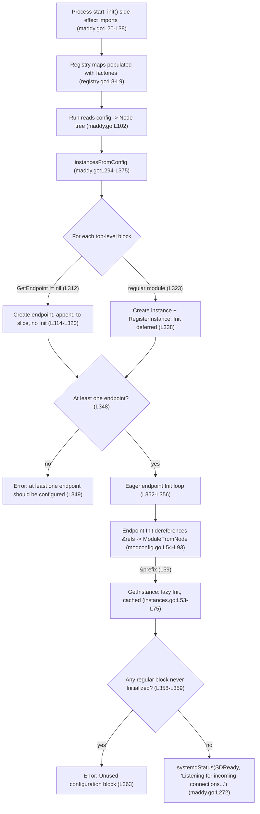

# How Maddy's Module System Assembles at Server Startup (mixed SMTP + IMAP)

This document answers five developer-onboarding questions about how the [Maddy](https://github.com/foxcpp/maddy) mail server wires its module system together **when the server starts**, with special attention to configurations that mix `smtp` and `imap` endpoints sharing a common backing instance. It is written **from direct runtime observation of the canonical binary**: every behavioral claim is paired with the exact command that produced it and the complete, unedited output it emitted, and every code claim carries a `file:line` anchor valid at branch `maddy_26452dd8dd78`, HEAD `26452dd`. Each claim is tagged **Observed** (confirmed by running the code) or **Inferred** (reasoned from the source, only where a run could not confirm it directly).

> **Note on the observation log format.** Maddy's logger prints each record as `<message><TAB><structured-context>`. When a record carries no structured context the line therefore **ends with a literal TAB**; when it carries JSON context the TAB sits **between the message and the `{...}`**. The captured blocks below preserve these tabs verbatim — do not "clean them up".

---

## Build & environment

- **Toolchain / target.** The project declares `go 1.13` (`go.mod:L3`; highest documented supported toolchain is 1.13.4). It requires a C compiler because the SQLite driver `github.com/mattn/go-sqlite3 v1.11.0` (`go.mod:L26`) is cgo-based. The canonical binary was built and run inside the maintainer-provided container image `ghcr.io/scaleapi/swe-atlas:swe_atlas_QnA_foxcpp_maddy_1.0` (Go 1.18.10 — the maintainer-proven toolchain — with `gcc 10.2.1` and `python3`). The repository was mounted **read-only** so the investigation could not modify it.

- **Build command (Observed — exit 0, only a benign SQLite warning):**

```
CGO_ENABLED=1 GOPROXY=off go build -o /tmp/maddy-bin ./cmd/maddy
```

The sole diagnostic emitted was the well-known SQLite amalgamation warning (not an error):

```
# github.com/mattn/go-sqlite3
sqlite3-binding.c: In function 'sqlite3SelectNew':
sqlite3-binding.c:125322:10: warning: function may return address of local variable [-Wreturn-local-addr]
125322 |   return pNew;
       |          ^~~~
sqlite3-binding.c:125282:10: note: declared here
125282 |   Select standin;
       |          ^~~~~~~
```

- **Version banner (Observed).** In a default source-tree build there is no VCS version stamp, so the `Version` default string at `maddy.go:L41` (`Version = "unknown (built from source tree)"`) is reported. The banner is printed by `maddy.go:L126` (`fmt.Println("maddy", BuildInfo())`):

```
$ /tmp/maddy-bin -v
maddy unknown (built from source tree)
```

- **The observation lever is `-debug`.** The `-debug` flag is registered at `maddy.go:L104` (`flag.BoolVar(&log.DefaultLogger.Debug, "debug", false, "enable debug logging early")`). It is what surfaces the `reference &...` / `new module ...` resolution lines and the pipeline's `initializing state for ...` line; without it those signals are not printed.

- **Canonical entry point.** `cmd/maddy/main.go`'s `main` calls `maddy.Run()` (`maddy.go:L102`), which reads the config, sets up directives, and calls `moduleMain` (`maddy.go:L243`); `moduleMain` calls `instancesFromConfig` (`maddy.go:L294`) to assemble the module graph. All output below comes from this real path — no test doubles, mocks, or debug hooks.

- **Config gotchas honored** so runs do not abort early: the global directives are **`state`** and **`runtime`** (absolute paths), not `state_dir`/`runtime_dir` — `maddy.go:L245-L246`; the `smtp` endpoint needs a `hostname`, satisfied by a global `hostname localhost` — `smtp.go:L558`; maddy `os.Chdir`s into the state directory (`maddy.go:L220`) so relative `dsn` paths resolve there; and loopback endpoints use `tls off` (`internal/config/tls_server.go:L22`, `case "off":`). **`tls off` on loopback is a testing-only convenience and is not a security recommendation.**

---

## How the graph assembles (overview)

The backbone of every answer below is the three-loop function `instancesFromConfig` (`maddy.go:L294-L375`). Reading the config first produces a tree of top-level blocks (`Node`s); `instancesFromConfig` then walks them in three passes:

1. **Create pass** (`maddy.go:L300-L346`) — iterate every top-level block. If the block's name resolves to an **endpoint** factory (`module.GetEndpoint`, `maddy.go:L312`), construct the endpoint and append it to a slice **without** initializing it (`maddy.go:L314-L320`, ending in `continue`). Otherwise it is a **regular module**: construct the instance and register it with `module.RegisterInstance` (`maddy.go:L338`) — again **without** initializing it.
2. **Require-an-endpoint pass** (`maddy.go:L348-L350`) — if no endpoint was configured, abort with `at least one endpoint should be configured`.
3. **Eager endpoint-init pass** (`maddy.go:L352-L356`) — call `Init` on every endpoint directly. This is where `&` references get dereferenced, cascading lazy initialization into the regular modules.
4. **Unused-block guard** (`maddy.go:L358-L365`) — any regular module whose instance was never initialized (never referenced) aborts startup with `Unused configuration block ...`.



The mixed configuration used throughout mixes an `smtp` and an `imap` endpoint that both point at one `sql` instance named `local_mailboxes` (aliased `local_authdb`), so a single backing store is shared across both endpoints — the most instructive object for demonstrating cross-endpoint sharing.

---

## Q1 — When the server reads the config, what gets registered immediately and what stays unresolved until later?

> **Question (verbatim):** "When the server reads the config, what gets registered immediately and what stays unresolved until later?"

**Direct answer (Observed).** Two different things are "registered" at two different times. **Module _factory functions_ are registered immediately, at process start, before any config is read** — this populates the registry maps. **Configuration _blocks_ become module _instances_ that are registered but deliberately left uninitialized** during the config-reading create pass; a regular module's `Init` is deferred until something references it. So at the moment the config is parsed: factories = present for every compiled-in module; endpoint instances = created (but not yet initialized); regular-module instances = created and registered, but **unresolved/uninitialized** until first reference.

**Mechanism (cause -> effect).**

- *Immediate factory registration.* The root package blank-imports every module package purely for its registration side effect — the comment `// Import packages for side-effect of module registration.` at `maddy.go:L20`, followed by the `_ "..."` imports at `maddy.go:L21-L37`. Importing a package runs its `func init()`, and each module package's `init()` calls `module.Register(...)` or `module.RegisterEndpoint(...)`. `Register` (`registry.go:L19-L28`) writes into the `modules` map (`registry.go:L8`, `modules = make(map[string]FuncNewModule)`) and `RegisterEndpoint` (`registry.go:L56-L65`) writes into the `endpoints` map (`registry.go:L9`, `endpoints = make(map[string]FuncNewEndpoint)`). Both maps are package-level `var`s initialized at load time, so they are fully populated **before** `main` runs. As a concrete example, the shared-backing `sql` module's `func init()` (`sql.go:L423`) calls `module.Register("sql", New)` (`sql.go:L424`), so the `sql` factory is present in the `modules` map before any config is read. (This is the same blank-import side-effect idiom used by `database/sql` drivers.)
- *Deferred instance construction.* When the config is read, `instancesFromConfig` walks the top-level blocks. For a regular module it constructs the instance and calls `module.RegisterInstance(inst, ...)` at `maddy.go:L338` — but it does **not** call `Init`. Registering the factory (`Register`) is therefore **not** the same as constructing an instance, and constructing an instance (`RegisterInstance`) is **not** the same as initializing it. Initialization is deferred to first reference (Q2). Concretely, for the shared `sql` block the factory `New` (`sql.go:L159`, `func New(_, instName string, _, inlineArgs []string)`) constructs the instance during the create pass, while its `Init` (`sql.go:L176`, `func (store *Storage) Init(cfg *config.Map) error`) — which prints the `go-imap-sql version` line at `sql.go:L268` — is not run until the block is first referenced.

**Command run (Observed):**

```
/tmp/maddy-bin -debug -config /tmp/maddy-obs/mixed.conf
```

with `/tmp/maddy-obs/mixed.conf` (line numbers are load-bearing — `deliver_to &local_mailboxes` is on line 12, `auth &local_authdb` on line 17, `storage &local_mailboxes` on line 18):

```
hostname localhost
state /tmp/maddy-obs/state
runtime /tmp/maddy-obs/runtime

sql local_mailboxes local_authdb {
    driver sqlite3
    dsn mail.db
}

smtp tcp://127.0.0.1:10025 {
    tls off
    deliver_to &local_mailboxes
}

imap tcp://127.0.0.1:10143 {
    tls off
    auth &local_authdb
    storage &local_mailboxes
}
```

**Complete, unedited output (Observed; every line ends with a literal TAB; reproduced identically across 2 runs):**

```text
[debug] sql: go-imap-sql version 0.4.0	
[debug] /tmp/maddy-obs/mixed.conf:12: reference &local_mailboxes	
smtp: listening on tcp://127.0.0.1:10025	
[debug] /tmp/maddy-obs/mixed.conf:17: reference &local_authdb	
[debug] /tmp/maddy-obs/mixed.conf:18: reference &local_mailboxes	
imap: listening on tcp://127.0.0.1:10143	
imap: TLS is disabled, this is insecure configuration and should be used only for testing!	
signal received (terminated), next signal will force immediate shutdown.	
```

**Why this proves the point.** The shared `sql` instance `local_mailboxes` is referenced **three** times (line 12 by the SMTP side; lines 17 and 18 by the IMAP side, one via its alias `local_authdb`), yet `sql: go-imap-sql version 0.4.0` — the line printed inside `sql`'s `Init` (`sql.go:L268`, `store.Log.Debugln("go-imap-sql version", imapsql.VersionStr)`) — appears **exactly once**. That is the visible proof that the `sql` block was registered as an instance but initialized only once, on first reference, not at config-read time. **Label: Observed.**

---

## Q2 — The lazy initialization feels almost invisible, yet it lets modules reference each other with the `&` syntax even out of order. What exactly happens during parsing to make that possible?

> **Question (verbatim):** "The lazy initialization mentioned in the docs feels almost invisible, yet it allows modules to reference each other with the ampersand syntax even when they appear out of order, so what exactly happens during parsing to make that possible?"

**Direct answer (Observed).** Ordering does not matter because **all top-level blocks are turned into registered instances during the create pass before any regular module's `Init` runs**, so any `&name` reference can always find its target regardless of where it appears. During load, a directive whose first argument starts with `&` is detected as a *reference*; the referenced instance is fetched (and initialized on first use, then cached) via `module.GetInstance`. A directive that does **not** start with `&` is instead built as a brand-new *inline* module. The whole effect is "invisible" precisely because it is just two branches in one small function plus an idempotent init-and-cache step.

**Mechanism (cause -> effect).**

- *Why order is irrelevant.* The `Module` interface documents it directly (`module.go:L30-L35`): initialization is done in `Init`, not in the factory, "so all module instances are registered at time of initialization, thus initialization does not depends on ordering of configuration blocks and modules can reference each other without any problems." The design summary echoes this: all separate top-level blocks "are created before main initialization and are placed in the instances registry" (`HACKING.md:L54-L58`), and top-level instances "are initialized (Init method) **lazily** as they are required by other modules" (`HACKING.md:L60`, the one place the docs use the word).
- *Detecting `&` during load.* `ModuleFromNode` (`internal/config/module/modconfig.go:L54`) computes `referenceExisting := strings.HasPrefix(args[0], "&")` at `modconfig.go:L59`. In the reference branch it calls `module.GetInstance(args[0][1:])` at `modconfig.go:L67` and then logs `"%s:%d: reference %s"` at `modconfig.go:L68`. In the inline branch it first logs `"%s:%d: new module %s %v"` at `modconfig.go:L70` and then calls `createInlineModule(args[0], args[1:])` at `modconfig.go:L71`.
- *Lazy init + caching to break cycles.* `GetInstance` (`internal/module/instances.go:L53-L75`) resolves aliases, looks the instance up in the `instances` map, and then, guarded by the `Initialized` map (`instances.go:L16`): if `Initialized[name]` is already true it short-circuits and returns the cached instance (`instances.go:L65-L67`, under the comment `// Break circular dependencies.`); otherwise it sets `Initialized[name] = true` (`instances.go:L69`) **before** calling `mod.mod.Init(mod.cfg)` (`instances.go:L70`). Effect: `&name` -> `GetInstance(name)` -> (first time) mark initialized + run `Init`; (every later time) return the already-built instance. This yields **at-most-once** initialization no matter how many times, or in what order, the instance is referenced.

**Timing detail worth noting (Observed).** In the Q1 output the `sql: go-imap-sql version 0.4.0` line prints **just before** the first `reference &local_mailboxes` line. That ordering is expected: `GetInstance` at `modconfig.go:L67` runs (triggering `sql`'s `Init`, which prints the version line) **before** the `reference` debug line at `modconfig.go:L68` is emitted.

**Command run (Observed)** — this second config exercises **both** resolver branches in one run (two inline modules and three `&` references):

```
/tmp/maddy-bin -debug -config /tmp/maddy-obs/pipeline.conf
```

`/tmp/maddy-obs/pipeline.conf` (inline `check` name `require_matching_ehlo` on line 13; inline modifier `replace_rcpt ...` on line 16; `&` references on lines 18, 23, 24):

```
hostname localhost
state /tmp/maddy-obs/state
runtime /tmp/maddy-obs/runtime

sql local_mailboxes local_authdb {
    driver sqlite3
    dsn mail.db
}

smtp tcp://127.0.0.1:10025 {
    tls off
    check {
        require_matching_ehlo
    }
    modify {
        replace_rcpt postmaster postmaster@example.org
    }
    deliver_to &local_mailboxes
}

imap tcp://127.0.0.1:10143 {
    tls off
    auth &local_authdb
    storage &local_mailboxes
}
```

**Complete, unedited daemon output (Observed; plain lines end with a TAB, JSON-context lines have a TAB between the message and `{`; `msg_id` `6b5af15b`, the heap pointer `0xc0002a83c0`, and the client TCP port `51792` are per-run variable; structure reproduced identically across 2 runs):**

```text
[debug] /tmp/maddy-obs/pipeline.conf:13: new module require_matching_ehlo []	
[debug] /tmp/maddy-obs/pipeline.conf:16: new module replace_rcpt [postmaster postmaster@example.org]	
[debug] sql: go-imap-sql version 0.4.0	
[debug] /tmp/maddy-obs/pipeline.conf:18: reference &local_mailboxes	
smtp: listening on tcp://127.0.0.1:10025	
[debug] /tmp/maddy-obs/pipeline.conf:23: reference &local_authdb	
[debug] /tmp/maddy-obs/pipeline.conf:24: reference &local_mailboxes	
imap: listening on tcp://127.0.0.1:10143	
imap: TLS is disabled, this is insecure configuration and should be used only for testing!	
smtp: incoming message	{"msg_id":"6b5af15b","sender":"sender@example.org","src_host":"nonexistent.invalid","src_ip":"127.0.0.1:51792"}
[debug] smtp/pipeline: initializing state for require_matching_ehlo: (0xc0002a83c0)	{"msg_id":"6b5af15b"}
smtp/pipeline: quarantined	{"check":"require_matching_ehlo","msg_id":"6b5af15b","reason":"no such host","smtp_code":550,"smtp_enchcode":"5.7.0","smtp_msg":"DNS error during policy check"}
[debug] smtp/pipeline: sender sender@example.org matched by default rule	{"msg_id":"6b5af15b"}
[debug] smtp/pipeline: global rcpt modifiers: postmaster@example.org => postmaster@example.org	{"msg_id":"6b5af15b"}
[debug] smtp/pipeline: per-source rcpt modifiers: postmaster@example.org => postmaster@example.org	{"msg_id":"6b5af15b"}
[debug] smtp/pipeline: recipient postmaster@example.org matched by default rule (clean = postmaster@example.org)	{"msg_id":"6b5af15b"}
[debug] smtp/pipeline: per-rcpt modifiers: postmaster@example.org => postmaster@example.org	{"msg_id":"6b5af15b"}
[debug] smtp/pipeline: tgt.Start(sender@example.org) ok, target = sql:local_mailboxes	{"msg_id":"6b5af15b"}
smtp: RCPT error	{"effective_rcpt":"postmaster@example.org","rcpt":"postmaster@example.org","reason":"imap: user doesn't exists","smtp_code":550,"smtp_enchcode":"5.1.1","smtp_msg":"User does not exist","target":"sql"}
smtp: aborted	{"msg_id":"6b5af15b"}
```

**Why this proves the point.** Both branches of `ModuleFromNode` appear in a single run: the **inline** branch (`modconfig.go:L70`) logged `new module require_matching_ehlo []` (line 13) and `new module replace_rcpt [postmaster postmaster@example.org]` (line 16); the **reference** branch (`modconfig.go:L68`) logged `reference &local_mailboxes` / `reference &local_authdb` (lines 18, 23, 24). And exactly as in Q1, the shared `sql` instance emitted a single `go-imap-sql version` line despite the three `&` references — the observable signature of the `Initialized` cache guaranteeing at-most-once init. **Label: Observed.**

---

## Q3 — Endpoint modules play by slightly different rules than regular modules. Where do their lifecycles diverge, and why?

> **Question (verbatim):** "Endpoint modules also seem to play by slightly different rules than regular modules, and I want to understand where their lifecycles diverge and why."

**Direct answer (Observed).** Endpoints diverge from regular modules in four concrete ways: (1) they live in a **separate registry map**; (2) in the create pass they are **created but not registered as instances** (and get no instance name); (3) they **cannot be defined inline**; and (4) they are **initialized directly and eagerly**, rather than lazily-on-reference. **Why:** endpoints are the active **roots** of the module graph — they must always run, and it is their eager `Init` that dereferences the `&` references and thereby cascades lazy initialization into the rest of the graph. If endpoints were also lazy, nothing would ever pull the graph into existence.

**Mechanism (cause -> effect).**

- *Separate registry.* Endpoints are registered by `RegisterEndpoint` (`registry.go:L56`) into the `endpoints` map (`registry.go:L9`), distinct from the `modules` map used by regular `Register` (`registry.go:L8`, `L19`). They are looked up by `GetEndpoint` (`registry.go:L45-L50`).
- *Created-but-not-instanced, eagerly initialized.* In the create pass, `endpFactory := module.GetEndpoint(modName)` at `maddy.go:L312`; if non-nil the endpoint is constructed and appended to a slice at `maddy.go:L314-L320`, then the loop `continue`s — so `RegisterInstance` (the regular-module path at `maddy.go:L338`) is **never** called for an endpoint. Endpoints are then initialized directly in the eager loop at `maddy.go:L352-L356` (`endp.instance.Init(config.NewMap(globals, &endp.cfg))`), whereas a regular module waits to be referenced.
- *The contract explains the divergence.* `FuncNewEndpoint`'s doc (`module.go:L59-L71`) states endpoint instances are "Not registered in the global registry," "Can't be defined inline," "Don't have an unique name" (so `InstanceName` returns the same value as `Name`), and receive "All config arguments are always passed as an 'addrs' slice and not used as names" (`module.go:L66-L67`) — the factory signature is `func(modName string, addrs []string) (Module, error)` (`module.go:L71`), unlike the regular `FuncNewModule func(modName, instName string, aliases, inlineArgs []string)` (`module.go:L57`). `HACKING.md:L61-L62` says the smtp/imap modules "follow a special initialization path, so they are always initialized directly."

**Named endpoint personalities (Observed-from-source).** One SMTP `New` factory (`smtp.go:L488`) is registered under **three** names in `smtp.go`'s `init()` (`smtp.go:L714-L717`): `RegisterEndpoint("smtp", New)` (L715), `RegisterEndpoint("submission", New)` (L716), and `RegisterEndpoint("lmtp", New)` (L717). The IMAP `New` factory (`imap.go:L44`) is registered as `RegisterEndpoint("imap", New)` (`imap.go:L221`). SMTP's `Init` (`smtp.go:L500`) builds the message pipeline with `endp.pipeline, err = msgpipeline.New(...)` (`smtp.go:L580`); IMAP's `Init` (`imap.go:L53`) resolves its own `&`-references via `cfg.Custom("auth", ...)` (`imap.go:L60`) and `cfg.Custom("storage", ...)` (`imap.go:L61`). The observation config exercises `smtp` and `imap`; `submission` and `lmtp` share the identical `New` factory, so they are covered here as registration facts from `smtp.go:L714-L717`.

**Command + complete output (Observed).** The mixed config from Q1 is sufficient; its output is reproduced here in full so the ordering claim sits next to its evidence:

```
/tmp/maddy-bin -debug -config /tmp/maddy-obs/mixed.conf
```

```text
[debug] sql: go-imap-sql version 0.4.0	
[debug] /tmp/maddy-obs/mixed.conf:12: reference &local_mailboxes	
smtp: listening on tcp://127.0.0.1:10025	
[debug] /tmp/maddy-obs/mixed.conf:17: reference &local_authdb	
[debug] /tmp/maddy-obs/mixed.conf:18: reference &local_mailboxes	
imap: listening on tcp://127.0.0.1:10143	
imap: TLS is disabled, this is insecure configuration and should be used only for testing!	
signal received (terminated), next signal will force immediate shutdown.	
```

**Why this proves the point.** `smtp: listening on ...` is emitted **before** `imap: listening on ...`, matching the configuration order — because the eager endpoint-init loop (`maddy.go:L352-L356`) initializes endpoints directly, in order, and each endpoint's `Init` is what triggers the `reference &local_mailboxes` / `reference &local_authdb` resolution lines interleaved between them. Only `imap` prints the TLS-disabled warning (explained under Q5's adjacent detail), a property of the two endpoints' own `Init` methods that reinforces that endpoints are initialized by their eager path. **Label: Observed** (with the `submission`/`lmtp` registration sub-claim labeled Observed-from-source).

---

## Q4 — As messages begin flowing, how do `check` and `modifier` modules coordinate without explicit wiring in the config?

> **Question (verbatim):** "As messages begin flowing through the system, how do check and modifier modules quietly coordinate without explicit wiring in the config[?]"

**Direct answer (Observed).** They never reference each other at all. Each `check` entry and each `modify` entry is resolved **independently** into an interface value, and the message **pipeline** is what invokes them — by interface, at fixed lifecycle points, in a fixed scope order (global -> per-source -> per-recipient). The "coordination" is therefore structural: it lives in the pipeline's call order and the `Check`/`Modifier` interfaces, not in any config directive that ties a check to a modifier.

**Mechanism (cause -> effect).**

- *Independent resolution.* `parseChecksGroup` (`internal/msgpipeline/config.go:L350`) turns each `check` child into a `module.Check` (via `modconfig.MessageCheck`); `parseModifiersGroup` (`config.go:L363`) turns each `modify` child into a modifier (via `modconfig.MsgModifier`). Neither function references the other — checks and modifiers are parsed into two separate collections.
- *Invocation by interface, at fixed points.* The `MsgPipeline` struct (`internal/msgpipeline/msgpipeline.go:L26`) holds these collections and calls them by interface. Checks satisfy `Check` (`module.go:L14-L23`, entry point `CheckStateForMsg` at `check.go:L22`) and their per-message method order is guaranteed — `CheckConnection` (`check.go:L43`), `CheckSender` (`check.go:L47`), `CheckRcpt` (`check.go:L51`), `CheckBody` (`check.go:L58`), also documented at `HACKING.md:L117-L118` ("CheckConnection, CheckSender, CheckRcpt, CheckBody."). Modifiers satisfy `Modifier` (`module.go:L26-L30`, entry point `ModStateForMsg` at `modifier.go:L29`). Recipient modifiers run in three fixed scopes, logged in order: `global rcpt modifiers:` (`msgpipeline.go:L241`), `per-source rcpt modifiers:` (`msgpipeline.go:L247`), `per-rcpt modifiers:` (`msgpipeline.go:L279`).
- *Checks run in parallel, results merged.* `checkRunner.runAndMergeResults` (`internal/msgpipeline/check_runner.go:L142-L208`) launches each check state in its own goroutine (`sync.WaitGroup` at `check_runner.go:L155`, `wg.Add(1)` at L160, `go func()` at L161, `wg.Done()` at L194, `wg.Wait()` at L198) and merges their results, applied via `applyResults` (`check_runner.go:L262`). The per-message check-state line is `cr.log.Debugf("initializing state for %v (%p)", objectName(check), check)` (`check_runner.go:L67`), where `objectName` (`internal/msgpipeline/objname.go:L11`) returns `Name() + ":" + InstanceName()`.

**Command run (Observed)** — the daemon from Q2 plus a driven SMTP transaction (the check-state / modifier-scope lines only appear when a message is actually processed):

```
# daemon
/tmp/maddy-bin -debug -config /tmp/maddy-obs/pipeline.conf
# driver: a Python smtplib client sending EHLO nonexistent.invalid / MAIL FROM:<sender@example.org> / RCPT TO:<postmaster@example.org>
```

**Client session (Observed):**

```text
EHLO -> 250 Hello nonexistent.invalid
PIPELINING
8BITMIME
ENHANCEDSTATUSCODES
SMTPUTF8
SIZE 33554432
MAIL FROM -> 250 2.0.0 Roger, accepting mail from <sender@example.org>
RCPT TO -> 550 5.1.1 User does not exist (msg ID = 6b5af15b)
```

**Complete, unedited daemon output (Observed; per-run-variable values `6b5af15b`, `0xc0002a83c0`, `51792`; structure reproduced identically across 2 runs):**

```text
[debug] /tmp/maddy-obs/pipeline.conf:13: new module require_matching_ehlo []	
[debug] /tmp/maddy-obs/pipeline.conf:16: new module replace_rcpt [postmaster postmaster@example.org]	
[debug] sql: go-imap-sql version 0.4.0	
[debug] /tmp/maddy-obs/pipeline.conf:18: reference &local_mailboxes	
smtp: listening on tcp://127.0.0.1:10025	
[debug] /tmp/maddy-obs/pipeline.conf:23: reference &local_authdb	
[debug] /tmp/maddy-obs/pipeline.conf:24: reference &local_mailboxes	
imap: listening on tcp://127.0.0.1:10143	
imap: TLS is disabled, this is insecure configuration and should be used only for testing!	
smtp: incoming message	{"msg_id":"6b5af15b","sender":"sender@example.org","src_host":"nonexistent.invalid","src_ip":"127.0.0.1:51792"}
[debug] smtp/pipeline: initializing state for require_matching_ehlo: (0xc0002a83c0)	{"msg_id":"6b5af15b"}
smtp/pipeline: quarantined	{"check":"require_matching_ehlo","msg_id":"6b5af15b","reason":"no such host","smtp_code":550,"smtp_enchcode":"5.7.0","smtp_msg":"DNS error during policy check"}
[debug] smtp/pipeline: sender sender@example.org matched by default rule	{"msg_id":"6b5af15b"}
[debug] smtp/pipeline: global rcpt modifiers: postmaster@example.org => postmaster@example.org	{"msg_id":"6b5af15b"}
[debug] smtp/pipeline: per-source rcpt modifiers: postmaster@example.org => postmaster@example.org	{"msg_id":"6b5af15b"}
[debug] smtp/pipeline: recipient postmaster@example.org matched by default rule (clean = postmaster@example.org)	{"msg_id":"6b5af15b"}
[debug] smtp/pipeline: per-rcpt modifiers: postmaster@example.org => postmaster@example.org	{"msg_id":"6b5af15b"}
[debug] smtp/pipeline: tgt.Start(sender@example.org) ok, target = sql:local_mailboxes	{"msg_id":"6b5af15b"}
smtp: RCPT error	{"effective_rcpt":"postmaster@example.org","rcpt":"postmaster@example.org","reason":"imap: user doesn't exists","smtp_code":550,"smtp_enchcode":"5.1.1","smtp_msg":"User does not exist","target":"sql"}
smtp: aborted	{"msg_id":"6b5af15b"}
```

**Why this proves the point.** The check-state line `initializing state for require_matching_ehlo: (0xc0002a83c0)` (`check_runner.go:L67`) appears once as the message enters the pipeline; the check then produces `smtp/pipeline: quarantined` — and the three recipient-modifier scopes fire in the fixed order **global -> per-source -> per-rcpt** (`msgpipeline.go:L241`/`L247`/`L279`), unconditionally, even though nothing rewrote the address (`postmaster@example.org => postmaster@example.org`). At no point does a `check` name a `modify` or vice-versa; the ordering is entirely the pipeline's.

**Two distinct, real behaviors — do not conflate (Observed).** (1) The message is **quarantined** by the check: `require_matching_ehlo` is registered with `check.FailAction{Quarantine: true}` (`internal/check/dns/dns.go:L211`), and because the EHLO name `nonexistent.invalid` never resolves, the check result carries `reason":"no such host"`. (2) **Separately**, delivery is rejected with `User does not exist` / `imap: user doesn't exists` because the recipient `postmaster@example.org` was never provisioned in the `sql` store — a real delivery-time rejection, distinct from the quarantine. Both are reported here exactly as observed. **Label: Observed.**

---

## Q5 — What evidence at runtime shows that the module graph has fully settled into place?

> **Question (verbatim):** "...what evidence at runtime shows that the module graph has fully settled into place?"

**Direct answer (Observed).** Four concrete runtime signals show the graph has settled: **(a)** one `reference &...` (or `new module ...`) debug line per resolved directive, showing every edge was walked; **(b)** the per-message `initializing state for ...` line, showing the pipeline is live; **(c)** the **unused-block guard** — startup *aborts* if any top-level block was never reached, so a clean startup proves every block was reached; and **(d)** the **readiness signal** emitted after all endpoints initialize. The before/after transition (a block is uninitialized until first reference, then cached) is itself visible as the single `go-imap-sql version` line versus three references.

**Mechanism (cause -> effect).**

- **(a) Per-reference lines.** Emitted at `internal/config/module/modconfig.go:L68` (`reference %s`) and `modconfig.go:L70` (`new module %s %v`) — one per resolved directive (shown in Q1/Q2).
- **(b) Per-message check-state line.** `check_runner.go:L67` (shown in Q4) — proof the assembled pipeline is processing messages.
- **(c) Unused-block guard.** After the eager endpoint-init pass, `instancesFromConfig` loops over the regular modules (`maddy.go:L358-L359`): `if module.Initialized[inst.instance.InstanceName()] { continue }`. Any instance that is still uninitialized causes `return nil, fmt.Errorf("Unused configuration block at %s:%d - %s (%s)", ...)` at `maddy.go:L363`, with fields `inst.cfg.File, inst.cfg.Line, inst.instance.InstanceName(), inst.instance.Name()` at `maddy.go:L364`. Cause -> effect: a block that nothing references is never passed to `GetInstance`, so its `Initialized[...]` stays false, so the guard fires and startup fails.
- **(d) Readiness signal.** Once `instancesFromConfig` returns without error, `moduleMain` calls `systemdStatus(SDReady, "Listening for incoming connections...")` at `maddy.go:L272`.

### Evidence (c): the unused-block abort — Condition 3

**Command run (Observed) -> exit code 2 (reproduced identically twice):**

```
/tmp/maddy-bin -debug -config /tmp/maddy-obs/error.conf
```

`/tmp/maddy-obs/error.conf` is the mixed config plus a second, **unreferenced** `sql orphan_db` block declared on line 10:

```
hostname localhost
state /tmp/maddy-obs/state
runtime /tmp/maddy-obs/runtime

sql local_mailboxes local_authdb {
    driver sqlite3
    dsn mail.db
}

sql orphan_db {
    driver sqlite3
    dsn orphan.db
}

smtp tcp://127.0.0.1:10025 {
    tls off
    deliver_to &local_mailboxes
}

imap tcp://127.0.0.1:10143 {
    tls off
    auth &local_authdb
    storage &local_mailboxes
}
```

**Complete, unedited output (Observed; every line ends with a TAB):**

```text
[debug] sql: go-imap-sql version 0.4.0	
[debug] /tmp/maddy-obs/error.conf:17: reference &local_mailboxes	
smtp: listening on tcp://127.0.0.1:10025	
[debug] /tmp/maddy-obs/error.conf:22: reference &local_authdb	
[debug] /tmp/maddy-obs/error.conf:23: reference &local_mailboxes	
imap: listening on tcp://127.0.0.1:10143	
imap: TLS is disabled, this is insecure configuration and should be used only for testing!	
Unused configuration block at /tmp/maddy-obs/error.conf:10 - orphan_db (sql)	
```

**Why this proves the point.** The final line matches the `maddy.go:L363-L364` format exactly: file, line **10**, `InstanceName` `orphan_db`, `Name` `sql`. Note the ordering — both endpoints reach `listening on ...` **first**, and only **then** does the guard abort. That confirms the three-loop order (create -> eager endpoint `Init` -> unused-block validate). Conversely, the clean configs in Q1/Q2 reach `listening` with **no** such error, proving every top-level block there was reached through the reference graph. **Label: Observed.**

### Evidence (d): the readiness signal — Condition 4

**The systemd nuance (Observed).** `systemdStatus` (`systemd.go:L61-L86`) is a **no-op when `NOTIFY_SOCKET` is unset**: `sdNotifySock()` (`systemd.go:L28`) returns `ErrNoNotifySock` when `os.Getenv("NOTIFY_SOCKET") == ""` (`systemd.go:L29-L31`), so `systemdStatus` hits its `return` at `systemd.go:L67` **without printing**. That is why the foreground runs in Q1–Q3 (no `NOTIFY_SOCKET`) show **zero** `systemd:` lines — the foreground-observable readiness proxy is the per-endpoint `listening on` lines. Under a **real** `unixgram` `NOTIFY_SOCKET` (exactly how systemd launches the daemon — canonical, not a stand-in), the notification is written at `systemd.go:L76` (`fmt.Sprintf("%s\nSTATUS=%s", status, desc)`) and logged at `systemd.go:L79` (`systemd: %s STATUS="%s"`), with `SDReady = "READY=1"` (`systemd.go:L20`) and `SDStopping = "STOPPING=1"` (`systemd.go:L21`).

**Command run (Observed).** A Python listener bound a `unixgram` socket, set `NOTIFY_SOCKET` to its path, launched `/tmp/maddy-bin -debug -config /tmp/maddy-obs/mixed.conf`, and read the datagrams (reproduced identically twice). The **actual datagram bytes received on the socket** were:

```text
READY_DATAGRAM_BYTES=b'READY=1\nSTATUS=Listening for incoming connections...'
STOPPING_DATAGRAM_BYTES=b'STOPPING=1\nSTATUS=Waiting for running transactions to complete...'
```

and the daemon's corresponding debug lines (each ends with a TAB) were:

```text
[debug] systemd: READY=1 STATUS="Listening for incoming connections..."	
[debug] systemd: STOPPING=1 STATUS="Waiting for running transactions to complete..."	
```

**Why this proves the point.** The `READY=1` datagram is written by `maddy.go:L272` **only after** `instancesFromConfig` returns successfully — i.e. after the whole graph has assembled and every endpoint is listening. The `STOPPING=1` datagram is the shutdown counterpart emitted by `maddy.go:L276` (`systemdStatus(SDStopping, "Waiting for running transactions to complete...")`). **Label: Observed.**

### Before/after transition (Observed)

The uninitialized -> initialized(cached) transition is directly visible: across all clean runs, the shared `sql` instance emits its `go-imap-sql version` line **once** (the moment `GetInstance` first initializes it), while the `reference &local_mailboxes` / `reference &local_authdb` lines appear **three** times. One init versus three references *is* the before(uninitialized)->after(cached) proof, backed by the `Initialized` guard at `instances.go:L65-L69`.

### Adjacent detail: why only `imap` prints the TLS-disabled warning (Observed)

In every mixed run only the `imap` endpoint prints `TLS is disabled, this is insecure configuration ...`, never `smtp`. This is not a bug and not environmental: the SMTP endpoint guards the warning with `if !allLocal` (`smtp.go:L540-L542`, warning at `smtp.go:L542`), and on a loopback (`127.0.0.1`) listener `allLocal` is true, so SMTP **suppresses** it; the IMAP endpoint prints the same warning **unconditionally** whenever `TLSConfig == nil` (`imap.go:L154-L155`). Both are the endpoints' own `Init`-time behavior. (`tls off` on loopback is testing-only, not a security recommendation.)

---

## Coverage pass

A final pass confirming every sub-question and every named item is answered, with the evidence that proves it.

- [x] **Q1** registration vs. deferral -> §Q1 + Condition 1 (one `sql` init despite three references).
- [x] **Q2** lazy init & the `&` syntax -> §Q2 + Conditions 1 & 2 (`modconfig.go:L59/L67/L68/L70/L71`; `instances.go:L65-L70`).
- [x] **Q3** endpoint lifecycle divergence + **why** -> §Q3 + Condition 1 (`maddy.go:L312-L320/L352-L356`; `module.go:L59-L71`).
- [x] **Q4** check/modifier coordination without wiring -> §Q4 + Condition 2 (`config.go:L350/L363`; `msgpipeline.go:L241/L247/L279`; `check_runner.go:L67/L142-L208`).
- [x] **Q5** runtime evidence of a settled graph -> §Q5 + Conditions 1–4 (`modconfig.go:L68/L70`; `check_runner.go:L67`; `maddy.go:L358-L365`; `maddy.go:L272`).
- [x] Endpoint personalities **`smtp`**, **`submission`**, **`lmtp`** (all three from one `New`, `smtp.go:L714-L717`) and **`imap`** (`imap.go:L221`) -> §Q3.
- [x] **`check`** and **`modify`** resolved independently (`config.go:L350` / `L363`) -> §Q4.
- [x] **`&`-references** vs. **inline modules** — both branches shown in one run (`modconfig.go:L68` vs `L70`) -> §Q2 (Condition 2).
- [x] **before(uninitialized)** vs. **after(cached)** states (`instances.go:L65-L69`; one version line vs. three refs) -> §Q1, §Q5.
- [x] **Unused-block** error/edge path (`maddy.go:L358-L365`; exit code 2) -> §Q5 (Condition 3).
- [x] **Readiness** signal (`maddy.go:L272`; systemd nuance `systemd.go:L61-L86`) -> §Q5 (Condition 4).
- [x] **TLS-warning asymmetry** (`smtp.go:L540-L542` guarded vs `imap.go:L154-L155` unconditional) -> §Q5 adjacent detail.
- [x] **Read-only affirmation** (repo unchanged; temp artifacts under `/tmp` removed) -> §Source lineage below.

---

## Source lineage / read-only note

This investigation was **read-only** with respect to the Maddy repository. The only file added to the repository is this document, `blitzy/documentation/maddy_26452dd8dd78.md`. No existing source, test, configuration, or build file was modified, added, or deleted.

All build and observation artifacts lived **outside** the repository and were removed after the runs: the compiled binary (`/tmp/maddy-bin`), the scratch configs and state/runtime directories and SQLite databases (`/tmp/maddy-obs/...`), and the Python driver scripts. During observation the repository was mounted **read-only** into the build container, so it could not be altered; afterwards `git status --porcelain`, run from the repository root, showed only the single new documentation file.

Read-only files consulted for citations (all at branch `maddy_26452dd8dd78`, HEAD `26452dd`): `maddy.go`, `cmd/maddy/main.go`, `config.go`, `signal.go`, `systemd.go`, `internal/module/module.go`, `internal/module/registry.go`, `internal/module/instances.go`, `internal/module/check.go`, `internal/module/modifier.go`, `internal/config/module/modconfig.go`, `internal/config/map.go`, `internal/config/tls_server.go`, `pkg/cfgparser/parse.go`, `internal/msgpipeline/config.go`, `internal/msgpipeline/msgpipeline.go`, `internal/msgpipeline/check_runner.go`, `internal/msgpipeline/objname.go`, `internal/endpoint/smtp/smtp.go`, `internal/endpoint/imap/imap.go`, `internal/storage/sql/sql.go`, `internal/check/dns/dns.go`, `internal/modify/replace_addr.go`, `HACKING.md`, `maddy.conf`, `go.mod`. `internal/check/skeleton.go` was noted only as an illustrative minimal check; it carries a `//+build ignore` tag and is not compiled into the binary.

**Observed/Inferred summary.** Every behavioral claim above is **Observed** — produced by running the canonical `cmd/maddy` binary built from this exact checkout, with each key signal reproduced across at least two runs. The only sub-claim labeled *Observed-from-source* is that the `submission` and `lmtp` personalities share the same `New` factory as `smtp` (`smtp.go:L714-L717`): the observation config exercises `smtp` and `imap`, and the extra two names are registration facts read from the source. No claim in this document relies on an unlabeled inference.
