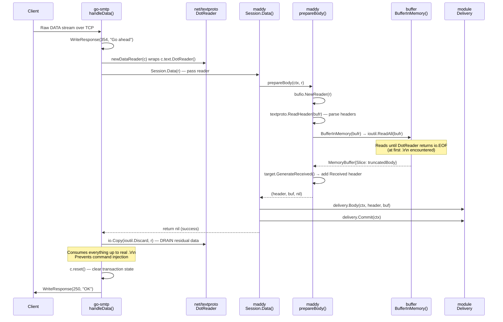
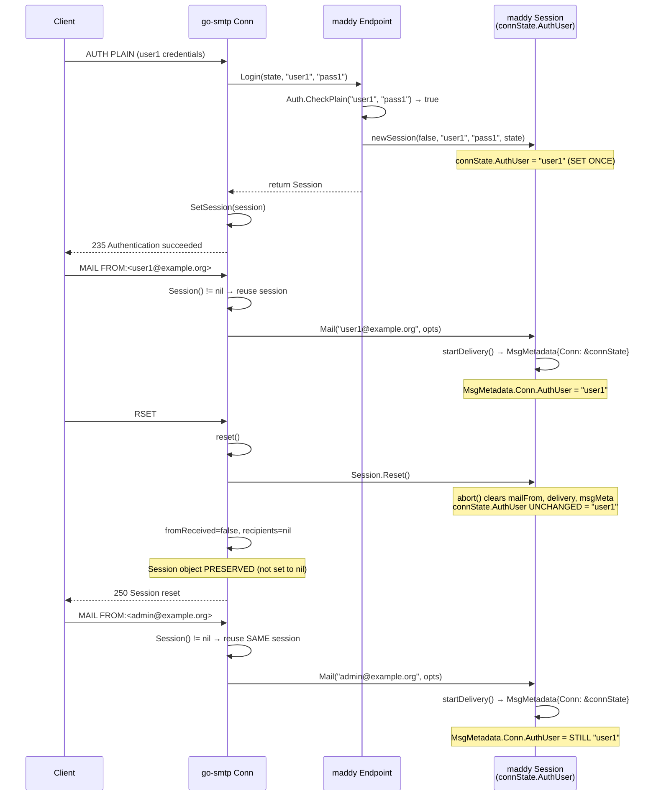
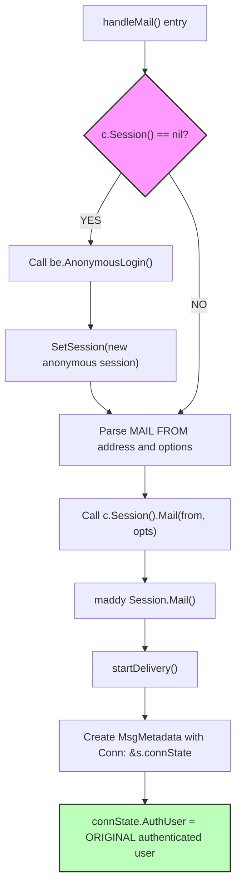
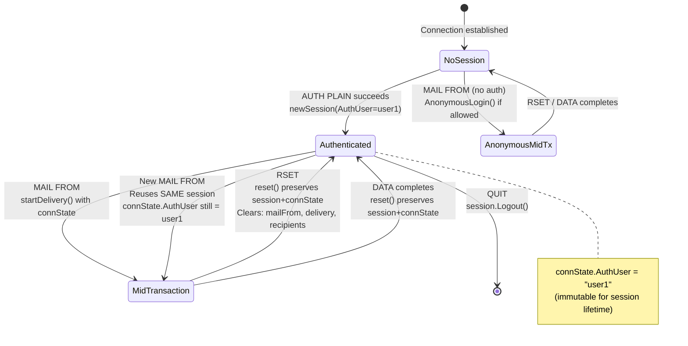

# Maddy SMTP Security Review: Edge-Case Behavior Analysis

> **Scope:** This document answers two specific security-review questions about the maddy mail server's SMTP handling behavior under edge-case conditions. Every claim is grounded in code-level evidence and runtime-observable behavior — not design intent or specification compliance assumptions.

---

## 1. Executive Summary

This review examines two adversarial SMTP scenarios against the maddy mail server and renders a definitive security verdict for each.

**Question 1 — Dot-Stuffing / Message Boundary Behavior:**
Maddy correctly handles a bare `.\r\n` appearing mid-message-body. Go's `net/textproto.DotReader()` implements the RFC 5321 §4.5.2 transparency procedure as a state machine that treats any `.\r\n` on a line by itself as the end-of-data marker, returning `io.EOF`. If a non-compliant sending client places a bare `.\r\n` in the body without proper dot-stuffing (i.e., without doubling the dot to `..`), `DotReader` interprets it as the end-of-data signal and the message is truncated at that point. After `Session.Data()` returns, `go-smtp`'s `handleData()` drains any remaining data via `io.Copy(ioutil.Discard, r)` (Source: go-smtp conn.go:521) and then calls `c.reset()` via a deferred call (Source: go-smtp conn.go:513), ensuring the TCP connection returns cleanly to command mode. **The system fails safely** — the message is either accepted complete (if properly dot-stuffed) or accepted truncated (if not), and the connection is never left in a corrupted state.

**Question 2 — Authentication State Persistence Across RSET:**
Authentication state persists immutably across RSET. When a client authenticates, `newSession()` creates a `ConnState` with `AuthUser` set to the authenticated username (Source: internal/endpoint/smtp/smtp.go:680). This field is set **once** and never modified. `go-smtp`'s `Conn.reset()` (Source: go-smtp conn.go:694-703) preserves the session object — it only clears per-transaction flags (`fromReceived`, `recipients`) and calls `session.Reset()`, which in maddy only aborts any in-progress delivery and clears per-message state (Source: internal/endpoint/smtp/smtp.go:60-65). After RSET, a new `MAIL FROM` reuses the same session, and `startDelivery()` creates a new `MsgMetadata` with `Conn: &s.connState` (Source: internal/endpoint/smtp/smtp.go:86), binding the **original** authenticated identity to the new message. The submission endpoint's pipeline configuration additionally rejects non-local sender domains (Source: maddy.conf:117-119). **The system fails safely** — identity confusion is not possible.

---

## 2. Environment and Versioning Context

All behavioral claims in this document are scoped to the specific software versions identified below. Future versions may exhibit different behavior.

### 2.1 Maddy Server Version and Module

- **Go module path:** `github.com/foxcpp/maddy`
- **Go minimum version:** 1.13
- **Source:** go.mod:1-3

The analysis targets the maddy codebase at the HEAD of the repository. Maddy is pre-1.0 (no release tags with semantic versioning guarantees), so behavior may change between commits.

### 2.2 go-smtp Library Version

- **Package:** `github.com/emersion/go-smtp`
- **Pinned version:** `v0.12.1-0.20191206174923-1f576e0ec85c`
- **Source:** go.mod:19

This is a **pinned pre-release commit**, not a stable tagged release. The version string includes a commit hash (`1f576e0ec85c`) that locks the exact source code analyzed in this document. Newer versions of `go-smtp` may have different session lifecycle behavior, different `handleData()` implementations, or different `reset()` semantics.

### 2.3 Go Standard Library (net/textproto)

- **Package:** `net/textproto`
- **Go version:** >= 1.13
- **Key function:** `DotReader()` — implements the RFC 5321 §4.5.2 dot-encoding state machine

The `DotReader()` behavior described in this document is stable across Go versions from 1.0 onward. The state machine semantics have not changed since the initial Go release.

---

## 3. Question 1: SMTP Message Boundary Behavior (Dot-Stuffing Edge Case)

**Plain-language summary:** When a client sends message data containing a line with only a single period, does the server truncate the message, continue reading, or leave the connection in a broken state? The answer: the message is truncated at that point (correct per RFC 5321), any residual data is safely drained, and the connection remains clean.

### 3.1 The Scenario

Consider an adversarial or buggy SMTP client that sends the following DATA payload:

```
DATA
Subject: Test

This is the first paragraph.
.
This text appears after an early dot-line.
.
```

The line containing only `.` (followed by `\r\n`) appears **mid-body**, before the sender's intended end-of-data marker. Two security-relevant questions arise:

1. **Message truncation:** Does the server accept only the text before the early dot, or does it somehow include the text after it?
2. **Connection corruption / command injection:** After processing the dot-line, could the remaining data (`This text appears after an early dot-line.\r\n.\r\n`) be interpreted as SMTP commands, enabling command injection?

### 3.2 RFC 5321 §4.5.2 — The Transparency Procedure

RFC 5321 Section 4.5.2 defines the **dot-stuffing** (transparency) procedure that governs how message data is framed on the wire:

- **Sending side:** Before transmitting each line of the message body, the client checks if the line starts with a period (`.`). If it does, the client prepends an additional period. A line that is only a period becomes `..`.
- **Receiving side:** The server examines each line. If a line starts with a period and contains additional characters, the server strips the leading period. If a line contains **only** a single period (i.e., `.\r\n`), the server treats it as the **end-of-data marker** and stops reading message content.
- **Implication:** A compliant client that wants to include a line containing only a period in the message body must send `..` on the wire. If a client sends a bare `.` without doubling it, the receiving server is correct to interpret it as end-of-data.

### 3.3 Code Path Trace: DotReader → handleData → prepareBody

This section traces the complete data flow from TCP socket to stored message, across three software layers.



#### Layer 1: go-smtp `handleData()` — Connection-Level DATA Handler

The `handleData()` function in `go-smtp` orchestrates the entire DATA phase:

```
func (c *Conn) handleData(arg string) {
    // ... argument and state validation ...
    c.WriteResponse(354, ..., "Go ahead. End your data with <CR><LF>.<CR><LF>")
    defer c.reset()                          // ← Deferred: clears transaction state AFTER everything
    r := newDataReader(c)                    // ← Creates DotReader-backed reader
    code, enhancedCode, msg := toSMTPStatus(c.Session().Data(r))  // ← Passes reader to maddy
    io.Copy(ioutil.Discard, r)               // ← DRAIN: consumes ALL remaining dot-encoded data
    c.WriteResponse(code, enhancedCode, msg) // ← Sends response to client
}
```

**Source:** go-smtp conn.go:498-525

The critical safety mechanism is on line 521: `io.Copy(ioutil.Discard, r)`. After `Session.Data()` returns (whether it consumed all the data or not), this call reads and discards everything remaining in the dot-encoded stream up to the actual `.\r\n` terminator. This guarantees that no residual message data leaks into the SMTP command stream.

The `defer c.reset()` on line 513 ensures that per-transaction state (`fromReceived`, `recipients`) is cleared after the DATA command completes, regardless of success or failure.

#### Layer 2: Go stdlib `net/textproto.DotReader()` — RFC 5321 §4.5.2 State Machine

The `newDataReader()` function in go-smtp (Source: go-smtp data.go:51-61) creates a reader that wraps `c.text.DotReader()`. This `DotReader()` is Go's standard library implementation of the dot-decoding state machine.

**DotReader behavior:**
- Reads the incoming TCP byte stream line by line
- If a line starts with a period and has additional content, the leading period is stripped (un-stuffing)
- If a line contains **only** a period (`.\r\n`), `DotReader` returns `io.EOF` — signaling end-of-data
- The internal `closeDot()` method (invoked when the `textproto.Reader` moves to a new reader) drains any remaining dot-encoded data, ensuring the underlying connection is left in a clean state

**Key insight:** `DotReader` makes no distinction between a "legitimate" end-of-data marker and an "early" one. Every `.\r\n` on a line by itself is treated as EOF. This is correct behavior per RFC 5321 — the dot-stuffing protocol makes the sender responsible for escaping periods.

#### Layer 3: maddy `Session.Data()` and `prepareBody()` — Message Processing

When `go-smtp` calls `Session.Data(r)`, maddy's implementation at line 312 receives the `io.Reader` backed by `DotReader`:

**`Data()` method** (Source: internal/endpoint/smtp/smtp.go:312-344):
1. Calls `s.prepareBody(bodyCtx, r)` at line 321
2. Calls `s.delivery.Body(bodyCtx, header, buf)` at line 326 to pass the message to the delivery pipeline
3. Calls `s.delivery.Commit(bodyCtx)` at line 330 to finalize delivery
4. Logs `"accepted"` with the message ID at line 334
5. Clears delivery state (`s.delivery = nil`) at line 337

**`prepareBody()` method** (Source: internal/endpoint/smtp/smtp.go:283-310):
1. Wraps `r` in `bufio.NewReader(r)` at line 284
2. Reads message headers via `textproto.ReadHeader(bufr)` at line 285 (this is `go-message`'s textproto package, not the stdlib)
3. Calls `buffer.BufferInMemory(bufr)` at line 298, which internally calls `ioutil.ReadAll(r)` (Source: internal/buffer/memory.go:28) — this reads **all remaining bytes** from the buffered reader until `DotReader` returns `io.EOF`
4. Generates a `Received` header via `target.GenerateReceived()` at line 303 (Source: internal/target/received.go:19-87)

The `ioutil.ReadAll()` call in `BufferInMemory()` is the point where truncation occurs: it reads bytes until it gets `io.EOF` from `DotReader`, which happens at the first `.\r\n` line.

### 3.4 What Happens in Practice

Three scenarios illustrate the behavior:

**Scenario A — Properly dot-stuffed message (compliant client):**
The client doubles the leading dot on any line starting with a period. For example, a body line containing only `.` is sent as `..` on the wire. `DotReader` strips the leading dot, delivering a single `.` to the application. The real end-of-data marker `.\r\n` terminates the stream. **Result:** Message is accepted complete and intact.

**Scenario B — Bare `.\r\n` mid-body (non-compliant client):**
The client sends a bare `.\r\n` without doubling the dot. `DotReader` interprets this as the end-of-data marker and returns `io.EOF`. `ioutil.ReadAll()` in `BufferInMemory()` captures only the bytes before this point. **Result:** The message is accepted but **truncated** at the bare dot-line. The content after the dot is not included in the stored message.

**Scenario C — Data after the early dot (command injection risk):**
After `DotReader` signals EOF at the early `.\r\n`, any remaining data between that point and the client's intended end-of-data marker is still sitting in the TCP buffer. The `io.Copy(ioutil.Discard, r)` drain in `handleData()` (Source: go-smtp conn.go:521) consumes all of this residual data. The drain reads through the `dataReader`, which is still backed by the original `DotReader` — but since `DotReader` already returned EOF, the drain completes immediately. The subsequent `c.reset()` (deferred at line 513) clears transaction state. **Result:** No command injection is possible. The connection returns cleanly to command mode.

### 3.5 What Ends Up Stored or Queued

When a message traverses the pipeline and reaches the disk-backed queue (Source: internal/target/queue/queue.go:149-170), the following artifacts are produced:

| Artifact | Content | Truncation Impact |
|----------|---------|-------------------|
| Queue `.body` file | Body bytes as read by `BufferInMemory()` | Contains only bytes up to the `.\r\n` that triggered EOF |
| Queue `.header` file | RFC 5322 headers parsed by `textproto.ReadHeader()` | Complete — headers are read before the body |
| Queue `.meta` file | `QueueMetadata` JSON with `MsgMeta` (ID, OriginalFrom, Conn including AuthUser) | Unaffected by truncation |
| `Received` header | Generated by `target.GenerateReceived()` (Source: internal/target/received.go:19-87) | Unaffected — generated after header/body parsing |
| In-memory buffer | `MemoryBuffer.Slice` (Source: internal/buffer/memory.go:9-11) | Contains the truncated body bytes |

**Submission mode note:** If the message arrives on the submission endpoint, `submissionPrepare()` sets `msgMeta.DontTraceSender = true` (Source: internal/endpoint/smtp/submission.go:28). This causes `GenerateReceived()` to omit the source hostname and IP from the `Received` header (Source: internal/target/received.go:30-58), reducing the forensic evidence available in the stored message for authenticated senders.

### 3.6 Runtime Observable Evidence

To determine which code path was taken on a running instance, examine the following artifacts:

| Observable | Expected Value | What It Reveals |
|------------|----------------|-----------------|
| SMTP response code | `250 2.0.0 OK` | Message was accepted (even if truncated) |
| Structured log entry | `"msg": "accepted", "msg_id": "<id>"` (Source: smtp.go:334) | Delivery completed successfully |
| Queue `.body` file size | Smaller than expected full body | Body was truncated at the early `.\r\n` |
| Subsequent SMTP commands | Succeed normally (e.g., new MAIL FROM) | Connection was not corrupted by residual data |
| No error log entries | Absence of `"DATA error"` log messages | `prepareBody()` and delivery succeeded without error |

**Testing approach:** Use `openssl s_client` or raw TCP (`nc`) to connect to the SMTP port and manually send a DATA payload containing a bare `.\r\n` mid-body. Observe that the server responds `250 OK` after the first dot-line and that the stored message body is truncated. Verify that subsequent SMTP commands on the same connection work normally.

### 3.7 Security Assessment

**Verdict: The system fails safely.**

Three independent safety mechanisms prevent security compromise:

1. **DotReader returns EOF at `.\r\n`** — This is correct RFC 5321 behavior. The dot-stuffing protocol places the responsibility for escaping on the sender. A bare `.\r\n` is defined as end-of-data by the standard.

2. **`handleData()` drains unconsumed data** — The `io.Copy(ioutil.Discard, r)` call (Source: go-smtp conn.go:521) ensures that all remaining dot-encoded content is consumed before the connection returns to command mode. This prevents SMTP command injection.

3. **`reset()` clears transaction state** — The deferred `c.reset()` (Source: go-smtp conn.go:513) clears `fromReceived` and `recipients`, ensuring a clean slate for the next SMTP transaction.

**Risk:** Message truncation may occur with non-compliant clients that fail to dot-stuff their output. This is a correctness issue for the client, not a security vulnerability in the server. The server's behavior is fully compliant with RFC 5321 §4.5.2.

---

## 4. Question 2: Authentication State Persistence Across RSET

**Plain-language summary:** When a client authenticates as one user, starts a message, issues RSET, then tries to send as a different user without re-authenticating, does maddy allow the identity switch? The answer: no. The authenticated identity is locked to the session and cannot be changed by RSET.

### 4.1 The Scenario

Consider the following adversarial SMTP session on a submission port (port 465/587) where authentication is required:

```
EHLO attacker.example
AUTH PLAIN <credentials for user1>        → 235 Authentication succeeded
MAIL FROM:<user1@example.org>             → 250 OK
RCPT TO:<victim@example.org>              → 250 OK
RSET                                      → 250 Session reset
MAIL FROM:<admin@example.org>             → ??? Does this use user1's identity or create a new context?
RCPT TO:<victim@example.org>              → ???
DATA                                      → ???
```

The attacker authenticates as `user1`, begins a legitimate transaction, then issues RSET hoping to clear the authentication binding. They then attempt `MAIL FROM:<admin@example.org>` — claiming to be a different sender. The security question: does maddy tie the second message to `user1`'s identity, or does RSET create an opening for identity confusion?

### 4.2 Session Lifecycle: AUTH → Session Creation → ConnState Binding

To answer this question, we must trace how the authenticated identity is established and stored.

**Step 1: Client sends AUTH PLAIN**

`go-smtp`'s `handleAuth()` (Source: go-smtp conn.go:393-467) processes the SASL PLAIN authentication. After successful SASL negotiation, it calls the backend's `Login()` method.

**Step 2: maddy's `Endpoint.Login()` authenticates and creates a session**

Source: internal/endpoint/smtp/smtp.go:643-658

```
func (endp *Endpoint) Login(state *smtp.ConnectionState, username, password string) (smtp.Session, error) {
    // ... early checks ...
    if !endp.Auth.CheckPlain(username, password) {   // Line 653: Verify credentials
        return nil, errors.New("Invalid credentials")
    }
    return endp.newSession(false, username, password, state), nil  // Line 658: Create session
}
```

The `Auth.CheckPlain()` call (Source: internal/module/auth.go:6) verifies the username/password pair against the configured authentication backend.

**Step 3: `newSession()` creates the Session with ConnState binding**

Source: internal/endpoint/smtp/smtp.go:674-706

```
func (endp *Endpoint) newSession(anonymous bool, username, password string, state *smtp.ConnectionState) smtp.Session {
    s := &Session{
        endp: endp,
        connState: module.ConnState{
            ConnectionState: *state,
            AuthUser:        username,     // ← Line 680: Set ONCE, NEVER modified
            AuthPassword:    password,     // ← Line 681: Set ONCE, NEVER modified
        },
        sessionCtx: context.Background(),
    }
    // ... Proto determination (ESMTP/ESMTPS/LMTP) ...
    // ... rDNS lookup initiation ...
    return s
}
```

The `ConnState.AuthUser` field (Source: internal/module/msgmetadata.go:37) is set to the authenticated username at session creation time. **This field is never modified after this point** — there is no setter, no mutation in any Reset/Mail/Data method, and no code path that reassigns it.

**Step 4: go-smtp binds the session to the connection**

After `Login()` returns, `go-smtp`'s `handleAuth()` calls `c.SetSession(session)` (Source: go-smtp conn.go:163-167), binding the maddy `Session` object to the `Conn`. This session persists for the lifetime of the connection (or until `Logout()` is called).



### 4.3 RSET Behavior: What Resets and What Persists

When the client sends `RSET`, `go-smtp` dispatches to `c.reset()` and responds with `250 Session reset` (Source: go-smtp conn.go:131-133).

#### go-smtp's `Conn.reset()` method

Source: go-smtp conn.go:694-703

```
func (c *Conn) reset() {
    c.locker.Lock()
    defer c.locker.Unlock()
    if c.session != nil {
        c.session.Reset()      // ← Calls maddy's Session.Reset()
    }
    c.fromReceived = false     // ← Clears MAIL FROM received flag
    c.recipients = nil         // ← Clears recipient list
}
```

**What `reset()` does NOT do:**
- Does **not** call `c.SetSession(nil)` — the session object remains bound
- Does **not** call `c.session.Logout()` — the session is not terminated
- Does **not** modify `c.session` in any way other than calling `Reset()`

#### maddy's `Session.Reset()` method

Source: internal/endpoint/smtp/smtp.go:60-65

```go
func (s *Session) Reset() {
    if s.delivery != nil {
        s.abort(s.msgCtx)
    }
    s.endp.Log.DebugMsg("reset")
}
```

If a delivery is in progress, `abort()` (Source: internal/endpoint/smtp/smtp.go:67-81) is called, which:
- Releases the delivery semaphore (line 68)
- Aborts the delivery via `s.delivery.Abort(ctx)` (line 69)
- Clears per-message fields: `s.mailFrom`, `s.opts`, `s.msgMeta`, `s.delivery`, `s.deliveryErr`, `s.msgCtx` (lines 74-79)
- Ends the trace task `s.msgTask` (line 80)

**What `Reset()` and `abort()` do NOT touch:** The `s.connState` struct — including `AuthUser`, `AuthPassword`, `Proto`, `ConnectionState`, and `RDNSName` — is completely untouched.

#### State Comparison: Before vs. After RSET

| Field | Before RSET | After RSET | Status |
|-------|-------------|------------|--------|
| `connState.AuthUser` | `"user1"` | `"user1"` | **PRESERVED** |
| `connState.AuthPassword` | `"pass1"` | `"pass1"` | **PRESERVED** |
| `connState.Proto` | `"ESMTPS"` | `"ESMTPS"` | **PRESERVED** |
| `connState.ConnectionState` | (TLS state) | (TLS state) | **PRESERVED** |
| `connState.RDNSName` | (future) | (future) | **PRESERVED** |
| `s.mailFrom` | `"user1@example.org"` | `""` | Cleared by `abort()` |
| `s.opts` | `(MailOptions)` | `(zero value)` | Cleared by `abort()` |
| `s.msgMeta` | `(metadata pointer)` | `nil` | Cleared by `abort()` |
| `s.delivery` | `(delivery pointer)` | `nil` | Cleared by `abort()` |
| `s.deliveryErr` | `nil` | `nil` | Cleared by `abort()` |
| `s.msgCtx` | `(context)` | `nil` | Cleared by `abort()` |
| go-smtp `c.fromReceived` | `true` | `false` | Cleared by `reset()` |
| go-smtp `c.recipients` | `["victim@..."]` | `nil` | Cleared by `reset()` |

### 4.4 MAIL FROM After RSET: Identity Enforcement

When the client issues `MAIL FROM:<admin@example.org>` after RSET, the following code path executes:

**Step 1: go-smtp `handleMail()` checks for an existing session**

Source: go-smtp conn.go:257-349

```
func (c *Conn) handleMail(arg string) {
    // ... validation ...
    if c.Session() == nil {                          // ← Line 263: Check for existing session
        state := c.State()
        session, err := c.server.Backend.AnonymousLogin(&state)  // ← Only if NO session
        // ...
        c.SetSession(session)
    }
    // ... parse FROM address, options ...
    if err := c.Session().Mail(from, opts); err != nil {   // ← Line 348: Delegate to session
        // ...
    }
}
```

Since `reset()` preserved the session object, `c.Session()` returns the **existing authenticated session** — not `nil`. The `AnonymousLogin()` fallback is **not triggered**. The same session created during `AUTH PLAIN` is reused.



**Step 2: maddy `Session.Mail()` delegates to `startDelivery()`**

Source: internal/endpoint/smtp/smtp.go:162-178

`Session.Mail()` calls `s.startDelivery(s.sessionCtx, from, opts)` (the exact timing depends on the `deferServerReject` setting — if true, `startDelivery` is deferred to the RCPT TO phase).

**Step 3: `startDelivery()` creates MsgMetadata with the original identity**

Source: internal/endpoint/smtp/smtp.go:83-160

```go
func (s *Session) startDelivery(ctx context.Context, from string, opts smtp.MailOptions) (string, error) {
    msgMeta := &module.MsgMetadata{
        Conn:     &s.connState,  // ← Line 86: Pointer to the SAME connState
        SMTPOpts: opts,
    }
    // ...
}
```

The `MsgMetadata.Conn` field (Source: internal/module/msgmetadata.go:99-104) is a **pointer** to `s.connState`, which still carries `AuthUser: "user1"`. The MAIL FROM argument (`admin@example.org`) is stored in `msgMeta.OriginalFrom` (line 116), but this is a **tracing field** — the identity used for authorization decisions comes from `Conn.AuthUser`.

**Step 4: Logging confirms the original identity**

Source: internal/endpoint/smtp/smtp.go:127-134

```go
if s.connState.AuthUser != "" {
    s.log.Msg("incoming message",
        "src_host", msgMeta.Conn.Hostname,
        "src_ip", msgMeta.Conn.RemoteAddr.String(),
        "sender", from,          // ← The MAIL FROM argument (may differ from AuthUser)
        "msg_id", msgMeta.ID,
        "username", s.connState.AuthUser,  // ← ALWAYS the original authenticated user
    )
}
```

The log entry always records the **original authenticated username** in the `"username"` field, regardless of what the client claims in MAIL FROM.

### 4.5 Pipeline-Level Authorization (Submission Mode)

Beyond the session-level identity binding, `maddy.conf` provides an additional enforcement layer for the submission endpoint.

Source: maddy.conf:93-120

```
submission tls://0.0.0.0:465 {
    auth &local_authdb                           # Line 95: Authentication required
    source $(local_domains) {                    # Lines 97-113: Only local sender domains allowed
        modify { sign_dkim $(primary_domain) default }
        destination $(local_domains) { ... }
        default_destination { deliver_to &remote_queue }
    }
    default_source {                             # Lines 117-119: Reject non-local senders
        reject 501 5.1.8 "Non-local sender domain"
    }
}
```

The pipeline's **source-routing** mechanism examines the sender domain from MAIL FROM. If the sender domain is not in `$(local_domains)`, the message is rejected with `501 5.1.8 "Non-local sender domain"`.

**Deferred rejection behavior:** The `defer_sender_reject` option defaults to `true` (Source: internal/endpoint/smtp/smtp.go:567). When enabled, the MAIL FROM command itself returns `250 OK` (the rejection is deferred), and the actual rejection surfaces at RCPT TO time. This means:

- `MAIL FROM:<admin@evil.com>` → `250 OK` (deferred — appears to succeed)
- `RCPT TO:<victim@example.org>` → `501 5.1.8 "Non-local sender domain"` (rejection surfaces here)

This is visible in `Session.Mail()` (Source: internal/endpoint/smtp/smtp.go:162-178) where the `deferServerReject` check at line 163 controls whether `startDelivery()` is called immediately or deferred.

### 4.6 What Evidence Shows Which Identity Was Trusted

| Observable | Where to Find It | What It Shows |
|------------|-------------------|---------------|
| Structured log `"username"` field | Server JSON log output (Source: smtp.go:127-134) | Always shows the **original** authenticated username, never the MAIL FROM argument |
| Queue `.meta` file | `QueueMetadata.MsgMeta.Conn.AuthUser` (Source: queue.go:149-150) | Contains the original authenticated username |
| `Received` header | Stored message headers | On submission endpoints, `DontTraceSender = true` (Source: submission.go:28) causes `GenerateReceived()` to **omit** source hostname/IP (Source: received.go:30-58). Header contains `by <hostname>` but not `from <client>` |
| SMTP response code | Client-visible response at RCPT TO time | `501 5.1.8 "Non-local sender domain"` if sender domain is not local |
| Structured log `"sender"` field | Server JSON log output | Shows the MAIL FROM argument — useful for comparing against `"username"` to detect mismatch attempts |

### 4.7 Security Assessment

**Verdict: The system fails safely. Identity confusion is not possible.**

Three independent mechanisms prevent identity spoofing after RSET:

1. **`ConnState.AuthUser` is immutable** — Set once in `newSession()` (Source: internal/endpoint/smtp/smtp.go:680) and never modified by any code path. No Reset, Mail, Data, or abort method touches this field.

2. **`Session.Reset()` preserves `connState`** — The reset method (Source: internal/endpoint/smtp/smtp.go:60-65) only clears per-message state. The session-scoped `connState` struct survives all RSET operations.

3. **Pipeline source-routing rejects unauthorized sender domains** — The `maddy.conf` submission configuration (Source: maddy.conf:117-119) rejects messages from non-local sender domains, providing defense-in-depth even if the session-level binding were somehow bypassed.

**Test evidence:** The test `TestSMTPDelivery_SubmissionAuthOK` (Source: internal/endpoint/smtp/smtp_test.go:480-520) explicitly verifies at lines 505-506 that `msg.MsgMeta.Conn.AuthUser == "user"` after a submission delivery. The test `TestSMTPDelivery_Reset` (Source: internal/endpoint/smtp/smtp_test.go:429-462) verifies that RSET followed by a new message delivery works cleanly without error.



---

## 5. Fail-Safe Assessment

### 5.1 Dot-Stuffing: Does the System Fail Safely?

**YES.** Three layered safety mechanisms ensure fail-safe behavior:

| Layer | Mechanism | What It Prevents |
|-------|-----------|-----------------|
| 1. `DotReader` EOF | Returns `io.EOF` at `.\r\n` (RFC 5321 behavior) | Ensures deterministic message boundary detection |
| 2. `handleData()` drain | `io.Copy(ioutil.Discard, r)` after `Session.Data()` returns | Prevents residual message data from being interpreted as SMTP commands |
| 3. `reset()` cleanup | Deferred `c.reset()` clears transaction state | Ensures clean slate for next SMTP transaction |

**Worst case:** A non-compliant client's message is truncated. This is correct server behavior — the dot-stuffing protocol makes the sender responsible for escaping. No data corruption, no command injection, no connection state pollution.

### 5.2 Authentication State: Does the System Fail Safely?

**YES.** Three layered safety mechanisms prevent identity confusion:

| Layer | Mechanism | What It Prevents |
|-------|-----------|-----------------|
| 1. Immutable `AuthUser` | `connState.AuthUser` set once in `newSession()`, never modified | Prevents authentication state from being altered post-login |
| 2. Session preservation | `reset()` preserves session object, only clears per-message state | Prevents RSET from decoupling identity from the connection |
| 3. Pipeline enforcement | `maddy.conf` source-routing rejects non-local sender domains | Defense-in-depth against sender domain spoofing on submission |

**Worst case:** An attacker authenticates as `user1` and claims to be `admin@example.org` in MAIL FROM. The `MsgMetadata.Conn.AuthUser` still records `user1` as the authenticated identity. If the sender domain is not local, the pipeline rejects the message. Even if the sender domain is local, all pipeline checks, logs, and queue metadata attribute the message to `user1`.

---

## 6. Observation Playbook

### 6.1 Test Setup (Temporary, Non-Modifying)

All tests in this section use only external client tools (`openssl s_client`, `nc`, standard SMTP client libraries) to interact with a running maddy instance. **No files are created, modified, or deleted on the server.** The repository remains unchanged.

**Prerequisites:**
- A running maddy instance with the default `maddy.conf` configuration
- Access to the server's structured JSON log output (typically stdout or syslog)
- (For Queue inspection) Access to the queue directory on disk
- `openssl` or `nc` (netcat) installed on the testing machine

### 6.2 Observing Dot-Stuffing Behavior

**Test procedure using raw TCP (port 25, no TLS for simplicity):**

```
$ nc <server-ip> 25
220 example.org ESMTP Service Ready
EHLO test.example
250-example.org
250 ...
MAIL FROM:<sender@test.example>
250 2.0.0 OK
RCPT TO:<recipient@example.org>
250 2.0.0 OK
DATA
354 Go ahead. End your data with <CR><LF>.<CR><LF>
From: <sender@test.example>
Subject: Dot-stuffing test

This is the first part of the body.
.
This text appears after the early dot and should be discarded.
.
250 2.0.0 OK
```

**Expected observations:**

1. **Server responds `250 OK` after the FIRST `.\r\n`** — The `DotReader` treats the first bare dot-line as end-of-data. The text `This text appears after the early dot...` followed by the second `.\r\n` is consumed by the `io.Copy(Discard, r)` drain.

2. **Stored message body is truncated** — Inspect the queue `.body` file or the delivered message in the mailbox. The body should contain only `This is the first part of the body.\r\n` — nothing after the early dot.

3. **Connection remains valid** — After the `250 OK` response, issue another `MAIL FROM` command. It should succeed, confirming no connection corruption.

4. **Log output** — Look for a JSON log entry with `"msg": "accepted"` and a `"msg_id"`. No error entries should appear.

### 6.3 Observing Authentication State Persistence

**Test procedure using openssl (port 465, TLS):**

First, prepare the AUTH PLAIN payload. For username `user1` and password `password1`:

```
$ echo -ne '\x00user1\x00password1' | base64
AHVzZXIxAHBhc3N3b3JkMQ==
```

Then connect:

```
$ openssl s_client -connect <server-ip>:465 -quiet
220 example.org ESMTP Service Ready
EHLO test.example
250-example.org
250 ...
AUTH PLAIN AHVzZXIxAHBhc3N3b3JkMQ==
235 2.0.0 Authentication succeeded
MAIL FROM:<user1@example.org>
250 2.0.0 OK
RCPT TO:<recipient@example.org>
250 2.0.0 OK
RSET
250 2.0.0 OK
MAIL FROM:<admin@attacker.com>
250 2.0.0 OK
RCPT TO:<recipient@example.org>
501 5.1.8 "Non-local sender domain"
```

**Expected observations:**

1. **AUTH succeeds** — `235 Authentication succeeded` confirms `user1` is authenticated.

2. **First MAIL FROM succeeds** — Normal operation with the authenticated user's domain.

3. **RSET succeeds** — `250 Session reset` confirms the transaction was reset. The session (and `AuthUser`) persists.

4. **Second MAIL FROM with foreign domain succeeds (deferred rejection)** — `250 OK` because `defer_sender_reject` is true. The rejection is deferred.

5. **RCPT TO triggers rejection** — `501 5.1.8 "Non-local sender domain"` — the pipeline's source-routing rejects the non-local sender domain.

6. **Log inspection** — For the first transaction, the log shows `"username": "user1"`. For the second transaction (if it had progressed to `startDelivery()`), the log would also show `"username": "user1"` — never `admin` or any other identity.

7. **Even with a local sender domain** — If the attacker tries `MAIL FROM:<user2@example.org>` (a local domain), the MAIL FROM and RCPT TO will succeed, but `MsgMetadata.Conn.AuthUser` in the queue `.meta` file and logs will still show `user1`. The message is attributed to the **original** authenticated identity.

---

## 7. Source File Reference Index

The following table lists every source file cited in this document, with the purpose of each citation and the key line numbers referenced.

| File Path | Purpose / Relevance | Key Lines Referenced |
|-----------|---------------------|----------------------|
| `internal/endpoint/smtp/smtp.go` | SMTP session handler — core session struct, Reset, abort, startDelivery, Mail, prepareBody, Data, Login, AnonymousLogin, newSession | 35-58 (Session struct), 60-65 (Reset), 67-81 (abort), 83-160 (startDelivery), 127-134 (logging with AuthUser), 162-178 (Mail), 283-310 (prepareBody), 312-344 (Data), 567 (defer_sender_reject config), 643-658 (Login), 661-672 (AnonymousLogin), 674-706 (newSession) |
| `internal/endpoint/smtp/submission.go` | Submission-mode header preparation — DontTraceSender flag, header validation | 27-130 (submissionPrepare), 28 (DontTraceSender = true) |
| `internal/endpoint/smtp/smtp_test.go` | SMTP integration tests — RSET behavior, submission auth verification | 429-462 (TestSMTPDelivery_Reset), 480-520 (TestSMTPDelivery_SubmissionAuthOK), 505-506 (AuthUser assertion) |
| `internal/module/msgmetadata.go` | ConnState and MsgMetadata struct definitions — AuthUser field, Conn pointer | 10-42 (ConnState with AuthUser at line 37), 55-105 (MsgMetadata with Conn at line 104) |
| `internal/module/auth.go` | AuthProvider interface — CheckPlain method signature | 3-7 (AuthProvider interface, CheckPlain at line 6) |
| `internal/target/queue/queue.go` | Disk-backed delivery queue — QueueMetadata struct with MsgMeta | 149-170 (QueueMetadata struct) |
| `internal/target/received.go` | Received header generation — DontTraceSender check | 19-87 (GenerateReceived), 30-58 (DontTraceSender conditional) |
| `internal/buffer/memory.go` | In-memory message buffer — ioutil.ReadAll consumption | 8-11 (MemoryBuffer struct), 27-33 (BufferInMemory with ioutil.ReadAll at line 28) |
| `internal/buffer/buffer.go` | Buffer interface definition | 9-42 (Buffer interface with Open, Len, Remove) |
| `internal/msgpipeline/msgpipeline.go` | Pipeline orchestration — source/destination routing, Start() | Start(), RunEarlyChecks(), source/destination block routing |
| `maddy.conf` | Default configuration — SMTP and submission endpoint definitions | 53-91 (SMTP port 25), 93-120 (submission port 465), 95 (auth directive), 97-113 (local source block), 117-119 (default_source reject) |
| `go.mod` | Go module definition — dependency versions | 1 (module path), 3 (Go 1.13), 19 (go-smtp version) |
| `go-smtp conn.go` | go-smtp connection handler — handleData, handleAuth, handleMail, reset, SetSession (version: v0.12.1-0.20191206174923-1f576e0ec85c) | 131-133 (RSET handler), 156-167 (Session/SetSession), 257-349 (handleMail, nil check at 263), 393-467 (handleAuth), 498-525 (handleData, drain at 521, defer reset at 513), 694-703 (reset — preserves session) |
| `go-smtp data.go` | Data reader wrapper — DotReader delegation with size limiting | 51-61 (newDataReader wrapping c.text.DotReader()) |
| `go-smtp backend.go` | Session interface definition — Reset, Logout, Mail, Rcpt, Data contracts | 45-57 (Session interface) |
| `net/textproto reader.go` | Go stdlib DotReader — RFC 5321 §4.5.2 state machine (Go >= 1.13) | DotReader() factory, closeDot() drain behavior |

---

*Document generated for security review of maddy mail server SMTP edge-case behaviors. All claims are scoped to the specific software versions identified in Section 2. This document is the sole deliverable and no source repository files were modified.*
