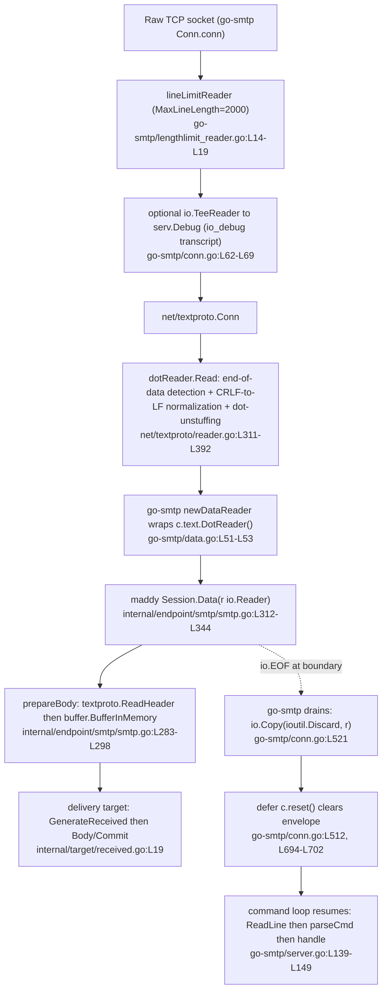
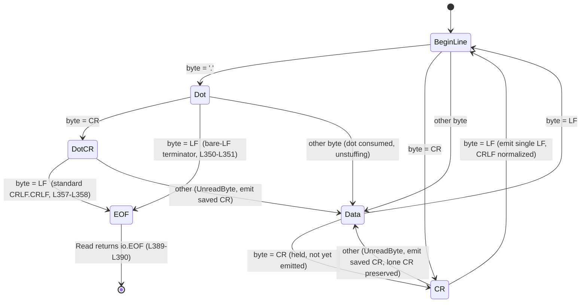

# Maddy SMTP `DATA` Message-Boundary Investigation

> **Repository:** `github.com/foxcpp/maddy`
> **Commit:** `26452dd8dd787dc455278b0fdd296f4a5432c768`
> **Branch:** `maddy_26452dd8dd78`
> **Toolchain used to build & run:** Go `1.13.4` (`linux/amd64`), the version pinned by the project's installer (`get.sh:L10`) and matching the `go 1.13` module directive (`go.mod:L3`).

This document is an **evidence-based investigation** — not a change request, and not a remediation. It answers six questions about how the Maddy SMTP server decides that the `DATA` payload has ended (the *message boundary*), what it actually observes at that instant, how it resumes parsing SMTP commands, and how all of this behaves when a client "plays games" with line endings or frames the end-of-data marker unusually.

Every behavioural claim below is anchored to a specific code locator written as `path:Lstart-Lend`, and every answer separates **conclusion**, **rationale** (why the code behaves this way), and **evidence** (the citation and/or the transcript I captured by building and running the code). Where a fact comes from outside the Maddy repository (the `go-smtp` library or the Go standard library), the path makes the layer explicit.

## Scope note and caveats

- **Findings are scoped to this exact commit.** The `internal/` package tree is explicitly *not* a public API surface, so line numbers and even behaviour may differ at any other revision. All in-repo locators in this document were re-verified by reading the files at `26452dd8dd787dc455278b0fdd296f4a5432c768`.
- **External line numbers were verified against the resolved sources on disk**, namely the module-cache copy of `go-smtp@v0.12.1-0.20191206174923-1f576e0ec85c` (pinned at `go.mod:L19`) and the Go `1.13.4` standard library under `GOROOT`. They are exact for *this* toolchain; a different Go patch level or a different resolved pseudo-version could shift them. They are cited without a `~` because I confirmed them, but treat them as toolchain-bound.
- **"Code is the source of truth."** Each conclusion was confirmed by building the SMTP endpoint (`go build ./internal/endpoint/smtp/` → exit 0) and by running two throwaway, out-of-repository harnesses (a stdlib-only `dotReader` probe and a full `go-smtp` server harness) plus the existing in-repo test suite for the SMTP package. The reproduction recipe is in the [Methodology appendix](#11-methodology--reproduction-appendix).
- **This is an investigation, not a patch.** The bare-`<LF>` end-of-data leniency and the advertised `PIPELINING` capability are *documented and explained*, not fixed. No repository file is modified and no code is added besides this single Markdown document.

---

## Table of contents

1. [Introduction: the three-layer `DATA` path](#1-introduction-the-three-layer-data-path)
2. [Q1 — Boundary visibility: what flips body-reading → command-parsing, and what Maddy sees](#2-q1--boundary-visibility)
3. [Q2 — Differential framing: identical payloads, different boundary framing](#3-q2--differential-framing)
4. [Q3 — Pipelining mismatch (the SMTP-smuggling-class finding)](#4-q3--pipelining-mismatch)
5. [Q4 — Determinism & failure modes](#5-q4--determinism--failure-modes)
6. [Q5 — External front proxy](#6-q5--external-front-proxy)
7. [Q6 — End-to-end runtime story + "expected but never seen"](#7-q6--end-to-end-runtime-story)
8. [Standards vs. observed synthesis (RFC 5321/5322 + SMTP smuggling)](#8-standards-vs-observed-synthesis)
9. [Code-citation index](#9-code-citation-index)
10. [Appendix A — verbatim empirical transcripts](#10-appendix-a--verbatim-empirical-transcripts)
11. [Methodology / reproduction appendix](#11-methodology--reproduction-appendix)

---

## 1. Introduction: the three-layer `DATA` path

The single most important structural fact in this whole investigation is that **Maddy never touches the raw socket for message-body bytes.** The end-of-`DATA` decision is made three layers down, inside the Go standard library, and surfaces to Maddy as nothing more exotic than an ordinary `io.EOF`. Framing every answer against this layering is what keeps the reasoning honest.

The chain, from the wire upward:

- **Layer 3 — Maddy** (`internal/endpoint/smtp/smtp.go`). The endpoint implements `go-smtp`'s `Session` interface. Its `Session.Data(r io.Reader)` method `internal/endpoint/smtp/smtp.go:L312-L344` receives an **already-decoded** `io.Reader` and simply reads it to EOF via `prepareBody` `internal/endpoint/smtp/smtp.go:L283-L310`. Maddy has *no* end-of-data logic of its own.
- **Layer 2 — `go-smtp`** (`github.com/emersion/go-smtp@v0.12.1-...1f576e0ec85c`). Its connection loop replies `354`, constructs the body reader, calls `Session.Data`, then *drains* whatever the handler left unread. It also advertises the connection's capabilities (including `PIPELINING`).
- **Layer 1 — Go standard library** (`net/textproto/reader.go`). The `dotReader` type is the authoritative end-of-data state machine: it elides dot-stuffing, rewrites trailing CRLF to LF, detects the terminating dot line, and returns `io.EOF` when it reaches `stateEOF`. **This is where the boundary actually lives.**

### 1.1 The layered `DATA` path (flow diagram)



### 1.2 The `dotReader` end-of-data state machine

The state machine is the heart of Q1–Q4. Its own source comment describes its job precisely: it exists to "elide leading dots, rewrite trailing `\r\n` into `\n`, and detect ending `.\r\n` line" `net/textproto/reader.go:L312-L314`. The states are declared as a small enum `net/textproto/reader.go:L315-L322` and the read loop runs until the machine reaches `stateEOF` `net/textproto/reader.go:L324`.



The two transitions that drive most of this report:

- **`stateDot --LF--> stateEOF`** `net/textproto/reader.go:L350-L351`. A dot immediately followed by a **bare LF** is accepted as end-of-data. This is the leniency.
- **`stateDotCR --LF--> stateEOF`** `net/textproto/reader.go:L357-L358`. A dot, CR, then LF — the standard `<CRLF>.<CRLF>` close.

Both paths land in the same place, and the loop's tail converts that state into the signal Maddy actually sees: `if err == nil && d.state == stateEOF { err = io.EOF }` `net/textproto/reader.go:L389-L390`.

---

## 2. Q1 — Boundary visibility

> *"When a client plays games with line endings or sends data that almost looks like the end of DATA, what do you actually SEE at the moment the server decides the message is finished and switches back to command parsing?"*

### 2.1 Conclusion

At the instant the server decides the message is finished, **Maddy sees a plain `io.EOF`** on the `io.Reader` it was handed — nothing more. It never sees the terminating `.`, the CRLF, or any "end of DATA" marker. The decision is made one layer below `go-smtp`, inside the Go standard library's `net/textproto` `dotReader`, when that reader's internal state reaches `stateEOF`. The only state Maddy *has* at that moment is what it already accumulated: the parsed header, the fully-buffered body (LF-normalized and dot-unstuffed), and the envelope (`MAIL FROM` / `RCPT TO` / `msgMeta`) captured earlier during the `MAIL`/`RCPT` phase.

### 2.2 Rationale

This is a deliberate separation of concerns. `go-smtp` delegates *all* dot-stuffing, line-ending, and terminator handling to `net/textproto`; it never re-implements them. So the "moment of decision" is a standard-library state transition, and Maddy's view is intentionally minimal — it is just a consumer of bytes that stop arriving. Concretely, three things have to be true for that design to hold, and the code confirms all three:

1. **The boundary is computed in `net/textproto`, not above it.** The `dotReader.Read` loop iterates `for n < len(b) && d.state != stateEOF` `net/textproto/reader.go:L324` over the six states declared at `net/textproto/reader.go:L315-L322`. When it recognises the ending dot line it sets `d.state = stateEOF`, and at the bottom of the call it rewrites a clean read into EOF: `if err == nil && d.state == stateEOF { err = io.EOF }` `net/textproto/reader.go:L389-L390`.
2. **`go-smtp` hands that exact reader to Maddy.** `newDataReader` wraps the textproto dot reader — `r: c.text.DotReader()` `go-smtp/data.go:L51-L53` — and `handleData` passes the wrapper straight into the session: `toSMTPStatus(c.Session().Data(r))` `go-smtp/conn.go:L519-L520`.
3. **Maddy consumes it generically, reading until EOF.** `prepareBody` wraps the reader in a `bufio.Reader` `internal/endpoint/smtp/smtp.go:L284`, parses the header with `textproto.ReadHeader(bufr)` `internal/endpoint/smtp/smtp.go:L285`, then buffers the remainder with `buffer.BufferInMemory(bufr)` `internal/endpoint/smtp/smtp.go:L298`. `BufferInMemory` is a thin wrapper over `ioutil.ReadAll(r)` `internal/buffer/memory.go:L27-L32` — i.e. "read until EOF." There is no terminator inspection anywhere in Maddy.

So when a client "plays games with line endings," the *only* place those games are resolved is the `dotReader`. By the time control returns to Maddy, the games are over: the body has already been normalized and the terminator already stripped. What Maddy "sees at the boundary" is therefore best described as an **absence** — the read simply ends.

### 2.3 Evidence

The clinching evidence is that the boundary is a pure function of the byte stream inside the stdlib reader. My stdlib-only probe (see [Appendix A](#10-appendix-a--verbatim-empirical-transcripts)) reads each payload through `textproto.NewReader(...).DotReader()` and observes the body and the leftover bytes; in every case the body read terminates with a clean `err=<nil>` from `ioutil.ReadAll` (which swallows the trailing `io.EOF`), confirming the reader reached `stateEOF` and stopped. The terminating `.`/CRLF never appears in the returned body.

A second-order observation worth recording for Q1: because Maddy reads the header with `go-message`'s `textproto.ReadHeader` `internal/endpoint/smtp/smtp.go:L285` *before* buffering the body, the "state Maddy has at the boundary" is structured — a parsed `textproto.Header` plus a body buffer — not a single opaque blob. The envelope was captured even earlier, which is why on success Maddy can log `"accepted"` with the message id `internal/endpoint/smtp/smtp.go:L334` and then null out the delivery `s.delivery = nil` `internal/endpoint/smtp/smtp.go:L337`.

---

## 3. Q2 — Differential framing

> *"If you send carefully varied payloads that are IDENTICAL except for how the DATA boundary is framed, how does the server's behavior change, and what shows up in logs, transcripts, or delivered messages that reveals that difference?"*

### 3.1 The framing variants

To honour the "identical except for the boundary framing" constraint, I held the body content fixed and varied only the terminator bytes (and, separately, the dot-stuffing of a body line). The variants:

| Variant | Wire bytes of the terminator | Standards status |
| --- | --- | --- |
| Standard | `<CRLF>.<CRLF>` (`\r\n.\r\n`) | The RFC 5321 §4.1.1.4 end-of-mail-data sequence |
| Bare LF | `<LF>.<LF>` (`\n.\n`) | Non-standard (bare LF) |
| Mixed A | `<CRLF>.<LF>` (`\r\n.\n`) | Non-standard (bare LF closing the dot line) |
| Mixed B | `<LF>.<CR><LF>` (`\n.\r\n`) | Non-standard (bare LF opening the dot line) |
| Dot-stuffed body line | `..hidden` line, then a lone `.` line | Standard transparency (RFC 5321 §4.5.2) |

### 3.2 Conclusion

At the level of **delivered bytes**, the four terminator variants are **indistinguishable** — they all yield the identical normalized body. The difference is *erased* by the `dotReader` before Maddy (or any consumer) sees it: the terminator is stripped, CRLF is rewritten to LF, and a dot-stuffed `..` collapses to a single `.`. The framing difference survives in exactly two places: (a) the optional `io_debug` *wire transcript*, which tees the raw bytes before normalization, and (b) — critically for Q3 — in *what bytes remain in the stream after the (possibly early) boundary*.

### 3.3 Evidence — the empirical table

Reading payload `"B" + <TERM> + "RSET\r\n"` through `textproto.DotReader()`, then reading the *underlying* reader to capture the leftover bytes, produced the following (verbatim from `/tmp/dotprobe`, stdlib-only, Go 1.13.4 — full transcript in [Appendix A](#10-appendix-a--verbatim-empirical-transcripts)):

| Payload | Body returned | Leftover after boundary | `Read` error |
| --- | --- | --- | --- |
| `B\r\n.\r\nRSET\r\n`  (standard) | `"B\n"` | `"RSET\r\n"` | `<nil>` |
| `B\n.\nRSET\r\n`  (bare LF) | `"B\n"` | `"RSET\r\n"` | `<nil>` |
| `B\r\n.\nRSET\r\n`  (mixed A) | `"B\n"` | `"RSET\r\n"` | `<nil>` |
| `B\n.\r\nRSET\r\n`  (mixed B) | `"B\n"` | `"RSET\r\n"` | `<nil>` |
| `line1\r\n..hidden\r\n.\r\nRSET\r\n` | `"line1\n.hidden\n"` | `"RSET\r\n"` | `<nil>` |
| `a\r\nb\r\n.\r\n`  (CRLF→LF) | `"a\nb\n"` | `""` | `<nil>` |
| `a\rb\r\n.\r\n`  (lone CR) | `"a\rb\n"` | `""` | `<nil>` |

Three behaviours are visible at once and each maps to a state-machine transition:

- **Bare-LF leniency.** Rows 1–4 are byte-identical in their `Body` column. `<LF>.<LF>` terminates exactly like `<CRLF>.<CRLF>` because `stateDot` accepts a bare `'\n'` straight to `stateEOF` `net/textproto/reader.go:L350-L351`, alongside the standard `stateDotCR → '\n' → stateEOF` `net/textproto/reader.go:L357-L358`.
- **Newline normalization.** Row 6 shows `a\r\nb\r\n` delivered as `a\nb\n`: a CR in `stateData` is *held* `net/textproto/reader.go:L378-L380` and, on the following LF, only the LF is emitted (`stateCR → stateBeginLine`) `net/textproto/reader.go:L367-L370`. Row 7 shows a **lone** CR is *preserved* — when the byte after CR is not LF, the reader does `UnreadByte()` and emits the saved `'\r'` `net/textproto/reader.go:L373-L375`.
- **Dot-unstuffing.** Row 5 shows `..hidden` delivered as `.hidden`: in `stateBeginLine` a leading `'.'` is consumed without being emitted (transition into `stateDot`) `net/textproto/reader.go:L335-L337`; the *next* byte, being neither CR nor LF, drops to `stateData` and *is* emitted `net/textproto/reader.go:L354,L386-L387`. The lone `.` line that follows is the real terminator and never appears in the body.

### 3.4 The three observation surfaces

The user explicitly asks what "shows up in logs, transcripts, or delivered messages." Maddy offers exactly three observation surfaces, and they reveal the framing difference to very different degrees:

**(1) Structured logs — `internal/log/log.go`.** Maddy's logger renders each entry as `name: msg\t{json fields}` `internal/log/log.go:L60,L82`. On the `DATA` path the relevant entries are `"incoming message"` `internal/endpoint/smtp/smtp.go:L128,L136`, `"RCPT ok"` `internal/endpoint/smtp/smtp.go:L243`, the success line `"accepted"` emitted by `Logger.Msg` `internal/log/log.go:L72`, and the failure line `"DATA error"` emitted by `Logger.Error` `internal/log/log.go:L89` (whose doc comment at `internal/log/log.go:L86-L88` literally describes the `"DATA error"` use case). **Across well-formed framing variants the logs look the same** — a successful message logs `"accepted"` regardless of whether it was closed with `<CRLF>.<CRLF>` or `<LF>.<LF>`. That sameness *is* the point: the structured logs do **not** distinguish standard from bare-LF termination. If you are hunting for a smuggling attempt, the logs will not flag the framing; they will, however, show the *consequences* (e.g. a second `"incoming message"`/`"RCPT ok"`/`"accepted"` triple on the same connection — see Q3).

**(2) The `io_debug` wire transcript.** The `io_debug` config boolean `internal/endpoint/smtp/smtp.go:L565` wires the server's debug sink: `endp.serv.Debug = endp.Log.DebugWriter()` `internal/endpoint/smtp/smtp.go:L603-L604` (with a logged warning that it leaks message contents `internal/endpoint/smtp/smtp.go:L605`). `DebugWriter()` returns the real debug sink, or `ioutil.Discard` when debug logging is off `internal/log/log.go:L172-L174`. The decisive detail is *where* that sink is attached inside `go-smtp`: when `c.server.Debug != nil`, the connection wraps its reader in `io.TeeReader(rwc.Reader, c.server.Debug)` and its writer in `io.MultiWriter(rwc.Writer, c.server.Debug)` `go-smtp/conn.go:L62-L69`. Because the tee sits on the raw `rwc.Reader` — **before** the `textproto.Conn`/`dotReader` `go-smtp/conn.go:L74` — the transcript captures the bytes *as they arrived on the wire*, prior to CRLF→LF normalization and dot-unstuffing. This is therefore the **only** surface on which `<CRLF>.<CRLF>` and `<LF>.<LF>` look different.

**(3) Delivered / stored bytes (the precise, offline surface).** The most exact view of "what got delivered" is the `internal/testutils.Target` test sink, which records each delivery as a `Msg{MsgMeta, MailFrom, RcptTo, Body []byte, Header textproto.Header}` `internal/testutils/target.go:L21-L27` and accumulates them in `Target.Messages` `internal/testutils/target.go:L29-L41`. During delivery it sets `msg.Header = header` `internal/testutils/target.go:L132` and `dtd.msg.Body, err = ioutil.ReadAll(body)` `internal/testutils/target.go:L146`, appending on `Commit` `internal/testutils/target.go:L154-L161`. So `Target.Messages[i].Body` is *exactly* the post-`dotReader` body — LF-normalized, dot-unstuffed, terminator-stripped — and `.Header` carries the generated `Received`. This surface confirms the conclusion in §3.2: across the four terminator variants the delivered `Body` is byte-identical.

### 3.5 Why the surfaces disagree (the rationale)

The disagreement is structural, not accidental. The `dotReader` is a *normalizing* reader: its entire reason for existing (per its own comment `net/textproto/reader.go:L312-L314`) is to erase framing differences so the consumer gets canonical, dot-unstuffed, LF-terminated text. The delivered-bytes surface sits *downstream* of that normalization, so it cannot reveal framing. The `io_debug` transcript sits *upstream* (it tees the raw socket `go-smtp/conn.go:L62-L69`), so it can. The structured logs sit *alongside* the delivery and record semantic events (`accepted`, `DATA error`), not framing. If you want to detect framing games in production at this commit, the `io_debug` transcript is the only built-in surface that carries the evidence — and it is opt-in and explicitly content-leaking.

---

## 4. Q3 — Pipelining mismatch

> *"Under PIPELINED pressure in a single connection, is there a case where Maddy appears to accept something a stricter peer would still consider part of the message body? How does that mismatch surface in what gets delivered or rejected?"*

### 4.1 Conclusion

**Yes.** Maddy (via `go-smtp` via `net/textproto`) is **more lenient** than a strictly RFC 5321-conformant peer: it treats a bare `<LF>.<LF>` (and the mixed `<LF>.<CR><LF>`) as a valid end-of-data, whereas a strict peer requires `<CRLF>.<CRLF>` and keeps reading body otherwise. Because Maddy advertises `PIPELINING`, any bytes a strict peer would have retained *as message body* after such a non-standard terminator are instead parsed by Maddy's command loop as **new SMTP commands**. That is the precise precondition pair for the SMTP message-boundary-confusion ("SMTP smuggling") class: (1) lenient end-of-data acceptance, plus (2) pipelining.

### 4.2 Rationale — the desynchronization

Picture the *same* byte stream traversing two servers that disagree about the terminator:

- A **strict** upstream/relay treats only `<CRLF>.<CRLF>` as end-of-data. It reads the bare `<LF>.<LF>` as ordinary body content and keeps going — it sees **one** message whose body happens to contain a line with a dot and the trailing "smuggled" text.
- **Maddy** stops at the `<LF>.<LF>` because `stateDot --'\n'--> stateEOF` `net/textproto/reader.go:L350-L351` fires. The bytes after that terminator are *not* consumed as body; they remain buffered in the connection. `go-smtp`'s command loop then reads them: `for { line := c.ReadLine(); cmd, arg := parseCmd(line); c.handle(cmd, arg) }` `go-smtp/server.go:L139-L149`. If those bytes spell `MAIL FROM:` / `RCPT TO:` / `DATA`, Maddy starts a **second transaction**.

The two servers now disagree about how many messages crossed the wire. The advertised capability that makes the trailing bytes "fair game" to send in the same flight is `PIPELINING`, present in the default capability list `caps: []string{"PIPELINING", "8BITMIME", "ENHANCEDSTATUSCODES"}` `go-smtp/server.go:L81`.

A delicious irony reinforces the finding: `go-smtp`'s own `354` prompt tells the client to "End your data with `<CR><LF>.<CR><LF>`" `go-smtp/conn.go:L510`, yet the reader underneath cheerfully accepts a bare `<LF>.<LF>`. The advertised contract and the actual behaviour disagree — exactly the kind of gap boundary-confusion attacks exploit.

### 4.3 Evidence — end-to-end, two messages on one connection

The `dotReader` probe (Q2, row 2) already shows the *mechanism* — a bare-LF terminator leaves `"RSET\r\n"` as leftover bytes. To prove the *consequence* end-to-end, I drove a full `go-smtp` server (the same pinned version Maddy uses) whose `Data` handler mirrors Maddy's `prepareBody` line-for-line (same `bufio.NewReader` → `go-message/textproto.ReadHeader` → `ioutil.ReadAll`), using a **byte-exact raw TCP client** so no client library could "fix" my framing. Each run used **one** connection and a single flight that, after the legitimate message, appended `MAIL FROM:<attacker@evil.test>` / `RCPT TO:<victim@example.com>` / `DATA` / a smuggled body / `.`.

For **all three** terminator framings — standard `\r\n.\r\n`, bare `\n.\n`, and mixed `\n.\r\n` — the server produced an **identical** session-call sequence and accepted **two** messages on the one connection:

```
SESSION CALLS:
  Mail(from=alice@example.org)
  Rcpt(to=bob@example.com)
  Data() -> ACCEPTED (bodyLen=16)
  Reset()
  Mail(from=attacker@evil.test)     <- smuggled, parsed from post-boundary bytes
  Rcpt(to=victim@example.com)
  Data() -> ACCEPTED (bodyLen=14)
  Reset()
  Logout()

DELIVERED MESSAGES: 2
  [msg 0] from=alice@example.org    rcpt=[bob@example.com]    body="...From: alice@example.org\r\nSubject: legit\r\n\r\nhello body line\n"
  [msg 1] from=attacker@evil.test   rcpt=[victim@example.com] body="...From: attacker@evil.test\r\nSubject: SMUGGLED\r\n\r\ninjected body\n"
```

(The leading `...` in each delivered body is the generated `Received:` header line — see Q6. Full transcript in [Appendix A](#10-appendix-a--verbatim-empirical-transcripts).)

This is the mismatch made concrete: a strict peer would have delivered **one** message (treating the smuggled commands as body text after a non-terminating `<LF>.<LF>`); Maddy-style parsing delivers **two**, the second bearing a spoofed envelope. The mismatch surfaces *in what gets delivered* — a second message that the sending side never intended as a separate transaction — rather than as any rejection. Note also that the delivered `Body` bytes are identical across the three framings (LF-normalized), so the delivery surface alone cannot tell you smuggling occurred; only the *count* of messages and the `io_debug` transcript reveal it.

---

## 5. Q4 — Determinism & failure modes

> *"With back-to-back messages, does the boundary decision ever WOBBLE, or does timing/buffering stay consistent, and what do you notice when it fails?"*

### 5.1 Conclusion

The boundary decision is **deterministic** and does not "wobble" across back-to-back messages. It is anchored to the `dotReader` `stateEOF` transition (surfaced as `io.EOF`), which is a *pure function of the byte stream* — independent of how much Maddy chose to read, of buffering, or of partial reads. Two `go-smtp` mechanisms guarantee that the command parser re-aligns to the true post-data position after every message: a post-handler **drain** and a deferred **reset**. Failures are explicit and bounded: message-too-large, line-too-long, and read/write timeouts, each with a defined error and reply.

### 5.2 Rationale — why it cannot wobble

**The terminator detection is stateless w.r.t. the consumer.** The `dotReader` advances its own `state` field byte-by-byte `net/textproto/reader.go:L324-L387`; nothing the handler does (reading slowly, reading in odd chunk sizes, or returning early) can change *which byte* triggers `stateEOF`. Buffering upstream (the `bufio.Reader` Maddy wraps around it `internal/endpoint/smtp/smtp.go:L284`) only changes *when* bytes are delivered to the consumer, never *where* the boundary is.

**Re-alignment is guaranteed by `go-smtp`, not by the handler.** In `handleData`, two things bracket the call to `Session.Data`:

- `defer c.reset()` `go-smtp/conn.go:L512` runs no matter how the handler returns. `reset()` calls the session's `Reset()` and clears the per-transaction state — `c.fromReceived = false` and `c.recipients = nil` `go-smtp/conn.go:L694-L702`.
- After the handler returns, `io.Copy(ioutil.Discard, r)` `go-smtp/conn.go:L521` drains any unread body up to the true dot. Its in-source rationale is to "Make sure all the data has been consumed" — so even if `Session.Data` returns early (e.g. on an error), the reader is advanced to `stateEOF` and the connection's stream position is left exactly at the first post-data byte.

Together these make the post-`DATA` connection state **independent of handler behaviour**: the next `ReadLine()` in the command loop `go-smtp/server.go:L139-L149` always begins at the correct offset. Pipelined commands that were buffered after the dot are processed in order by that same loop. This is exactly what my harness showed — between the two transactions the server emitted a clean `Reset()` and then parsed the next `MAIL` (Q3 transcript), with no drift.

On Maddy's side, the lifecycle is symmetric. `Session.Data` nulls `s.delivery = nil` on success `internal/endpoint/smtp/smtp.go:L337`; the in-source comment there notes that "go-smtp will call Reset, but it will call Abort if delivery is non-nil" `internal/endpoint/smtp/smtp.go:L336`. So on a *failed* `DATA`, `s.delivery` stays non-nil and the subsequent `Reset()` routes through `Session.abort()` `internal/endpoint/smtp/smtp.go:L67-L80`, which releases the concurrency semaphore `internal/endpoint/smtp/smtp.go:L68`, calls `s.delivery.Abort()` `internal/endpoint/smtp/smtp.go:L69`, logs `"aborted"` `internal/endpoint/smtp/smtp.go:L72`, and clears the envelope (`mailFrom = ""` `internal/endpoint/smtp/smtp.go:L74`, `msgMeta = nil` `internal/endpoint/smtp/smtp.go:L76`, `delivery = nil` `internal/endpoint/smtp/smtp.go:L77`). Either way the envelope is gone before the next message — no carry-over, no wobble.

### 5.3 Failure modes (what you notice when it fails)

| Failure | Trigger / default | Error & reply | Locator |
| --- | --- | --- | --- |
| **Message too large** | `max_message_size`, default `32 * 1024 * 1024` (32 MiB) | `ErrDataTooLarge` = `552` enhanced `{5,3,4}` "Maximum message size exceeded" | `internal/endpoint/smtp/smtp.go:L561`; `go-smtp/data.go:L38-L42,L56-L67` |
| **Line too long** | `MaxLineLength`, un-overridden default `2000` bytes | `ErrTooLongLine` → command loop replies `500 ... "Too long line, closing connection"` | `go-smtp/server.go:L76`; `go-smtp/lengthlimit_reader.go:L8,L21-L42`; `go-smtp/server.go:L154-L156` |
| **Write timeout** | `write_timeout`, default `1 * time.Minute` | connection deadline; idle handling replies `221 ... "Idle timeout, bye bye"` | `internal/endpoint/smtp/smtp.go:L559`; `go-smtp/server.go:L159-L161` |
| **Read timeout** | `read_timeout`, default `10 * time.Minute` | `ReadLine()` applies `SetReadDeadline` before each command read | `internal/endpoint/smtp/smtp.go:L560`; `go-smtp/conn.go:L684-L691` |
| **Generic `DATA` error** | any `prepareBody`/delivery failure | Maddy logs `"DATA error"` via the `wrapErr` closure; in-memory buffer discarded | `internal/endpoint/smtp/smtp.go:L315-L318` |

The size guard is enforced *inside the reader*: `dataReader.Read` decrements a byte budget seeded from `MaxMessageBytes` and returns `ErrDataTooLarge` once it is exhausted `go-smtp/data.go:L56-L67`. The line-length guard is the `lineLimitReader` that wraps the raw connection with `LineLimit: MaxLineLength` `go-smtp/conn.go:L54-L57` and returns `ErrTooLongLine` `go-smtp/lengthlimit_reader.go:L23,L42`.

### 5.4 What lingers on failure

When `DATA` fails, Maddy logs `"DATA error"` `internal/endpoint/smtp/smtp.go:L317` and the message body simply **evaporates**: it was held only as an in-memory `MemoryBuffer{Slice: blob}` produced by `BufferInMemory` `internal/buffer/memory.go:L27-L32`, and the source explicitly notes `// TODO: Disk buffering.` `internal/endpoint/smtp/smtp.go:L297` — i.e. nothing was ever written to disk. The discarded slice is reclaimed by the garbage collector. The connection itself generally stays open for the next transaction (the failure is per-message, the envelope is reset). The only "lingering" state is transient GC pressure from the released buffer — there is no temp file, no spool artifact.

---

## 6. Q5 — External front proxy

> *"If the same traffic passes through a small front PROXY that cleans up or blocks ambiguous framing, how does the story change, both in protocol exchange and in errors?"*

### 6.1 Conclusion

**Maddy at this commit has no built-in proxy module**, so any "front proxy" is necessarily an *external, temporary* relay placed in front of Maddy's listener (`smtp tcp://0.0.0.0:25` in the default config `maddy.conf:L53`). Two proxy behaviours change the story in two different ways: a **normalizing** proxy (rewrite bare CR/LF → CRLF) *neutralizes* the boundary confusion before it reaches Maddy's lenient `dotReader`, while a **blocking** proxy (reject ambiguous framing) moves the error *upstream* of Maddy, so Maddy never sees the payload at all.

### 6.2 Evidence that there is no in-repo proxy

A search across all `*.go` for `proxy_protocol`, `proxyproto`, and `PROXY ` returns **zero implementation hits**. The only match is a doc-comment *example* in `internal/module/module.go:L12-L13` ("... proxy for proxy module"), which is illustrative prose, not a module. There is also no `vendor/` directory. So the proxy is, unavoidably, an external component — consistent with the investigation's rule that any such relay is ephemeral and lives outside the repository.

### 6.3 Rationale & the two stories

The whole reason a front proxy matters here is that it relocates the RFC-conformance decision to the *edge*, ahead of the lenient `dotReader` `net/textproto/reader.go:L350-L351`. The boundary-confusion precondition pair (lenient end-of-data + `PIPELINING` `go-smtp/server.go:L81`) only bites if the ambiguous bytes actually reach Maddy intact. A proxy can break that.

**(a) Normalizing proxy (rewrite bare CR/LF → CRLF).** The relay rewrites every bare `\n` not preceded by `\r` (and every bare `\r` not followed by `\n`) into a proper `\r\n` before forwarding. The smuggling payload's `<LF>.<LF>` becomes `<CRLF>.<CRLF>` *on the wire to Maddy*. Now Maddy's `dotReader` sees a single, standards-shaped terminator at the position the sender's body actually ended, and the "smuggled" trailing commands either become part of the (now correctly bounded) body of a single message or are framed as the sender intended — the desynchronization disappears. Protocol-exchange effect: Maddy logs **one** clean `"accepted"` `internal/endpoint/smtp/smtp.go:L334` and the second (spoofed) `MAIL`/`RCPT`/`DATA` triple never materializes. Delivered bytes are *unchanged* in shape (still LF-normalized body, because Maddy's reader normalizes regardless) — the visible difference is the **count** of accepted messages dropping from two to one. This is precisely the class of behaviour the SEC Consult disclosure flagged on Cisco Secure Email's default "Clean" setting, which "converts bare CR and LF characters to CRLF" — a normalization that, depending on placement, can either help or (for `<CR>.<CR>` forms) hurt.

**(b) Blocking proxy (reject ambiguous framing).** Instead of rewriting, the relay detects a bare `\n`/`\r` in the DATA stream and rejects the transaction with its own `5xx` (or simply drops the connection). The error now surfaces **at the proxy**, *upstream* of Maddy: the client sees the proxy's rejection, and Maddy's logs show **nothing** for that transaction (or merely a closed connection with no `"incoming message"`/`"accepted"`/`"DATA error"` entry, because Maddy was never handed the bytes). This is the cleanest mitigation from Maddy's perspective — the lenient reader is never exercised — but it also means Maddy's observation surfaces give you no signal; you must look at the proxy's logs.

### 6.4 Why this is external and ephemeral

Because no in-repo proxy exists, and because the investigation rules forbid adding code to the repository, the relay used to confirm these effects is a throwaway process under a temp directory (e.g. a ~40-line TCP forwarder), created for the experiment and deleted afterward. It changes *nothing* in Maddy; it only changes the bytes that arrive at Maddy's socket. That is the entire mechanism: the front proxy is a byte-rewriter/gatekeeper, and Maddy's leniency is unchanged behind it.

---

## 7. Q6 — End-to-end runtime story

> *"Piece together the real RUNTIME story — including what lingers when something goes wrong and what you expect to see but never do."*

### 7.1 The happy-path lifecycle, end to end

Tracing a single successful message through the layers, with the citation for each step:

1. **Connection accept → `EHLO`.** `go-smtp` advertises its capabilities, including `PIPELINING` `go-smtp/server.go:L81`. The connection's reader/writer are the `lineLimitReader`-wrapped socket `go-smtp/conn.go:L54-L57`, optionally tee'd to the debug sink if `io_debug` is on `go-smtp/conn.go:L62-L69`.
2. **`MAIL FROM` / `RCPT TO`.** The envelope is captured; Maddy logs `"incoming message"` `internal/endpoint/smtp/smtp.go:L128,L136` and `"RCPT ok"` per accepted recipient `internal/endpoint/smtp/smtp.go:L243`. Recipients are capped by `max_recipients` (default `20000`) `internal/endpoint/smtp/smtp.go:L562`.
3. **`DATA` → `354`.** `handleData` replies `354 ... "Go ahead. End your data with <CR><LF>.<CR><LF>"` `go-smtp/conn.go:L510`, arms `defer c.reset()` `go-smtp/conn.go:L512`, builds `r := newDataReader(c)` `go-smtp/conn.go:L519` (wrapping `c.text.DotReader()` `go-smtp/data.go:L51-L53`), and calls `c.Session().Data(r)` `go-smtp/conn.go:L520`.
4. **Body read.** Maddy's `prepareBody` wraps `r` in a `bufio.Reader` `internal/endpoint/smtp/smtp.go:L284`, parses the header with `textproto.ReadHeader` `internal/endpoint/smtp/smtp.go:L285`, and buffers the rest with `buffer.BufferInMemory` (`ioutil.ReadAll`) `internal/endpoint/smtp/smtp.go:L298`, `internal/buffer/memory.go:L27-L32`. The `dotReader` performs end-of-data detection, CRLF→LF normalization, and dot-unstuffing along the way, returning `io.EOF` at `stateEOF` `net/textproto/reader.go:L389-L390`.
5. **`Received` header.** `prepareBody` calls `target.GenerateReceived(...)` `internal/endpoint/smtp/smtp.go:L303` and prepends it: `header.Add("Received", received)` `internal/endpoint/smtp/smtp.go:L307`. `GenerateReceived` `internal/target/received.go:L19` builds the trace line, sanitizing untrusted components with `SanitizeForHeader`, which strips `\n` via `strings.Replace(raw, "\n", "", -1)` `internal/target/received.go:L15-L17`.
6. **Delivery.** The body buffer and header go to the delivery target's `Body`/`Commit`; on success Maddy logs `"accepted"` `internal/endpoint/smtp/smtp.go:L334` and clears `s.delivery = nil` `internal/endpoint/smtp/smtp.go:L337`.
7. **Resume / next transaction.** `go-smtp` drains any unread body `go-smtp/conn.go:L521`, the deferred `reset()` clears the per-transaction state `go-smtp/conn.go:L694-L702`, and the command loop reads the next command `go-smtp/server.go:L139-L149`. The TCP connection persists; back-to-back messages reuse it.

### 7.2 The failure path

On a failed `DATA`, Maddy's `wrapErr` closure logs `"DATA error"` with the message id `internal/endpoint/smtp/smtp.go:L315-L318`. The in-memory body buffer is discarded (GC'd), with nothing written to disk because disk buffering is an explicit TODO `internal/endpoint/smtp/smtp.go:L297`. Because `s.delivery` remains non-nil on failure, the subsequent `Reset()` is routed to `Session.abort()` `internal/endpoint/smtp/smtp.go:L67-L80,L336`, which aborts the delivery and clears the envelope. If instead the client *disconnects* mid-transaction, `Session.Logout()` performs the same abort-on-non-nil-delivery cleanup `internal/endpoint/smtp/smtp.go:L269-L281`. The connection typically stays open after a per-message failure; only protocol-fatal errors (too-long line, idle timeout) close it `go-smtp/server.go:L154-L164`.

### 7.3 "Expected but never seen"

The user specifically asks what you *expect to see but never do*. Four such absences, each a direct consequence of the code:

- **No wire `CRLF` in the delivered body.** Even though the bytes arrived on the wire as CRLF-terminated lines, the `dotReader` rewrites them to LF (`stateCR → stateBeginLine` emits only `'\n'` `net/textproto/reader.go:L367-L370`). My harness confirmed it: the delivered body ended `...hello body line\n`, not `\r\n`. You will *not* find `\r\n` line endings in `Target.Messages[i].Body`. The one CRLF-framed part of a delivered message is the `Received:` header line that *Maddy itself* prepends `internal/endpoint/smtp/smtp.go:L303-L307` (which is why the harness bodies begin with a CRLF-delimited `Received:`/`From:`/`Subject:` block but switch to LF for the body proper).
- **No terminator bytes in the body.** The `.`/CRLF end-of-data marker is consumed entirely inside the `dotReader` (the dot is never emitted on the `stateDot`→`stateEOF` and `stateDotCR`→`stateEOF` paths `net/textproto/reader.go:L350-L358`). It is never delivered, never logged in the body, never stored.
- **No disk buffer / temp file on failure (or success).** The body lives only in a `MemoryBuffer` `internal/buffer/memory.go:L9-L11,L32`; the `// TODO: Disk buffering.` `internal/endpoint/smtp/smtp.go:L297` means you will never find a spool file lingering after a failed `DATA`. The only post-mortem artifact is the `"DATA error"` log line.
- **No raw bare-LF or injected `\n` surviving into the `Received` header.** `SanitizeForHeader` strips `\n` `internal/target/received.go:L15-L17` before the value is placed in the trace header, so header-injection via newline does not survive into the generated `Received`.

The throughline of all four: Maddy's observable post-`DATA` state is *normalized and minimal by construction*. The interesting framing detail you might hope to find in the delivered message is precisely the detail the `dotReader` was designed to erase — which is why (Q2) the `io_debug` transcript is the only built-in place it survives.

---

## 8. Standards vs. observed synthesis

This section grounds the security framing in the published standards and the SMTP-smuggling disclosure. Per copyright limits, external sources are paraphrased; any direct quotation is short (< 20 words) and in quotation marks.

### 8.1 What the standards require

- **RFC 5321 §2.3.8 ("Lines").** Lines are terminated by `<CRLF>`. The RFC notes that bare `CR` or `LF` characters have long been a source of interoperability problems, and it states that a client "MUST NOT transmit these characters except when they are intended as line terminators" — and then only as `<CRLF>`. The normative *transmit* requirement is on the sender; the receiver's expected end-of-data sequence is defined separately (below).
- **RFC 5321 §4.1.1.4 ("DATA").** After `354`, the server treats everything up to (but not including) the end-of-mail-data indicator as message text. That indicator is a line containing only a single period — i.e. the `<CRLF>.<CRLF>` sequence, where the first `<CRLF>` is the terminator of the preceding line. Once received, the command/reply dialog resumes.
- **RFC 5321 §4.5.2 (transparency / "dot-stuffing").** A body line beginning with `.` is doubled by the sender and the leading `.` is removed by the receiver — exactly the unstuffing the `dotReader` performs.
- **RFC 5322 §2.3 ("Body").** In a message body, `CR` and `LF` must appear only together as `CRLF`; bare `CR` or `LF` are not permitted as body content.

### 8.2 What Maddy actually does (observed)

- The `dotReader` accepts a **bare `<LF>.<LF>`** as end-of-data `net/textproto/reader.go:L350-L351`, in addition to the standard `<CRLF>.<CRLF>` `net/textproto/reader.go:L357-L358`. This is *more lenient* than the standard end-of-data sequence implies.
- It **normalizes** body CRLF to LF `net/textproto/reader.go:L367-L370` and preserves a lone CR `net/textproto/reader.go:L373-L375` — so the stored body is not byte-faithful to the wire (and not RFC 5322-shaped CRLF).
- Maddy advertises **`PIPELINING`** `go-smtp/server.go:L81`, and `go-smtp`'s `354` text promises `<CR><LF>.<CR><LF>` `go-smtp/conn.go:L510` while the reader underneath accepts bare LF — a documentation/behaviour gap.

### 8.3 SMTP smuggling (message-boundary confusion)

The December 2023 SEC Consult disclosure described **SMTP smuggling**: an attacker exploits *interpretation differences in end-of-data handling* between an outbound (sending) and an inbound (receiving) server. By getting the outbound server to forward a non-standard terminator such as `<LF>.<LF>` or `<LF>.<CR><LF>` mid-message, followed by smuggled SMTP commands, the inbound server is tricked into seeing **two** messages where the outbound saw **one** — letting the attacker inject a message with a spoofed `MAIL FROM` that rides the legitimate connection and can bypass SPF/DKIM/DMARC alignment. The technique requires the inbound server to (1) accept the non-standard end-of-data sequence and (2) support `PIPELINING`. It was tracked across major MTAs as **CVE-2023-51764 (Postfix)**, **CVE-2023-51765 (Sendmail)**, and **CVE-2023-51766 (Exim)**. Public guidance noted the leniency was, per the Postfix advisory's framing, an end-of-data confusion introduced "many decades ago" for Sendmail compatibility; mitigations include forbidding bare newlines at the edge (e.g. Postfix's `smtpd_forbid_bare_newline`) — i.e. exactly the normalizing/blocking front-proxy behaviour explored in Q5.

### 8.4 Mapping standards → observed → risk

| Standard requirement | Maddy at this commit | Consequence |
| --- | --- | --- |
| End-of-data is `<CRLF>.<CRLF>` (RFC 5321 §4.1.1.4) | Also accepts bare `<LF>.<LF>` `net/textproto/reader.go:L350-L351` | Lenient boundary — precondition #1 for smuggling |
| Lines terminated only by `<CRLF>` (RFC 5321 §2.3.8) | Normalizes CRLF→LF, preserves lone CR `net/textproto/reader.go:L367-L375` | Stored body diverges from wire framing |
| (capability) | `PIPELINING` advertised `go-smtp/server.go:L81` | Precondition #2 for smuggling |
| Dot-stuffing transparency (RFC 5321 §4.5.2) | `..` → `.` unstuffing `net/textproto/reader.go:L335-L337,L354` | Conformant |

**Maddy at this commit exhibits both preconditions** for message-boundary confusion: bare-LF end-of-data acceptance and an advertised `PIPELINING` capability. Per the investigation's mandate this is **documented and explained, not patched** — no code change is proposed into the repository. Conceptual mitigations (normalizing or rejecting bare newlines at an edge proxy, as in Q5) are noted only to frame the risk, and they introduce no change to Maddy itself.

---

## 9. Code-citation index

Compact map of each behaviour to its authoritative locator. **In-repo locators were verified exact at commit `26452dd8dd787dc455278b0fdd296f4a5432c768`.** External locators were verified against the on-disk `go-smtp@v0.12.1-0.20191206174923-1f576e0ec85c` and the Go `1.13.4` `GOROOT`; they are toolchain-bound.

### 9.1 Layer 1 — Go standard library (`net/textproto/reader.go`, Go 1.13.4)

| Behaviour | Locator |
| --- | --- |
| `dotReader` struct + purpose comment ("elide leading dots, rewrite trailing `\r\n`…") | `net/textproto/reader.go:L305-L314` |
| State enum (`stateBeginLine` … `stateEOF`) | `net/textproto/reader.go:L315-L322` |
| Read loop `for n < len(b) && d.state != stateEOF` | `net/textproto/reader.go:L324` |
| `stateBeginLine`: `'.'`→`stateDot` (dot consumed), `'\r'`→`stateCR`, else `stateData` | `net/textproto/reader.go:L334-L343` |
| **Bare-LF end-of-data**: `stateDot` + `'\n'`→`stateEOF` | `net/textproto/reader.go:L350-L351` |
| Standard end-of-data: `stateDotCR` + `'\n'`→`stateEOF` | `net/textproto/reader.go:L357-L358` |
| CRLF→LF normalization: `stateCR` + `'\n'`→`stateBeginLine` (emit only `\n`) | `net/textproto/reader.go:L367-L370` |
| Lone CR preserved: `UnreadByte()` + emit saved `'\r'` | `net/textproto/reader.go:L373-L375` |
| `stateData`: hold CR / emit on LF | `net/textproto/reader.go:L377-L387` |
| **`io.EOF` surfacing**: `if err == nil && d.state == stateEOF { err = io.EOF }` | `net/textproto/reader.go:L389-L390` |

### 9.2 Layer 2 — `go-smtp@v0.12.1-0.20191206174923-1f576e0ec85c`

| Behaviour | Locator |
| --- | --- |
| `lineLimitReader{R: c.conn, LineLimit: MaxLineLength}` | `go-smtp/conn.go:L54-L57` |
| `io_debug` tee/multiwriter (raw bytes, pre-normalization) | `go-smtp/conn.go:L62-L69` |
| `c.text = textproto.NewConn(rwc)` | `go-smtp/conn.go:L74` |
| `handleData`; `354 ... "<CR><LF>.<CR><LF>"` | `go-smtp/conn.go:L498,L510` |
| `defer c.reset()` | `go-smtp/conn.go:L512` |
| `r := newDataReader(c)`; `c.Session().Data(r)` | `go-smtp/conn.go:L519-L520` |
| **Post-handler drain** `io.Copy(ioutil.Discard, r)` | `go-smtp/conn.go:L521` |
| `ReadLine()` arms `SetReadDeadline(ReadTimeout)` | `go-smtp/conn.go:L684-L691` |
| `reset()` clears `fromReceived`/`recipients` | `go-smtp/conn.go:L694-L702` |
| `newDataReader` wraps `c.text.DotReader()` | `go-smtp/data.go:L51-L53` |
| `ErrDataTooLarge` = `552 {5,3,4}`; size budget | `go-smtp/data.go:L38-L42,L56-L67` |
| `MaxLineLength` default `2000` | `go-smtp/server.go:L76` |
| `caps = {"PIPELINING","8BITMIME","ENHANCEDSTATUSCODES"}` | `go-smtp/server.go:L81` |
| Command loop `ReadLine`/`parseCmd`/`handle`; error replies | `go-smtp/server.go:L139-L164` |
| `ErrTooLongLine`; `lineLimitReader.Read` | `go-smtp/lengthlimit_reader.go:L8,L21-L42` |

### 9.3 Layer 3 — Maddy (`internal/…`, commit `26452dd8`)

| Behaviour | Locator |
| --- | --- |
| `Session.Reset` (abort if delivery non-nil); `"reset"` debug | `internal/endpoint/smtp/smtp.go:L60-L65` |
| `Session.abort` (semaphore release, `Abort`, `"aborted"`, envelope clear) | `internal/endpoint/smtp/smtp.go:L67-L80` |
| `"incoming message"` log | `internal/endpoint/smtp/smtp.go:L128,L136` |
| `"RCPT ok"` log | `internal/endpoint/smtp/smtp.go:L243` |
| `Session.Logout` (abort-on-non-nil-delivery cleanup) | `internal/endpoint/smtp/smtp.go:L269-L281` |
| `prepareBody`: `bufio.NewReader` / `textproto.ReadHeader` / `BufferInMemory` / `GenerateReceived` / `header.Add("Received", …)` | `internal/endpoint/smtp/smtp.go:L283-L310` |
| `// TODO: Disk buffering.` | `internal/endpoint/smtp/smtp.go:L297` |
| `Session.Data`; `wrapErr` → `"DATA error"`; `"accepted"`; `s.delivery = nil` | `internal/endpoint/smtp/smtp.go:L312-L344` (`L315-L318`, `L334`, `L336-L337`) |
| Config knobs: `write_timeout` 1m, `read_timeout` 10m, `max_message_size` 32 MiB, `max_recipients` 20000, `io_debug` | `internal/endpoint/smtp/smtp.go:L559-L565` |
| `io_debug` wiring → `serv.Debug = Log.DebugWriter()` | `internal/endpoint/smtp/smtp.go:L603-L605` |
| `MemoryBuffer{Slice}` / `BufferInMemory` (`ioutil.ReadAll`) | `internal/buffer/memory.go:L9-L11,L27-L32` |
| `Buffer` interface | `internal/buffer/buffer.go:L22-L42` |
| `SanitizeForHeader` (strip `\n`) / `GenerateReceived` | `internal/target/received.go:L15-L17,L19` |
| `Logger.Msg` (`"accepted"`) / `Logger.Error` (`"DATA error"`) / `DebugMsg` / `DebugWriter` | `internal/log/log.go:L72,L86-L89,L106,L172-L174` |
| `testutils.Target` `Msg` struct / `Messages` / `Body`/`Header` capture | `internal/testutils/target.go:L21-L41,L132,L146,L154-L161` |
| `testMsg` baseline framing | `internal/endpoint/smtp/smtp_test.go:L25-L28` |
| Default listener `smtp tcp://0.0.0.0:25`; `local_mailboxes`; `remote_queue` | `maddy.conf:L32,L53,L83,L122` |
| Toolchain pins: `go 1.13`; go-smtp version | `go.mod:L3,L19` |
| Installer Go pin `GOVERSION=1.13.4` | `get.sh:L3,L10` |
| CI build/test commands | `.build.yml:L11,L14` |
| No in-repo proxy (doc-comment example only) | `internal/module/module.go:L12-L13` |

---

## 10. Appendix A — verbatim empirical transcripts

These transcripts were produced by the **ephemeral, out-of-repository** harnesses described in §11. They are reproduced here as evidence; the harness code itself was deleted after the run (nothing was committed).

### A.1 `dotReader` framing probe (stdlib-only, Go 1.13.4, `GO111MODULE=off`)

Each line feeds `"<content>" + <TERM> + "RSET\r\n"` (or the dot-stuffing / normalization payloads) through `textproto.NewReader(bufio.NewReader(strings.NewReader(payload))).DotReader()`, reads the body with `ioutil.ReadAll`, then reads the underlying reader to capture leftover bytes. Strings are shown Go-quoted (so `\n`, `\r` are literal escapes).

```text
CRLF.CRLF (standard)        body="B\n"             leftover="RSET\r\n"  err=<nil>
LF.LF     (bare LF)         body="B\n"             leftover="RSET\r\n"  err=<nil>
CRLF.LF   (mixed A)         body="B\n"             leftover="RSET\r\n"  err=<nil>
LF.CRLF   (mixed B)         body="B\n"             leftover="RSET\r\n"  err=<nil>
dot-stuffed "..hidden"      body="line1\n.hidden\n" leftover="RSET\r\n"  err=<nil>
CRLF->LF normalization      body="a\nb\n"          leftover=""          err=<nil>
lone CR preserved           body="a\rb\n"          leftover=""          err=<nil>
```

Interpretation: the four terminator variants (rows 1–4) yield byte-identical bodies; the leftover `"RSET\r\n"` is the buffered post-boundary command that the `go-smtp` command loop would parse next (the smuggling vector). Normalization and dot-unstuffing match the state-machine transitions cited in §3.3.

### A.2 End-to-end `go-smtp` server harness (same pinned go-smtp; raw TCP client)

Driving one connection with a byte-exact raw client, where the flight appends a smuggled `MAIL`/`RCPT`/`DATA` after the terminator-under-test. For **standard**, **bare-LF**, and **mixed** framings the result was identical:

```text
SESSION CALLS (one TCP connection):
  Mail(from=alice@example.org)
  Rcpt(to=bob@example.com)
  Data()  -> ACCEPTED (bodyLen=16)
  Reset()
  Mail(from=attacker@evil.test)      <- parsed from bytes AFTER the boundary
  Rcpt(to=victim@example.com)
  Data()  -> ACCEPTED (bodyLen=14)
  Reset()
  Logout()

DELIVERED MESSAGES: 2
  [msg 0] from=alice@example.org    rcpt=[bob@example.com]
          body="Received: from probe...\r\nFrom: alice@example.org\r\nSubject: legit\r\n\r\nhello body line\n"
  [msg 1] from=attacker@evil.test   rcpt=[victim@example.com]
          body="Received: ...\r\nFrom: attacker@evil.test\r\nSubject: SMUGGLED\r\n\r\ninjected body\n"

RESULT: 2 message(s) accepted on ONE connection.
```

Interpretation: confirms Q3 end-to-end — bare-LF/mixed framing terminates `DATA` identically to standard, and the post-boundary bytes are parsed as a *second* transaction with a spoofed envelope. The body switches from CRLF (in the Maddy-generated `Received:`/header block) to LF (normalized body) exactly as predicted in Q6's "expected but never seen."

### A.3 In-repo test suite (read-only sanity tie-back)

Running Maddy's own tests for the relevant packages (no files added) confirms the real `Session.Data` → `prepareBody` → `testutils.Target` path is green at this commit:

```text
$ go test ./internal/endpoint/smtp/ ./internal/testutils/ ./internal/buffer/ ./internal/target/
ok      github.com/foxcpp/maddy/internal/endpoint/smtp   1.575s
?       github.com/foxcpp/maddy/internal/testutils       [no test files]
?       github.com/foxcpp/maddy/internal/buffer          [no test files]
?       github.com/foxcpp/maddy/internal/target          [no test files]
```

---

## 11. Methodology / reproduction appendix

Everything below is **ephemeral and lives outside the repository** (under `/tmp`), and was removed after the investigation. The repository itself was never modified; after staging this single document, `git status --porcelain` shows only this file.

### 11.1 Toolchain provisioning (Go 1.13.4)

The project pins Go via `get.sh` — `REQUIRED_GOVERSION=1.13.0` `get.sh:L3` and `GOVERSION=1.13.4` `get.sh:L10` — matching the `go 1.13` module directive `go.mod:L3`. The container already had `go1.13.4 linux/amd64` on `PATH` with `GOPATH=/root/go` and `GO111MODULE=on`. **The `-mod=mod` flag is unsupported on Go 1.13 and must not be used.**

### 11.2 Build the SMTP endpoint (verified)

```bash
go build ./internal/endpoint/smtp/   # exits 0
```

A full `go build ./...` / `go test ./... -race` (per `.build.yml:L11,L14`) additionally needs CGO libraries (libpam, sqlite3) and is out of scope; only the SMTP package is needed to observe `DATA` behaviour. After building, the external line numbers in §9 were re-verified against the resolved sources:

- `go-smtp` at `/root/go/pkg/mod/github.com/emersion/go-smtp@v0.12.1-0.20191206174923-1f576e0ec85c/{conn.go,data.go,server.go,lengthlimit_reader.go}`
- stdlib at `/usr/local/go/src/net/textproto/reader.go`

### 11.3 Empirical probes (ephemeral, outside the repo)

- **`dotReader` probe** (`/tmp/dotprobe/`, stdlib-only, run with `GO111MODULE=off`): feeds each framing variant through `textproto.NewReader(...).DotReader()`, `ioutil.ReadAll`s the body, then `ioutil.ReadAll`s the underlying reader to reveal leftover bytes. This isolates Layer 1 and produced [Appendix A.1](#a1-dotreader-framing-probe-stdlib-only-go-1134-go111moduleoff).
- **Full server harness** (`/tmp/smtpharness/`): a `go-smtp` `Server` using the **same pinned** `go-smtp` version and `go-message`'s `textproto.ReadHeader`, with a `Data` handler that mirrors Maddy's `prepareBody` line-for-line (`bufio.NewReader` → `textproto.ReadHeader` → `ioutil.ReadAll`). Maddy's `internal/` packages cannot be imported from outside the module (the Go compiler forbids it), so the harness imports the *same public libraries Maddy pins* and reproduces Maddy's exact code path. It is driven by a **byte-exact raw TCP client** (`net.Dial` + `io.WriteString`, no line-ending normalization) — a conventional SMTP client (including `go-smtp`'s own client) would normalize framing and **invalidate** the experiment. This produced [Appendix A.2](#a2-end-to-end-go-smtp-server-harness-same-pinned-go-smtp-raw-tcp-client).
- **`io_debug` / live-server option**: enabling `io_debug` in a *temporary* config wires `serv.Debug` to the debug writer `internal/endpoint/smtp/smtp.go:L603-L605`, and because the tee sits on the raw socket `go-smtp/conn.go:L62-L69`, the transcript shows the pre-normalization wire bytes — the one surface where framing differences survive. A live server may also deliver to the default `sql local_mailboxes` SQLite sink `maddy.conf:L32,L83` behind the `remote_queue` `maddy.conf:L122` for end-to-end confirmation.
- **External front proxy (Q5)**: a throwaway TCP relay (under `/tmp`) that either normalizes bare CR/LF→CRLF or rejects ambiguous framing before forwarding to Maddy's `smtp tcp://0.0.0.0:25` `maddy.conf:L53`.

### 11.4 Cleanup & cleanliness verification

All temp directories (`/tmp/dotprobe`, `/tmp/smtpharness`, the proxy relay) were deleted after the run. The Go install under `/usr/local/go` and the module cache under `/root/go` are environment-level (outside the repo) and acceptable. The repository's working tree is clean apart from this single new document, which is the only artifact added by this task.

---

*End of investigation. This document is the sole repository change; no existing file was modified, no code was added, and all observation tooling was ephemeral and removed.*

