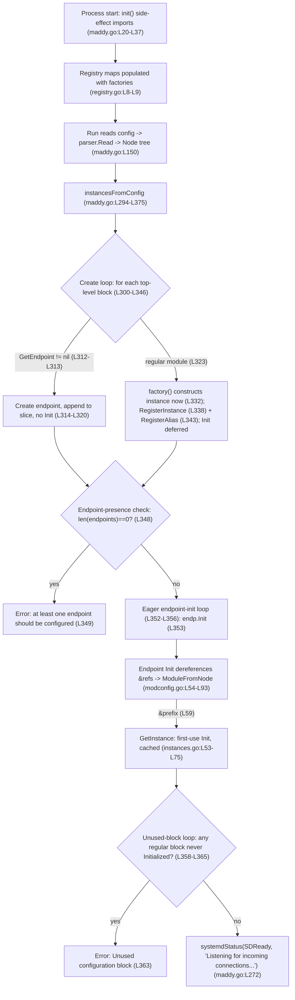

# How Maddy's Module System Assembles at Server Startup (mixed SMTP + IMAP)

This document answers five developer-onboarding questions about how the [Maddy](https://github.com/foxcpp/maddy) mail server wires its module system together **when the server starts**, with special attention to configurations that mix `smtp` and `imap` endpoints that share a common backing instance. The investigation follows a **run-first** methodology: the canonical binary was built from this exact checkout and exercised through its real entry point (`cmd/maddy`), and the log output shown throughout was captured from those runs. Behavior that a log line cannot show by itself (interface contracts, registry internals, the create/initialize loops) is grounded in a `file:line` anchor valid at branch `maddy_26452dd8dd78`, HEAD `26452dd`.

**Provenance labels (read these first).** Not every claim can be — or should be — proven by a log line. Registration order, interface shapes, and loop structure are facts of the *source*; the "why" behind a design is *reasoning*. So each substantive claim is tagged with exactly one of:

- **[Observed at runtime]** — demonstrated by captured daemon or client output shown *next to* the claim.
- **[Observed from source]** — established by reading the cited source at the given `file:line`; the behavior is structural and is not, by itself, printed at runtime.
- **[Inferred rationale]** — a reasoned "why" that explains the observed/source facts but is not itself printed; labeled so it is never mistaken for a runtime observation.

A short **Observed/Inferred summary** at the very end restates which parts of each of the five answers rest on which kind of evidence.

> **Note on the observation log format.** Maddy's logger prints each record as `<message><TAB><structured-context>`. When a record carries no structured context the line therefore **ends with a literal TAB**; when it carries JSON context the TAB sits **between the message and the `{...}`**. The captured blocks below preserve these tabs verbatim — do not "clean them up".

---

## Build & environment

### Canonical reproduction harness [Observed at runtime]

All observation ran inside the maintainer-provided container image, with the repository mounted **read-only** (so the investigation could not modify it) and every write directed to a scratch directory **outside** the repository. The exact outer invocation was:

```
docker run --rm \
  -v <maddy-checkout>:/src:ro \
  -v /tmp/maddy-capture:/work \
  -w /src \
  ghcr.io/scaleapi/swe-atlas:swe_atlas_QnA_foxcpp_maddy_1.0 \
  -c 'bash /work/run_default.sh'
```

- `-v <maddy-checkout>:/src:ro` mounts the checkout **read-only** at `/src`; any write attempt fails, so the repository cannot be altered by any run.
- `-v /tmp/maddy-capture:/work` mounts a directory **outside** the repository that holds the temporary observation scripts and receives their captured output.
- `-w /src` sets the working directory to the checkout root; the image entrypoint is `/bin/bash`, so commands are passed with `-c`.
- Default (bridge) networking is used unless stated otherwise. **The network mode is load-bearing for one check** — the same run under `--network none` changes an observed value; this divergence is shown and explained under Q4 as **Condition 2b**.

### Environment versions [Observed at runtime]

```
### go version
go version go1.18.10 linux/amd64
### gcc --version (first line)
gcc (Debian 10.2.1-6) 10.2.1 20210110
### baked source revision (/app)
26452dd8dd787dc455278b0fdd296f4a5432c768
```

The project declares its Go **target** as `go 1.13` (`go.mod:L3`); the container ships Go **1.18.10**, the maintainer-provided toolchain used for the build here. The document makes **no** claim about a specific maximum patch release — only the declared target (`go.mod:L3`) and the observed container toolchain are stated. A C compiler is required because the SQLite driver `github.com/mattn/go-sqlite3 v1.11.0` (`go.mod:L26`) is cgo-based; the container's `gcc 10.2.1` satisfies it.

### Build command and output [Observed at runtime]

The binary was built non-mutatingly — `-mod=readonly` forbids any change to `go.mod`/`go.sum`, and `GOPROXY=off` forbids network fetches (the container's module cache is warm):

```
CGO_ENABLED=1 GOPROXY=off go build -mod=readonly -o /tmp/maddy-bin ./cmd/maddy
```

Exit code `0`. The **only** diagnostic emitted is the well-known SQLite amalgamation warning (a warning, not an error), which is expected and harmless:

```
# github.com/mattn/go-sqlite3
sqlite3-binding.c: In function 'sqlite3SelectNew':
sqlite3-binding.c:125322:10: warning: function may return address of local variable [-Wreturn-local-addr]
125322 |   return pNew;
       |          ^~~~
sqlite3-binding.c:125282:10: note: declared here
125282 |   Select standin;
       |          ^~~~~~~
```

### Version banner [Observed at runtime]

A default source-tree build carries no VCS version stamp, so the `Version` default string (`maddy.go:L41`, `Version = "unknown (built from source tree)"`) is what `BuildInfo()` (`maddy.go:L89`) returns and `maddy.go:L126` (`fmt.Println("maddy", BuildInfo())`) prints:

```
$ /tmp/maddy-bin -v
maddy unknown (built from source tree)
```

This is the canonical default-build result; label it as such — a release build with a VCS stamp would print a version string instead.

### The observation lever is `-debug` [Observed from source]

The `-debug` flag is registered at `maddy.go:L104` (`flag.BoolVar(&log.DefaultLogger.Debug, "debug", false, "enable debug logging early")`). It is what surfaces the `reference &...` / `new module ...` resolution lines (`internal/config/module/modconfig.go:L68,L70`) and the pipeline's `initializing state for ...` line (`internal/msgpipeline/check_runner.go:L67`); without it those signals are not printed. (That the lines require `-debug` is confirmed at runtime below by their presence in every `-debug` run.)

### Canonical entry point and call chain [Observed from source]

The compiled binary's entry point is `cmd/maddy/main.go:L9-L10`:

```go
func main() {
	os.Exit(maddy.Run())
}
```

`maddy.Run()` (`maddy.go:L102`) parses flags, opens the config file, and parses it into a `Node` tree with `parser.Read(f, *configPath)` (`maddy.go:L150`, where `parser` is `pkg/cfgparser`). On success it calls `moduleMain(cfg)` (`maddy.go:L157`, defined at `maddy.go:L243`); `moduleMain` processes global directives and then calls `instancesFromConfig(globals.Values, unknown)` (`maddy.go:L267`, defined at `maddy.go:L294`) to assemble the graph, finally signalling readiness with `systemdStatus(SDReady, "Listening for incoming connections...")` (`maddy.go:L272`). **Parsing (`parser.Read`, `maddy.go:L150`) and orchestration (`instancesFromConfig`, `maddy.go:L294`) are distinct phases** — the parser only produces the `Node` tree; nothing is created, registered, or initialized until `instancesFromConfig` runs. Every log block below comes from this real path — no test doubles, mocks, or debug hooks.

### Scratch directory discipline [Observed at runtime]

Every temporary artifact lived under a **unique** scratch directory created with `mktemp -d` and locked to its owner, never inside the repository:

```
OBS="$(mktemp -d /tmp/maddy-obs.XXXXXXXX)"
chmod 700 "$OBS"
```

A representative captured path was `/tmp/maddy-obs.EcZt8uBq`. The 8-character suffix (and the per-condition sub-directory such as `c1_r1`) is **per-run variable**; it appears verbatim inside the log lines below and is the only path-shaped value that changes between runs. Cleanup removes exactly that captured directory (see "Cleanup" below).

### Reusable daemon lifecycle [Observed at runtime]

Every foreground-daemon condition (Q1, Q2, Q4, and the Q2 forward-reference run) used the same lifecycle, so the shutdown line is genuinely produced and the daemon is stopped by its **exact** PID — never with a broad `pkill`/pattern kill:

```
/tmp/maddy-bin -debug -config "$conf" > "$out" 2>&1 &
pid=$!                                   # capture the exact child PID
for i in $(seq 1 100); do                # bounded readiness wait
  grep -q "imap: listening" "$out" && break
  kill -0 "$pid" 2>/dev/null || break    # stop waiting if the child died
  sleep 0.1
done
# (for Q4, an SMTP transaction is driven here — see that section)
kill -TERM "$pid"                        # stop by the exact PID (no pkill)
wait "$pid"; echo "exit=$?"              # reap the child and record its exit status
```

On a clean single-`SIGTERM` shutdown maddy returns exit code `0` (`maddy.go:L163`), and the signal handler prints `signal received (terminated), next signal will force immediate shutdown.` (`signal.go:L35`, inside `handleSignals` at `signal.go:L19`, reached from `moduleMain` at `maddy.go:L274`). A startup/config failure instead returns `2` (`maddy.go:L135/L146/L154/L160`). Both exit values are confirmed at runtime in the conditions below.

### Config gotchas and security caveat

- **Directive names [Observed from source].** The global directives are **`state`** and **`runtime`** (absolute paths), not `state_dir`/`runtime_dir` (`maddy.go:L245-L246`); the `smtp` endpoint requires a `hostname`, supplied by a global `hostname localhost` (`internal/endpoint/smtp/smtp.go:L558`); maddy `os.Chdir`s into the state directory (`maddy.go:L220`) so a relative `dsn` resolves there; loopback endpoints use `tls off` (`internal/config/tls_server.go:L22`).
- **Security caveat [Inferred rationale].** `tls off` on a loopback listener is a testing-only convenience and is **not** a security recommendation; a plaintext listener must never be exposed beyond loopback. All example listeners here are bound to `127.0.0.1` and all addresses use reserved example domains.

### Cleanup and repository integrity [Observed at runtime]

After the runs, the scratch directory was removed, its removal confirmed, and the repository working tree verified clean:

```
rm -rf "$OBS"          # remove only the captured scratch directory
# scratch_removed=YES  (the harness re-checks and prints YES if $OBS is gone)

$ git status --porcelain
(empty output)
```

Because `/src` was mounted **read-only**, the repository could not have been modified during observation; the empty `git status --porcelain` confirms that the only repository artifact is this answer document.

---

## How the graph assembles (overview) [Observed from source]

The backbone of every answer below is `instancesFromConfig` (`maddy.go:L294-L375`). After `parser.Read` (`maddy.go:L150`) has turned the config text into a tree of top-level blocks (`Node`s), `instancesFromConfig` walks them in **three loops plus a one-line endpoint-presence check** (not "three passes" — the presence check is a single `if`, not a loop):

1. **Create loop** (`maddy.go:L300-L346`) — iterate every top-level block. If the block's name resolves to an **endpoint** factory (`module.GetEndpoint(modName)`, `maddy.go:L312`, non-nil at `maddy.go:L313`), construct the endpoint and append it to a slice **without** initializing it (`maddy.go:L314-L320`, ending in `continue`). Otherwise it is a **regular module**: look up its factory (`module.Get`, `maddy.go:L323`), construct the instance **immediately** (`maddy.go:L332`), register it with `module.RegisterInstance` (`maddy.go:L338`), and register any aliases with `module.RegisterAlias` (`maddy.go:L343`) — but do **not** call `Init`.
2. **Endpoint-presence check** (`maddy.go:L348-L350`) — a single `if len(endpoints) == 0` guard that aborts with `at least one endpoint should be configured`.
3. **Eager endpoint-init loop** (`maddy.go:L352-L356`) — call `Init` on every endpoint directly (`endp.instance.Init(...)`, `maddy.go:L353`). This is where `&` references get dereferenced, cascading lazy initialization into the regular modules.
4. **Unused-block loop** (`maddy.go:L358-L365`) — any regular module whose instance was never initialized (i.e. never referenced) aborts startup with `Unused configuration block ...` (`maddy.go:L363`).



The mixed configuration used throughout has one `smtp` and one `imap` endpoint that both point at a single `sql` instance named `local_mailboxes` (aliased `local_authdb`), so one backing store is shared across both endpoints — the most instructive object for demonstrating cross-endpoint sharing.

---

## Question 1 — When the server reads the config, what gets registered immediately and what stays unresolved until later?

> *"When the server reads the config, what gets registered immediately and what stays unresolved until later?"*

**Direct answer.** Two different kinds of "registration" happen at two different times:

- **Module _factory functions_ are registered immediately, at process start, before any config is read** *[Observed from source]* — this populates the two registry maps.
- **Configuration _blocks_ become module _instances_ that are constructed and registered during the create loop, but deliberately left _uninitialized_** *[Observed from source]*; a regular module's `Init` is deferred until something references it. The visible consequence — one initialization despite three references — is *[Observed at runtime]* below.

So at the moment the config is read: factories = present for every compiled-in module; endpoint instances = created (not yet initialized); regular-module instances = created and registered, but **uninitialized** until first reference.

**Mechanism (cause → effect).**

- *Immediate factory registration [Observed from source].* The root package blank-imports every module package purely for its registration side effect — the comment `// Import packages for side-effect of module registration.` (`maddy.go:L20`) followed by the `_ "..."` imports (`maddy.go:L21-L37`). Importing a package runs its `func init()`, and each module package's `init()` calls `module.Register(...)` or `module.RegisterEndpoint(...)`. `Register` (`registry.go:L19-L28`) writes into the `modules` map (`registry.go:L8`); `RegisterEndpoint` (`registry.go:L56-L65`) writes into the `endpoints` map (`registry.go:L9`). Both maps are package-level `var`s initialized at load time, so they are fully populated **before** `main` runs. Concretely, the shared-backing `sql` module's `func init()` (`sql.go:L423`) calls `module.Register("sql", New)` (`sql.go:L424`).
- *Blank-import idiom [Inferred rationale].* This is the same blank-import side-effect pattern used by `database/sql` drivers — `import _ "pkg"` runs `pkg`'s `init()` solely to register a factory. (Framing only; the registration calls themselves are Observed from source above.)
- *Deferred regular-module initialization [Observed from source].* In the create loop a regular module is **constructed immediately** by its factory (`maddy.go:L332`) and registered with `module.RegisterInstance` (`maddy.go:L338`) — but `Init` is **not** called. Registering the *factory* (`Register`) is therefore not the same as constructing an *instance* (`RegisterInstance`), and constructing an instance is not the same as *initializing* it. The instance object exists after the create loop; only initialization is deferred to first reference (Q2). For the shared `sql` block, `New` (`sql.go:L159`) constructs the instance during the create loop, while its `Init` (`sql.go:L176`) — which prints the `go-imap-sql version` line (`sql.go:L268`) — does not run until the block is first referenced.

*(Naming note: the deferred thing is regular-module **initialization**, not "instance construction" — the instance is built immediately; only `Init` waits.)*

**Condition 1 — command, config, and complete output** *[Observed at runtime].* Launched with the reusable daemon lifecycle from "Build & environment" (background launch, exact-PID `SIGTERM`, `wait`):

```
/tmp/maddy-bin -debug -config "$OBS/c1_r1/mixed.conf"    # backgrounded; stopped by its exact PID
```

`mixed.conf` (reference lines are load-bearing — `deliver_to &local_mailboxes` on line 12, `auth &local_authdb` on line 17, `storage &local_mailboxes` on line 18; `$OBS` is the per-run `mktemp -d` directory):

```
hostname localhost
state /tmp/maddy-obs.EcZt8uBq/c1_r1/state
runtime /tmp/maddy-obs.EcZt8uBq/c1_r1/runtime

sql local_mailboxes local_authdb {
    driver sqlite3
    dsn mail.db
}

smtp tcp://127.0.0.1:10025 {
    tls off
    deliver_to &local_mailboxes
}

imap tcp://127.0.0.1:10143 {
    tls off
    auth &local_authdb
    storage &local_mailboxes
}
```

Complete, unedited daemon output — **run 1** (every line ends with a literal TAB; `exit=0` on the `SIGTERM` stop):

```text
[debug] sql: go-imap-sql version 0.4.0	
[debug] /tmp/maddy-obs.EcZt8uBq/c1_r1/mixed.conf:12: reference &local_mailboxes	
smtp: listening on tcp://127.0.0.1:10025	
[debug] /tmp/maddy-obs.EcZt8uBq/c1_r1/mixed.conf:17: reference &local_authdb	
[debug] /tmp/maddy-obs.EcZt8uBq/c1_r1/mixed.conf:18: reference &local_mailboxes	
imap: listening on tcp://127.0.0.1:10143	
imap: TLS is disabled, this is insecure configuration and should be used only for testing!	
signal received (terminated), next signal will force immediate shutdown.	
```

Complete, unedited daemon output — **run 2** (byte-identical to run 1 except the per-run scratch sub-directory `c1_r2`; `exit=0`):

```text
[debug] sql: go-imap-sql version 0.4.0	
[debug] /tmp/maddy-obs.EcZt8uBq/c1_r2/mixed.conf:12: reference &local_mailboxes	
smtp: listening on tcp://127.0.0.1:10025	
[debug] /tmp/maddy-obs.EcZt8uBq/c1_r2/mixed.conf:17: reference &local_authdb	
[debug] /tmp/maddy-obs.EcZt8uBq/c1_r2/mixed.conf:18: reference &local_mailboxes	
imap: listening on tcp://127.0.0.1:10143	
imap: TLS is disabled, this is insecure configuration and should be used only for testing!	
signal received (terminated), next signal will force immediate shutdown.	
```

**Why this proves the point** *[Observed at runtime].* The shared `sql` instance `local_mailboxes` is referenced **three** times (line 12 by the SMTP side; lines 17 and 18 by the IMAP side, one via its alias `local_authdb`), yet `sql: go-imap-sql version 0.4.0` — printed inside `sql`'s `Init` (`sql.go:L268`, `store.Log.Debugln("go-imap-sql version", imapsql.VersionStr)`) — appears **exactly once**, before the first `reference` line. That single-init-despite-three-references signature is the visible proof that the `sql` block was registered as an instance but initialized only once, on first reference, not at config-read time. Both runs show it identically.

---

## Question 2 — Lazy initialization and the `&` syntax

> *"The lazy initialization mentioned in the docs feels almost invisible, yet it allows modules to reference each other with the ampersand syntax even when they appear out of order, so what exactly happens during parsing to make that possible?"*

**Direct answer** *[Observed at runtime; mechanism Observed from source].* Ordering is irrelevant because the orchestrator **fully separates instance *construction* from instance *initialization***. The first loop of `instancesFromConfig` constructs and registers **every** top-level block as an instance (`maddy.go:L300`–`L345`) *before* any regular module's `Init` is allowed to run. By the time anything is initialized, every named block is already present in the instances registry, so a directive can reference a block that appears **later** in the file. A directive argument that begins with `&` is not a value — it is a *reference*: `ModuleFromNode` detects the `&` prefix (`internal/config/module/modconfig.go:L59`) and resolves it through `module.GetInstance` (`modconfig.go:L67`), which initializes the target **on first use** and caches it so repeated references share one instance.

The interface contract states this design intent verbatim — `internal/module/module.go:L30`–`L35`, the doc comment on the `Init` method *[Observed from source]*:

```go
	// It is not done in FuncNewModule so all module instances are
	// registered at time of initialization, thus initialization does not
	// depends on ordering of configuration blocks and modules can reference
	// each other without any problems.
```

and `HACKING.md:L54`–`L58` restates it for the ampersand path — references via `&` are "simply looked up in the global instances registry," and "All modules defined the configuration as a separate top-level blocks are created before main initialization." *[Observed from source]*

### The parse/load sequence that makes ordering irrelevant *[Observed from source]*

1. `parser.Read` (`maddy.go:L150`) turns the config **text** into a `Node` tree — pure syntax; no modules exist yet.
2. `instancesFromConfig`'s first loop (`maddy.go:L300`) walks the top-level `Node`s. For a **regular** block it calls the registered factory `factory(modName, instName, modAliases, nil)` (`maddy.go:L332`) to *construct* the instance, registers it with `module.RegisterInstance` (`maddy.go:L338`), registers each alias with `module.RegisterAlias` (`maddy.go:L343`), and appends it to the `mods` slice (`maddy.go:L345`). **No regular `Init` runs in this loop.**
3. Only after every block is constructed does the eager endpoint-`Init` loop (`maddy.go:L352`–`L356`) run. When an endpoint's `Init` hits a `&`-reference, `GetInstance` runs the target's `Init` on demand.

Because step 2 completes for **all** blocks before any `Init` in step 3, a reference in an earlier block to a block defined later is already resolvable.

### Runtime condition — forward reference (C5) *[Observed at runtime]*

To prove order-independence directly, the shared `sql` block is placed **last** in the file while both endpoints reference it earlier. Config used (saved at `<scratch>/forward.conf`; `sql local_mailboxes local_authdb` is defined on **line 16**, yet referenced on lines 7, 12 and 13):

```text
hostname localhost
state /tmp/maddy-obs.EcZt8uBq/c5_r1/state
runtime /tmp/maddy-obs.EcZt8uBq/c5_r1/runtime

smtp tcp://127.0.0.1:10025 {
    tls off
    deliver_to &local_mailboxes
}

imap tcp://127.0.0.1:10143 {
    tls off
    auth &local_authdb
    storage &local_mailboxes
}

sql local_mailboxes local_authdb {
    driver sqlite3
    dsn mail.db
}
```

Command (same non-interactive daemon-lifecycle harness as Condition 1 — background launch, bounded readiness wait, `SIGTERM` to the exact PID, `wait`, capture exit code):

```bash
"$BIN" -debug -config "$OBS/c5_r1/forward.conf" > "$OUT/c5_r1.out" 2>&1 &
pid=$!
# bounded readiness wait: poll for the "listening" marker in c5_r1.out, guarded by kill -0 "$pid"
kill -TERM "$pid"; wait "$pid"; echo "exit=$?"    # -> exit=0
```

Complete, unedited daemon output — **run 1** (`exit=0`):

```text
[debug] sql: go-imap-sql version 0.4.0	
[debug] /tmp/maddy-obs.EcZt8uBq/c5_r1/forward.conf:7: reference &local_mailboxes	
smtp: listening on tcp://127.0.0.1:10025	
[debug] /tmp/maddy-obs.EcZt8uBq/c5_r1/forward.conf:12: reference &local_authdb	
[debug] /tmp/maddy-obs.EcZt8uBq/c5_r1/forward.conf:13: reference &local_mailboxes	
imap: listening on tcp://127.0.0.1:10143	
imap: TLS is disabled, this is insecure configuration and should be used only for testing!	
signal received (terminated), next signal will force immediate shutdown.	
```

Complete, unedited daemon output — **run 2** (byte-identical to run 1 except the per-run scratch sub-directory `c5_r2`; `exit=0`):

```text
[debug] sql: go-imap-sql version 0.4.0	
[debug] /tmp/maddy-obs.EcZt8uBq/c5_r2/forward.conf:7: reference &local_mailboxes	
smtp: listening on tcp://127.0.0.1:10025	
[debug] /tmp/maddy-obs.EcZt8uBq/c5_r2/forward.conf:12: reference &local_authdb	
[debug] /tmp/maddy-obs.EcZt8uBq/c5_r2/forward.conf:13: reference &local_mailboxes	
imap: listening on tcp://127.0.0.1:10143	
imap: TLS is disabled, this is insecure configuration and should be used only for testing!	
signal received (terminated), next signal will force immediate shutdown.	
```

**Why this proves the point** *[Observed at runtime].* The line `.../forward.conf:7: reference &local_mailboxes` is emitted while initializing the `smtp` endpoint, resolving a block whose defining `sql local_mailboxes local_authdb` statement does not appear until **line 16** — nine lines later. The daemon nonetheless reaches `smtp: listening ...` and `imap: listening ...` and shuts down cleanly (`exit=0`) on both runs. Forward references resolve exactly like backward references; source order is immaterial. This is the runtime counterpart of the create-then-init separation described above.

### At-most-once initialization and the alias path

`GetInstance` is the single choke point that makes lazy initialization idempotent and alias-aware — `internal/module/instances.go:L53`–`L75` *[Observed from source]*:

```go
func GetInstance(name string) (Module, error) {
	aliasedName := aliases[name]
	if aliasedName != "" {
		name = aliasedName
	}

	mod, ok := instances[name]
	if !ok {
		return nil, fmt.Errorf("unknown config block: %s", name)
	}

	// Break circular dependencies.
	if Initialized[name] {
		return mod.mod, nil
	}

	Initialized[name] = true
	if err := mod.mod.Init(mod.cfg); err != nil {
		return mod.mod, err
	}

	return mod.mod, nil
}
```

- **Alias resolution (`L54`–`L57`).** An alias is transparently rewritten to the canonical instance name before lookup. The alias table is populated during construction: in the create loop, `module.RegisterAlias(alias, instName)` (`maddy.go:L343`) stores `aliases[aliasName] = instName` (`internal/module/instances.go:L35`). So the alias `local_authdb` and the name `local_mailboxes` point at the **same** registry entry. *[Observed from source]*
- **Idempotent init (`L65`–`L70`).** The first `GetInstance` for a name sets `Initialized[name] = true` (`L69`) and runs `mod.mod.Init(mod.cfg)` (`L70`); every subsequent call returns early at the `if Initialized[name]` guard (`L65`–`L66`) without re-initializing. That guard carries the literal comment `// Break circular dependencies.` *[Observed from source]*

The runtime signature of this idempotency is already visible in **Condition 1** (Question 1): `local_mailboxes` is referenced three times — once as `&local_mailboxes` (line 12), once via its alias `&local_authdb` (line 17), and once again as `&local_mailboxes` (line 18) — yet `sql: go-imap-sql version 0.4.0` (printed inside `sql.Init`, `sql.go:L268`) appears **exactly once**. The alias reference on line 17 does **not** trigger a second `Init`; it resolves to the already-initialized instance through the `aliases` -> `instances` -> `Initialized` chain above. *[Observed at runtime]*

### The two branches of `ModuleFromNode` *[Observed from source]*

`ModuleFromNode` (`internal/config/module/modconfig.go:L54`–`L93`) has exactly two branches, both exercised at runtime in this investigation:

- **Reference branch (`&`-prefixed argument), `L63`–`L68`.** `referenceExisting` is true (`L59`); it calls `modObj, err = module.GetInstance(args[0][1:])` (`L67`), then logs `"%s:%d: reference %s"` (`L68`). The interface check (`L78`–`L82`) confirms the resolved instance implements the required interface, and the instance is stored into the caller's pointer via reflection (`L84`). The reference branch does **not** call `initInlineModule` — the guard `if !referenceExisting` (`L86`) is false — because `GetInstance` already performed (or skipped, if already initialized) the target's `Init`.
- **Inline branch (bare module name), `L70`–`L71`.** It logs `"%s:%d: new module %s %v"` (`L70`), then constructs the module with `createInlineModule(args[0], args[1:])` (`L71`; which looks the factory up via `module.Get`, `modconfig.go:L24`, erroring with `"unknown module: %s"` at `L26` when absent). After the interface check and reflective store, the guard `if !referenceExisting` (`L86`) is **true**, so the inline module is initialized **immediately and in place** by `initInlineModule` (`L87`), which calls `modObj.Init(config.NewMap(globals, inlineCfg))` (`modconfig.go:L36`–`L37`). Inline modules are therefore *not* lazy — they are constructed and initialized at the moment their enclosing block is loaded, unlike top-level regular blocks whose `Init` is deferred.

The inline branch's log line was observed in **Condition 2** (whose complete output is shown in full under Question 4). Excerpted here are the two `new module` lines that condition emits (full context in Question 4):

```text
[debug] /tmp/maddy-obs.EcZt8uBq/c2_r1/pipeline.conf:13: new module require_matching_ehlo []	
[debug] /tmp/maddy-obs.EcZt8uBq/c2_r1/pipeline.conf:16: new module replace_rcpt [postmaster postmaster@example.org]	
```

confirming both the check factory (`require_matching_ehlo`, an inline `check`) and the modifier factory (`replace_rcpt`, an inline `modify`) travel the inline branch — logged at `modconfig.go:L70`, constructed at `L71`, then initialized in place at `L86`–`L89`. The failure ordering of each branch — the log line is emitted *before* the error is checked — is demonstrated with the negative runs C6a/C6b under Question 5.

---

## Question 3 — Where the endpoint lifecycle diverges, and why

> *"Endpoint modules also seem to play by slightly different rules than regular modules, and I want to understand where their lifecycles diverge and why."*

**Direct answer** *[Observed from source; ordering Observed at runtime].* Endpoints diverge at three concrete points — a **separate registry**, a **separate create path that skips instance registration**, and **eager, direct initialization** — and the reason is structural: endpoints are the *active roots* of the module graph. They must always run, and it is their eager `Init` that dereferences the `&` directives inside their own blocks, which in turn cascades lazy initialization into the rest of the graph.

One clarification first, because it is easy to overstate: it is **not** accurate to say "endpoints get no instance name." Endpoints implement the same `Module` interface, including `InstanceName()`. What actually differs is that they have no *unique, configurable* per-instance identity — the endpoint-factory contract states that "InstanceName of the module object always returns the same value as Name" (`internal/module/module.go:L69`–`L70`). So `InstanceName()` exists but returns the module's type name (e.g. `smtp`), not a user-chosen label, which is precisely why an endpoint cannot be the target of an `&`-reference. *[Observed from source]*

### Divergence 1 — a separate registry *[Observed from source]*

The registry keeps **two disjoint maps** (`internal/module/registry.go:L8`–`L9`):

```go
	modules     = make(map[string]FuncNewModule)
	endpoints   = make(map[string]FuncNewEndpoint)
```

Regular modules register into `modules` via `Register` (`registry.go:L19`); endpoints register into `endpoints` via `RegisterEndpoint` (`registry.go:L56`). The two are read by different accessors — `Get` (`registry.go:L35`) and `GetEndpoint` (`registry.go:L45`) — and `Get`'s own doc comment states it "does not return endpoint-type modules, use GetEndpoint for that" (`registry.go:L31`–`L33`). Because `&`-references and inline modules both resolve through the *regular* path (`GetInstance` -> `instances` map, and `module.Get` -> `modules` map), an endpoint can never be reached either way. The four endpoint personalities are registered in package `init()` functions at process start *[Observed from source]*:

- `smtp`, `submission`, and `lmtp` all map to the same `smtp.New` constructor — `internal/endpoint/smtp/smtp.go:L715`–`L717`.
- `imap` maps to `imap.New` — `internal/endpoint/imap/imap.go:L221`.

### Divergence 2 — created but not registered as an instance *[Observed from source]*

In the first loop of `instancesFromConfig`, an endpoint block takes a different branch than a regular block. `endpFactory := module.GetEndpoint(modName)` (`maddy.go:L312`) is non-nil for an endpoint, so control enters the endpoint branch (`maddy.go:L313`):

```go
		endpFactory := module.GetEndpoint(modName)
		if endpFactory != nil {
			inst, err := endpFactory(modName, block.Args)
			if err != nil {
				return nil, err
			}

			endpoints = append(endpoints, modInfo{instance: inst, cfg: block})
			continue
		}
```

Two things differ from the regular path:
1. The factory signature is `endpFactory(modName, block.Args)` (`maddy.go:L314`) — the config arguments are handed over as an **addrs** slice, not parsed into an instance name and aliases (contrast the regular factory call `factory(modName, instName, modAliases, nil)` at `maddy.go:L332`). This matches the `FuncNewEndpoint` contract that "All config arguments are always passed as an 'addrs' slice and not used as names" (`module.go:L66`–`L67`).
2. The endpoint is appended to a dedicated `endpoints` slice (`maddy.go:L319`, declared at `maddy.go:L296`) and the loop `continue`s (`maddy.go:L320`) — it is **never** passed to `module.RegisterInstance`/`module.RegisterAlias`. So endpoints are absent from the instances registry, confirming the contract bullet "Not registered in the global registry" (`module.go:L63`).

### Divergence 3 — eager, direct initialization *[Observed from source + Observed at runtime]*

Regular top-level modules are initialized *lazily* — only when a reference forces `GetInstance` to run their `Init`. Endpoints are initialized *eagerly and directly*: after the create loop (and after the one-line presence check), the orchestrator walks the `endpoints` slice and calls each one's `Init` unconditionally (`maddy.go:L352`–`L356`):

```go
	for _, endp := range endpoints {
		if err := endp.instance.Init(config.NewMap(globals, &endp.cfg)); err != nil {
			return nil, err
		}
	}
```

`HACKING.md:L60`–`L62` states the same in prose: top-level instances "are initialized (Init method) lazily as they are required by other modules. 'smtp' and 'imap' modules follow a special initialization path, so they are always initialized directly." *[Observed from source]*

### Why they diverge *[Inferred rationale, grounded in the source above]*

Lazy initialization needs a trigger. If **every** module were lazy, nothing would ever start — there would be no root to force the first `Init`. Endpoints are that root: they are the externally-facing servers that own the listening sockets, so they must always be initialized, and their eager `Init` is exactly what dereferences the `&` directives inside their own config blocks — which is what pulls shared backends (such as the `sql` instance) into initialization on demand. That is why the eager endpoint loop runs *after* the create loop yet is the thing that *drives* the lazy graph: the roots initialize first and cause everything reachable from them to initialize in turn.

### Runtime evidence — ordering (Condition 1) *[Observed at runtime]*

Condition 1 (whose complete two-run output appears verbatim under Question 1) shows the divergence in action. The two endpoints initialize in **configuration order**, each announcing its listener the instant its `Init` completes:

- The `smtp` endpoint's `Init` runs first (it appears earlier in the config), emits `reference &local_mailboxes` for its `deliver_to` directive on line 12, and reaches `smtp: listening on tcp://127.0.0.1:10025`.
- Only then does the `imap` endpoint's `Init` run, emitting `reference &local_authdb` (line 17) and `reference &local_mailboxes` (line 18) for its `auth`/`storage` directives, and reaching `imap: listening on tcp://127.0.0.1:10143`.

The single `sql: go-imap-sql version 0.4.0` line preceding both listeners proves the endpoints are the roots whose eager `Init` pulled the shared `sql` backend into initialization exactly once. Both endpoints reaching `listening` with no `Unused configuration block` error is the settled-graph signal detailed in Question 5.

---

## Question 4 — How checks and modifiers coordinate without explicit wiring

> *"As messages begin flowing through the system, how do check and modifier modules quietly coordinate without explicit wiring in the config[?]"*

**Direct answer** *[Observed from source + Observed at runtime].* They never coordinate with *each other*. There is no wiring between a check and a modifier anywhere in the config or the code. Each `check` entry and each `modify` entry is resolved **independently** into a `module.Check` / `module.Modifier`, and the message pipeline invokes them **by interface, in a fixed order, across three scopes** (global, per-source, per-recipient). The "coordination" the user senses is exactly that fixed invocation order, plus a short-circuit rule: any check or modifier that returns an error stops that recipient's progression immediately. There is no data flow from a check into a modifier — they act on the same message independently.

### They are parsed into separate collections *[Observed from source]*

The `check` and `modify` directive groups are parsed by two separate functions that never reference one another — `internal/msgpipeline/config.go:L350`–`L374`:

```go
func parseChecksGroup(globals map[string]interface{}, nodes []config.Node) ([]module.Check, error) {
	checks := make([]module.Check, 0, len(nodes))
	for _, child := range nodes {
		msgCheck, err := modconfig.MessageCheck(globals, append([]string{child.Name}, child.Args...), &child)
		if err != nil {
			return nil, err
		}

		checks = append(checks, msgCheck)
	}
	return checks, nil
}

func parseModifiersGroup(globals map[string]interface{}, nodes []config.Node) (modify.Group, error) {
	modifiers := modify.Group{}
	for _, child := range nodes {
		modifier, err := modconfig.MsgModifier(globals, append([]string{child.Name}, child.Args...), &child)
		if err != nil {
			return modify.Group{}, err
		}

		modifiers.Modifiers = append(modifiers.Modifiers, modifier)
	}
	return modifiers, nil
}
```

`parseChecksGroup` (`config.go:L350`) builds a `[]module.Check`, resolving each child directive independently through `modconfig.MessageCheck` (`config.go:L353`). `parseModifiersGroup` (`config.go:L363`) builds a `modify.Group`, resolving each child through `modconfig.MsgModifier` (`config.go:L366`). Both resolutions ultimately go through `ModuleFromNode` (Question 2), so a `check`/`modify` entry can itself be an inline module or an `&`-reference — but a check is only ever stored as a `Check` and a modifier only ever as a `Modifier`. Neither function references the other's collection. That disjointness is the structural reason there is "no explicit wiring."

### The two interfaces and their guaranteed method ordering *[Observed from source]*

The interfaces live in `internal/module/check.go` and `internal/module/modifier.go` — **not** in `module.go`.

**`Check`** — `internal/module/check.go:L14`–`L23`:

```go
type Check interface {
	// CheckStateForMsg initializes the "internal" check state required for
	// processing of the new message.
	//
	// NOTE: Returned CheckState object must be hashable (usable as a map key).
	// This is used to deduplicate Check* calls, the easiest way to achieve
	// this is to have CheckState as a pointer to some struct, all pointers
	// are hashable.
	CheckStateForMsg(ctx context.Context, msgMeta *MsgMetadata) (CheckState, error)
}
```

Its single method `CheckStateForMsg` (`check.go:L22`) returns a per-message `CheckState` whose methods run in a fixed lifecycle order: `CheckConnection` (`check.go:L43`) -> `CheckSender` (`check.go:L47`) -> `CheckRcpt` (`check.go:L51`) -> `CheckBody` (`check.go:L58`) -> `Close` (`check.go:L62`). `HACKING.md:L117`–`L118` documents that same order in prose.

**`Modifier`** — `internal/module/modifier.go:L26`–`L30`, preceded by the explicit ordering contract at `modifier.go:L22`–`L25`:

```go
// Calls on ModifierState are always strictly ordered.
// RewriteRcpt is newer called before RewriteSender and RewriteBody is never called
// before RewriteRcpts. This allows modificator code to save values
// passed to previous calls for use in later operations.
type Modifier interface {
	// ModStateForMsg initializes modifier "internal" state
	// required for processing of the message.
	ModStateForMsg(ctx context.Context, msgMeta *MsgMetadata) (ModifierState, error)
}
```

Its single method `ModStateForMsg` (`modifier.go:L29`) returns a per-message `ModifierState` whose rewrite methods are, by that contract, "always strictly ordered": `RewriteSender` (`modifier.go:L43`) -> `RewriteRcpt` (`modifier.go:L51`) -> `RewriteBody` (`modifier.go:L58`) -> `Close` (`modifier.go:L62`).

### The fixed invocation order across three scopes *[Observed from source]*

Within a single recipient's processing, `msgpipelineDelivery.AddRcpt` (`internal/msgpipeline/msgpipeline.go:L227`) invokes checks and modifiers in one exact sequence, each stage guarded by `if err != nil { return }`. The contiguous slice below is `msgpipeline.go:L227`–`L280` — the check/modifier coordination portion of `AddRcpt` (delivery continues after line 280):

```go
func (dd *msgpipelineDelivery) AddRcpt(ctx context.Context, to string) error {
	if err := dd.checkRunner.checkRcpt(ctx, dd.d.globalChecks, to); err != nil {
		return err
	}
	if err := dd.checkRunner.checkRcpt(ctx, dd.sourceBlock.checks, to); err != nil {
		return err
	}

	originalTo := to

	newTo, err := dd.globalModifiersState.RewriteRcpt(ctx, to)
	if err != nil {
		return err
	}
	dd.log.Debugln("global rcpt modifiers:", to, "=>", newTo)
	to = newTo
	newTo, err = dd.sourceModifiersState.RewriteRcpt(ctx, to)
	if err != nil {
		return err
	}
	dd.log.Debugln("per-source rcpt modifiers:", to, "=>", newTo)
	to = newTo

	wrapErr := func(err error) error {
		return exterrors.WithFields(err, map[string]interface{}{
			"effective_rcpt": to,
		})
	}

	rcptBlock, err := dd.rcptBlockForAddr(to)
	if err != nil {
		return wrapErr(err)
	}

	if rcptBlock.rejectErr != nil {
		return wrapErr(rcptBlock.rejectErr)
	}

	if err := dd.checkRunner.checkRcpt(ctx, rcptBlock.checks, to); err != nil {
		return wrapErr(err)
	}

	rcptModifiersState, err := dd.getRcptModifiers(ctx, rcptBlock, to)
	if err != nil {
		return wrapErr(err)
	}

	newTo, err = rcptModifiersState.RewriteRcpt(ctx, to)
	if err != nil {
		rcptModifiersState.Close()
		return wrapErr(err)
	}
	dd.log.Debugln("per-rcpt modifiers:", to, "=>", newTo)
	to = newTo
```

Reading that sequence top-to-bottom, the stages are:

1. **global recipient checks** — `checkRunner.checkRcpt(dd.d.globalChecks, to)` (`msgpipeline.go:L228`); an error short-circuits at `L229`.
2. **per-source recipient checks** — `checkRunner.checkRcpt(dd.sourceBlock.checks, to)` (`L231`); short-circuit `L232`.
3. **global recipient modifiers** — `dd.globalModifiersState.RewriteRcpt(...)` (`L237`); logged at `L241`.
4. **per-source recipient modifiers** — `dd.sourceModifiersState.RewriteRcpt(...)` (`L243`); logged at `L247`.
5. **routing decision** — `dd.rcptBlockForAddr(to)` (`L256`); if the matched recipient block carries a `rejectErr`, the recipient is rejected here (`L261`–`L262`) — a routing rejection, distinct from any check.
6. **per-recipient checks** — `checkRunner.checkRcpt(rcptBlock.checks, to)` (`L265`); short-circuit `L266`.
7. **per-recipient modifiers** — `rcptModifiersState.RewriteRcpt(...)` (`L274`); on error `Close()`+return (`L276`–`L277`); logged at `L279`.

Each `checkRunner.checkRcpt` call (`check_runner.go:L219`) first builds the per-message `CheckState`s via `checkStates` — which emits the `initializing state for ...` debug line at `check_runner.go:L67` — then runs them in parallel and merges their verdicts in `runAndMergeResults` (`check_runner.go:L142`), where a quarantine action sets `mergedRes.Quarantine = true` (`check_runner.go:L205`) and each state's `CheckRcpt` is invoked at `check_runner.go:L237`.

**Correcting a common overstatement** *[Observed from source].* It is **not** accurate to say "modifiers run unconditionally." Every stage above returns early on error, so a modifier at stage 3, 4, or 7 runs only if all preceding checks and modifiers for that recipient succeeded. Modifiers are invoked along the **successful-progression path**, in the fixed order shown — not unconditionally.

### Runtime condition — a driven SMTP transaction (C2) *[Observed at runtime]*

The check-state and modifier-scope log lines appear only when an actual message is processed, so a real SMTP transaction is driven through the canonical `smtp` endpoint. The config adds one inline `check` (`require_matching_ehlo`, line 13) and one inline `modify` (`replace_rcpt`, line 16) to the SMTP block. Config (saved at `<scratch>/pipeline.conf`):

```text
hostname localhost
state /tmp/maddy-obs.EcZt8uBq/c2_r1/state
runtime /tmp/maddy-obs.EcZt8uBq/c2_r1/runtime

sql local_mailboxes local_authdb {
    driver sqlite3
    dsn mail.db
}

smtp tcp://127.0.0.1:10025 {
    tls off
    check {
        require_matching_ehlo
    }
    modify {
        replace_rcpt postmaster postmaster@example.org
    }
    deliver_to &local_mailboxes
}

imap tcp://127.0.0.1:10143 {
    tls off
    auth &local_authdb
    storage &local_mailboxes
}
```

Client script (`smtp_driver.py`) — drives one EHLO/MAIL FROM/RCPT TO transaction:

```python
#!/usr/bin/env python3
# Drives a real SMTP transaction against the running maddy smtp endpoint.
# Usage: smtp_driver.py <port>
import smtplib, sys

port = int(sys.argv[1])
s = smtplib.SMTP(timeout=15)
s.connect('127.0.0.1', port)
code, msg = s.ehlo('nonexistent.invalid')
print('EHLO -> %d %s' % (code, msg.decode()))
code, msg = s.docmd('MAIL', 'FROM:<sender@example.org>')
print('MAIL FROM -> %d %s' % (code, msg.decode()))
code, msg = s.docmd('RCPT', 'TO:<postmaster@example.org>')
print('RCPT TO -> %d %s' % (code, msg.decode()))
try:
    s.quit()
except Exception:
    pass
```

Command (background daemon with exact-PID lifecycle; the client is driven once the endpoint is listening):

```bash
"$BIN" -debug -config "$OBS/c2_r1/pipeline.conf" > "$OUT/c2_r1.out" 2>&1 &
pid=$!
# bounded readiness wait on the "listening" marker in c2_r1.out, guarded by kill -0 "$pid"
python3 smtp_driver.py 10025 > "$OUT/c2_r1.client" 2>&1
kill -TERM "$pid"; wait "$pid"; echo "exit=$?"    # -> exit=0
```

Complete, unedited **client** output — **run 1**:

```text
EHLO -> 250 Hello nonexistent.invalid
PIPELINING
8BITMIME
ENHANCEDSTATUSCODES
SMTPUTF8
SIZE 33554432
MAIL FROM -> 250 2.0.0 Roger, accepting mail from <sender@example.org>
RCPT TO -> 550 5.1.1 User does not exist (msg ID = 1405ac4c)
```

Complete, unedited **daemon** output — **run 1** (`exit=0`):

```text
[debug] /tmp/maddy-obs.EcZt8uBq/c2_r1/pipeline.conf:13: new module require_matching_ehlo []	
[debug] /tmp/maddy-obs.EcZt8uBq/c2_r1/pipeline.conf:16: new module replace_rcpt [postmaster postmaster@example.org]	
[debug] sql: go-imap-sql version 0.4.0	
[debug] /tmp/maddy-obs.EcZt8uBq/c2_r1/pipeline.conf:18: reference &local_mailboxes	
smtp: listening on tcp://127.0.0.1:10025	
[debug] /tmp/maddy-obs.EcZt8uBq/c2_r1/pipeline.conf:23: reference &local_authdb	
[debug] /tmp/maddy-obs.EcZt8uBq/c2_r1/pipeline.conf:24: reference &local_mailboxes	
imap: listening on tcp://127.0.0.1:10143	
imap: TLS is disabled, this is insecure configuration and should be used only for testing!	
smtp: incoming message	{"msg_id":"1405ac4c","sender":"sender@example.org","src_host":"nonexistent.invalid","src_ip":"127.0.0.1:41186"}
[debug] smtp/pipeline: initializing state for require_matching_ehlo: (0xc00022e0a0)	{"msg_id":"1405ac4c"}
smtp/pipeline: quarantined	{"check":"require_matching_ehlo","msg_id":"1405ac4c","reason":"no such host","smtp_code":550,"smtp_enchcode":"5.7.0","smtp_msg":"DNS error during policy check"}
[debug] smtp/pipeline: sender sender@example.org matched by default rule	{"msg_id":"1405ac4c"}
[debug] smtp/pipeline: global rcpt modifiers: postmaster@example.org => postmaster@example.org	{"msg_id":"1405ac4c"}
[debug] smtp/pipeline: per-source rcpt modifiers: postmaster@example.org => postmaster@example.org	{"msg_id":"1405ac4c"}
[debug] smtp/pipeline: recipient postmaster@example.org matched by default rule (clean = postmaster@example.org)	{"msg_id":"1405ac4c"}
[debug] smtp/pipeline: per-rcpt modifiers: postmaster@example.org => postmaster@example.org	{"msg_id":"1405ac4c"}
[debug] smtp/pipeline: tgt.Start(sender@example.org) ok, target = sql:local_mailboxes	{"msg_id":"1405ac4c"}
smtp: RCPT error	{"effective_rcpt":"postmaster@example.org","rcpt":"postmaster@example.org","reason":"imap: user doesn't exists","smtp_code":550,"smtp_enchcode":"5.1.1","smtp_msg":"User does not exist","target":"sql"}
smtp: aborted	{"msg_id":"1405ac4c"}
signal received (terminated), next signal will force immediate shutdown.	
```

Complete, unedited **client** output — **run 2**:

```text
EHLO -> 250 Hello nonexistent.invalid
PIPELINING
8BITMIME
ENHANCEDSTATUSCODES
SMTPUTF8
SIZE 33554432
MAIL FROM -> 250 2.0.0 Roger, accepting mail from <sender@example.org>
RCPT TO -> 550 5.1.1 User does not exist (msg ID = 56845bf0)
```

Complete, unedited **daemon** output — **run 2** (`exit=0`):

```text
[debug] /tmp/maddy-obs.EcZt8uBq/c2_r2/pipeline.conf:13: new module require_matching_ehlo []	
[debug] /tmp/maddy-obs.EcZt8uBq/c2_r2/pipeline.conf:16: new module replace_rcpt [postmaster postmaster@example.org]	
[debug] sql: go-imap-sql version 0.4.0	
[debug] /tmp/maddy-obs.EcZt8uBq/c2_r2/pipeline.conf:18: reference &local_mailboxes	
smtp: listening on tcp://127.0.0.1:10025	
[debug] /tmp/maddy-obs.EcZt8uBq/c2_r2/pipeline.conf:23: reference &local_authdb	
[debug] /tmp/maddy-obs.EcZt8uBq/c2_r2/pipeline.conf:24: reference &local_mailboxes	
imap: listening on tcp://127.0.0.1:10143	
imap: TLS is disabled, this is insecure configuration and should be used only for testing!	
smtp: incoming message	{"msg_id":"56845bf0","sender":"sender@example.org","src_host":"nonexistent.invalid","src_ip":"127.0.0.1:41194"}
[debug] smtp/pipeline: initializing state for require_matching_ehlo: (0xc0001b00a0)	{"msg_id":"56845bf0"}
smtp/pipeline: quarantined	{"check":"require_matching_ehlo","msg_id":"56845bf0","reason":"no such host","smtp_code":550,"smtp_enchcode":"5.7.0","smtp_msg":"DNS error during policy check"}
[debug] smtp/pipeline: sender sender@example.org matched by default rule	{"msg_id":"56845bf0"}
[debug] smtp/pipeline: global rcpt modifiers: postmaster@example.org => postmaster@example.org	{"msg_id":"56845bf0"}
[debug] smtp/pipeline: per-source rcpt modifiers: postmaster@example.org => postmaster@example.org	{"msg_id":"56845bf0"}
[debug] smtp/pipeline: recipient postmaster@example.org matched by default rule (clean = postmaster@example.org)	{"msg_id":"56845bf0"}
[debug] smtp/pipeline: per-rcpt modifiers: postmaster@example.org => postmaster@example.org	{"msg_id":"56845bf0"}
[debug] smtp/pipeline: tgt.Start(sender@example.org) ok, target = sql:local_mailboxes	{"msg_id":"56845bf0"}
smtp: RCPT error	{"effective_rcpt":"postmaster@example.org","rcpt":"postmaster@example.org","reason":"imap: user doesn't exists","smtp_code":550,"smtp_enchcode":"5.1.1","smtp_msg":"User does not exist","target":"sql"}
smtp: aborted	{"msg_id":"56845bf0"}
signal received (terminated), next signal will force immediate shutdown.	
```

**Reproducibility** *[Observed at runtime].* Both runs are byte-identical except for three intrinsically per-run values: the message id (`msg_id` `1405ac4c` vs `56845bf0`), the `CheckState` heap pointer printed by the `initializing state` line (`0xc00022e0a0` vs `0xc0001b00a0`), and the client's ephemeral source port (`127.0.0.1:41186` vs `127.0.0.1:41194`). After normalizing those three tokens, run 1 and run 2 are identical (confirmed by `diff`).

**Reading the output — the coordination made visible** *[Observed at runtime]*:

- The per-message check state is created once: `initializing state for require_matching_ehlo:` followed by the `CheckState` pointer. This is the `cr.log.Debugf("initializing state for %v (%p)", objectName(check), check)` line at `internal/msgpipeline/check_runner.go:L67`, emitted as `checkStates` lazily builds the state for this message.
- The check's verdict is `smtp/pipeline: quarantined` with fields `"check":"require_matching_ehlo"`, `"reason":"no such host"`, `"smtp_code":550`. `require_matching_ehlo` is registered with `check.FailAction{Quarantine: true}` (`internal/check/dns/dns.go:L211`), so its failure **quarantines** the message rather than rejecting the recipient. (The EHLO name `nonexistent.invalid` does not resolve, hence `no such host`.)
- The three modifier scopes then fire in the fixed order, each emitting its debug line: `global rcpt modifiers:` (`msgpipeline.go:L241`), `per-source rcpt modifiers:` (`msgpipeline.go:L247`), and `per-rcpt modifiers:` (`msgpipeline.go:L279`). Here `replace_rcpt postmaster postmaster@example.org` leaves the address unchanged (the target already equals the mapped value), so each line reads `postmaster@example.org => postmaster@example.org`.

**Quarantine vs. recipient rejection — two independent mechanisms** *[Observed from source + Observed at runtime].* The client ultimately sees `RCPT TO -> 550 5.1.1 User does not exist`. This 550 is **not** the check's quarantine verdict. It originates in the delivery target: after the pipeline stages succeed, delivery reaches `tgt.Start(sender@example.org) ok, target = sql:local_mailboxes`, and then the `sql` storage rejects the unknown local recipient — `smtp: RCPT error` with `"reason":"imap: user doesn't exists"`, `"smtp_code":550`, `"smtp_enchcode":"5.1.1"`, `"smtp_msg":"User does not exist"`, `"target":"sql"`. So one transaction shows two independent verdicts from two subsystems: the **check** quarantines (an internal disposition set by `FailAction.Quarantine`), while the **delivery target** rejects the recipient (the client-visible 550). Neither is wired to the other. *(The quarantine's `"reason":"no such host"` / `"smtp_code":550` verdict depends on the load-bearing outer network resolving `nonexistent.invalid` to NXDOMAIN — see the Build & environment section and **Condition 2b** below, where under `--network none` the same check instead reports `network is unreachable` with `"smtp_code":450` (a temporary error) while the client-visible 550 recipient rejection is unchanged.)*

**Condition 2b — the outer network is load-bearing (`--network none`)** *[Observed at runtime].* The quarantine reason in Condition 2 depends on DNS resolution of the unresolvable EHLO name `nonexistent.invalid`. Re-running the **identical** daemon lifecycle and configuration as Condition 2, changing **only** the outer container's network mode to `--network none`, changes exactly one observed value — the `require_matching_ehlo` check's failure reason and SMTP code. Everything else, including the client-visible `550 5.1.1 User does not exist` recipient rejection from the `sql` target, is unchanged.

Command that produced it (the inner daemon lifecycle, configuration, and `smtp_driver.py` are identical to Condition 2; the sole difference from the Condition 2 invocation is the added `--network none`):

```
docker run --rm \
  -v <maddy-checkout>:/src:ro \
  -v /tmp/maddy-capture:/work \
  -w /src --network none \
  ghcr.io/scaleapi/swe-atlas:swe_atlas_QnA_foxcpp_maddy_1.0 \
  -c 'bash /work/run_netnone.sh'
```

Complete, unedited **client** output — **run 1**:

```text
EHLO -> 250 Hello nonexistent.invalid
PIPELINING
8BITMIME
ENHANCEDSTATUSCODES
SMTPUTF8
SIZE 33554432
MAIL FROM -> 250 2.0.0 Roger, accepting mail from <sender@example.org>
RCPT TO -> 550 5.1.1 User does not exist (msg ID = a149f08c)
```

Complete, unedited **daemon** output — **run 1** (`exit=0`):

```text
[debug] /tmp/maddy-obs.TCASqU3f/c2b_r1/pipeline.conf:13: new module require_matching_ehlo []	
[debug] /tmp/maddy-obs.TCASqU3f/c2b_r1/pipeline.conf:16: new module replace_rcpt [postmaster postmaster@example.org]	
[debug] sql: go-imap-sql version 0.4.0	
[debug] /tmp/maddy-obs.TCASqU3f/c2b_r1/pipeline.conf:18: reference &local_mailboxes	
smtp: listening on tcp://127.0.0.1:10025	
[debug] /tmp/maddy-obs.TCASqU3f/c2b_r1/pipeline.conf:23: reference &local_authdb	
[debug] /tmp/maddy-obs.TCASqU3f/c2b_r1/pipeline.conf:24: reference &local_mailboxes	
imap: listening on tcp://127.0.0.1:10143	
imap: TLS is disabled, this is insecure configuration and should be used only for testing!	
smtp: incoming message	{"msg_id":"a149f08c","sender":"sender@example.org","src_host":"nonexistent.invalid","src_ip":"127.0.0.1:38528"}
[debug] smtp/pipeline: initializing state for require_matching_ehlo: (0xc0002b8140)	{"msg_id":"a149f08c"}
smtp/pipeline: quarantined	{"check":"require_matching_ehlo","msg_id":"a149f08c","reason":"dial udp 34.118.224.10:53: connect: network is unreachable","smtp_code":450,"smtp_enchcode":"5.7.0","smtp_msg":"DNS error during policy check"}
[debug] smtp/pipeline: sender sender@example.org matched by default rule	{"msg_id":"a149f08c"}
[debug] smtp/pipeline: global rcpt modifiers: postmaster@example.org => postmaster@example.org	{"msg_id":"a149f08c"}
[debug] smtp/pipeline: per-source rcpt modifiers: postmaster@example.org => postmaster@example.org	{"msg_id":"a149f08c"}
[debug] smtp/pipeline: recipient postmaster@example.org matched by default rule (clean = postmaster@example.org)	{"msg_id":"a149f08c"}
[debug] smtp/pipeline: per-rcpt modifiers: postmaster@example.org => postmaster@example.org	{"msg_id":"a149f08c"}
[debug] smtp/pipeline: tgt.Start(sender@example.org) ok, target = sql:local_mailboxes	{"msg_id":"a149f08c"}
smtp: RCPT error	{"effective_rcpt":"postmaster@example.org","rcpt":"postmaster@example.org","reason":"imap: user doesn't exists","smtp_code":550,"smtp_enchcode":"5.1.1","smtp_msg":"User does not exist","target":"sql"}
smtp: aborted	{"msg_id":"a149f08c"}
signal received (terminated), next signal will force immediate shutdown.	
```

Complete, unedited **client** output — **run 2**:

```text
EHLO -> 250 Hello nonexistent.invalid
PIPELINING
8BITMIME
ENHANCEDSTATUSCODES
SMTPUTF8
SIZE 33554432
MAIL FROM -> 250 2.0.0 Roger, accepting mail from <sender@example.org>
RCPT TO -> 550 5.1.1 User does not exist (msg ID = 17cae25c)
```

Complete, unedited **daemon** output — **run 2** (`exit=0`):

```text
[debug] /tmp/maddy-obs.TCASqU3f/c2b_r2/pipeline.conf:13: new module require_matching_ehlo []	
[debug] /tmp/maddy-obs.TCASqU3f/c2b_r2/pipeline.conf:16: new module replace_rcpt [postmaster postmaster@example.org]	
[debug] sql: go-imap-sql version 0.4.0	
[debug] /tmp/maddy-obs.TCASqU3f/c2b_r2/pipeline.conf:18: reference &local_mailboxes	
smtp: listening on tcp://127.0.0.1:10025	
[debug] /tmp/maddy-obs.TCASqU3f/c2b_r2/pipeline.conf:23: reference &local_authdb	
[debug] /tmp/maddy-obs.TCASqU3f/c2b_r2/pipeline.conf:24: reference &local_mailboxes	
imap: listening on tcp://127.0.0.1:10143	
imap: TLS is disabled, this is insecure configuration and should be used only for testing!	
smtp: incoming message	{"msg_id":"17cae25c","sender":"sender@example.org","src_host":"nonexistent.invalid","src_ip":"127.0.0.1:38540"}
[debug] smtp/pipeline: initializing state for require_matching_ehlo: (0xc0003220a0)	{"msg_id":"17cae25c"}
smtp/pipeline: quarantined	{"check":"require_matching_ehlo","msg_id":"17cae25c","reason":"dial udp 34.118.224.10:53: connect: network is unreachable","smtp_code":450,"smtp_enchcode":"5.7.0","smtp_msg":"DNS error during policy check"}
[debug] smtp/pipeline: sender sender@example.org matched by default rule	{"msg_id":"17cae25c"}
[debug] smtp/pipeline: global rcpt modifiers: postmaster@example.org => postmaster@example.org	{"msg_id":"17cae25c"}
[debug] smtp/pipeline: per-source rcpt modifiers: postmaster@example.org => postmaster@example.org	{"msg_id":"17cae25c"}
[debug] smtp/pipeline: recipient postmaster@example.org matched by default rule (clean = postmaster@example.org)	{"msg_id":"17cae25c"}
[debug] smtp/pipeline: per-rcpt modifiers: postmaster@example.org => postmaster@example.org	{"msg_id":"17cae25c"}
[debug] smtp/pipeline: tgt.Start(sender@example.org) ok, target = sql:local_mailboxes	{"msg_id":"17cae25c"}
smtp: RCPT error	{"effective_rcpt":"postmaster@example.org","rcpt":"postmaster@example.org","reason":"imap: user doesn't exists","smtp_code":550,"smtp_enchcode":"5.1.1","smtp_msg":"User does not exist","target":"sql"}
smtp: aborted	{"msg_id":"17cae25c"}
signal received (terminated), next signal will force immediate shutdown.	
```

**Reproducibility** *[Observed at runtime].* As with Condition 2, both runs are byte-identical except for the three intrinsically per-run values — the message id (`a149f08c` vs `17cae25c`), the `CheckState` heap pointer printed by the `initializing state` line (`0xc0002b8140` vs `0xc0003220a0`), and the client's ephemeral source port (`127.0.0.1:38528` vs `127.0.0.1:38540`). After normalizing those three tokens, run 1 and run 2 are identical (confirmed by `diff`). One additional value in the captured `reason` field is **environment-specific rather than per-run**: the DNS resolver address in `dial udp <resolver-ip>:53: connect: network is unreachable` is the observation container's configured in-cluster DNS resolver, read from its `/etc/resolv.conf` — it is **not** a value produced by Maddy. It is therefore identical across both runs shown here but will differ in any other environment, and it carries no significance beyond "the resolver was unreachable under `--network none`"; the literal address appearing in the run-1 and run-2 daemon captures above should be read as this per-environment placeholder.

**Reading the divergence** *[Observed at runtime].* Exactly one line differs from Condition 2 — the check verdict. Under default networking (Condition 2) it reads `"reason":"no such host","smtp_code":550`; under `--network none` it reads `"reason":"dial udp 34.118.224.10:53: connect: network is unreachable","smtp_code":450` (the resolver address embedded in that `reason` is the observation environment's in-cluster DNS resolver from `/etc/resolv.conf` — an **environment-specific** value that differs in other environments and is not produced by Maddy; see the **Reproducibility** note above) — a **temporary** failure, because with no network the resolver cannot reach a DNS server at all. The client-visible outcome is **unchanged**: `RCPT TO -> 550 5.1.1 User does not exist`, because that 550 originates in the `sql` delivery target rejecting the unknown recipient (as detailed above), not in the check. The network mode is therefore load-bearing for the check's reason/code, but not for the transaction's final client-visible verdict.

---

## Question 5 — What runtime evidence shows the module graph has fully settled

> *"...what evidence at runtime shows that the module graph has fully settled into place?"*

**Direct answer** *[Observed at runtime; mechanism Observed from source].* Four independent runtime signals together show the graph has settled: (1) every endpoint's eager `Init` completes and the endpoint announces `listening on ...`; (2) startup does **not** abort with an `Unused configuration block` error — every top-level block was reached through the reference graph; (3) on a systemd-managed run, maddy emits a real `READY=1` notification datagram *after* the listeners are up; and (4) a clean shutdown emits the `STOPPING=1` datagram and returns exit 0. Importantly, the per-reference `reference &...` / `new module ...` debug lines are **not** themselves proof of a settled graph — they are resolver-*attempt* signals, emitted before the resolver's success is known.

### Why the resolver debug lines are attempt signals, not settlement proof *[Observed from source]*

In `ModuleFromNode` the ordering of statements is decisive:

- the reference-branch log `"%s:%d: reference %s"` (`internal/config/module/modconfig.go:L68`) is emitted **after** `module.GetInstance` is *called* (`modconfig.go:L67`) but **before** its returned error is checked (`modconfig.go:L73`); and
- the inline-branch log `"%s:%d: new module %s %v"` (`modconfig.go:L70`) is emitted **before** the module is even constructed by `createInlineModule` (`modconfig.go:L71`).

So each line records that the resolver *attempted* an edge, not that the edge resolved. Two negative runs make this concrete.

**Negative run C6a — dangling `&`-reference** *[Observed at runtime].* The SMTP block references `&nonexistent` (line 12); no such block exists. Config (`<scratch>/badref.conf`):

```text
hostname localhost
state /tmp/maddy-obs.EcZt8uBq/c6a_r1/state
runtime /tmp/maddy-obs.EcZt8uBq/c6a_r1/runtime

sql local_mailboxes local_authdb {
    driver sqlite3
    dsn mail.db
}

smtp tcp://127.0.0.1:10025 {
    tls off
    deliver_to &nonexistent
}

imap tcp://127.0.0.1:10143 {
    tls off
    auth &local_authdb
    storage &local_mailboxes
}
```

Complete, unedited output — run 1 (`exit=2`; run 2 byte-identical modulo the scratch path):

```text
[debug] /tmp/maddy-obs.EcZt8uBq/c6a_r1/badref.conf:12: reference &nonexistent	
unknown config block: nonexistent	
```

The `reference &nonexistent` line (from `modconfig.go:L68`) is printed, and *then* startup aborts with `unknown config block: nonexistent` — the error returned by `GetInstance` (`internal/module/instances.go:L61`) and surfaced when `ModuleFromNode` checks it at `modconfig.go:L73`. The log preceded the failure; it recorded an attempt, not a settlement.

**Negative run C6b — unknown inline module** *[Observed at runtime].* The SMTP `check {}` block names a non-existent module `no_such_check_xyz` (line 13). Config (`<scratch>/badmod.conf`):

```text
hostname localhost
state /tmp/maddy-obs.EcZt8uBq/c6b_r1/state
runtime /tmp/maddy-obs.EcZt8uBq/c6b_r1/runtime

sql local_mailboxes local_authdb {
    driver sqlite3
    dsn mail.db
}

smtp tcp://127.0.0.1:10025 {
    tls off
    check {
        no_such_check_xyz
    }
    deliver_to &local_mailboxes
}

imap tcp://127.0.0.1:10143 {
    tls off
    auth &local_authdb
    storage &local_mailboxes
}
```

Complete, unedited output — run 1 (`exit=2`; run 2 byte-identical modulo the scratch path):

```text
[debug] /tmp/maddy-obs.EcZt8uBq/c6b_r1/badmod.conf:13: new module no_such_check_xyz []	
unknown module: no_such_check_xyz	
```

The `new module no_such_check_xyz []` line (from `modconfig.go:L70`) is printed, and *then* startup aborts with `unknown module: no_such_check_xyz` — the error from `createInlineModule` (`modconfig.go:L26`, via `module.Get` returning nil) which `modconfig.go:L71` runs *after* the log. Again the log preceded the failure.

### Signals 1 & 2 — settled startup: listeners up, no unused-block error *[Observed at runtime + Observed from source]*

The positive proof of settlement is the *absence* of the unused-block error together with the presence of both listeners. The guard is `maddy.go:L358`–`L365`:

```go
	for _, inst := range mods {
		if module.Initialized[inst.instance.InstanceName()] {
			continue
		}

		return nil, fmt.Errorf("Unused configuration block at %s:%d - %s (%s)",
			inst.cfg.File, inst.cfg.Line, inst.instance.InstanceName(), inst.instance.Name())
	}
```

After the eager endpoint-`Init` loop, this loop walks every regular top-level instance in `mods` and aborts if any was never `Initialized` — i.e. never reached by a reference (`maddy.go:L359`). A clean run (Condition 1) reaches `smtp: listening on tcp://127.0.0.1:10025` and `imap: listening on tcp://127.0.0.1:10143` with no such error, proving the shared `sql` instance and both endpoints were all reached. Condition 3 exercises the failure edge.

**Condition 3 — an orphan block aborts startup** *[Observed at runtime].* A second `sql` block named `orphan_db` (line 10) is added that nothing references. Config (`<scratch>/orphan.conf`):

```text
hostname localhost
state /tmp/maddy-obs.EcZt8uBq/c3_r1/state
runtime /tmp/maddy-obs.EcZt8uBq/c3_r1/runtime

sql local_mailboxes local_authdb {
    driver sqlite3
    dsn mail.db
}

sql orphan_db {
    driver sqlite3
    dsn orphan.db
}

smtp tcp://127.0.0.1:10025 {
    tls off
    deliver_to &local_mailboxes
}

imap tcp://127.0.0.1:10143 {
    tls off
    auth &local_authdb
    storage &local_mailboxes
}
```

Complete, unedited output — run 1 (`exit=2`):

```text
[debug] sql: go-imap-sql version 0.4.0	
[debug] /tmp/maddy-obs.EcZt8uBq/c3_r1/orphan.conf:17: reference &local_mailboxes	
smtp: listening on tcp://127.0.0.1:10025	
[debug] /tmp/maddy-obs.EcZt8uBq/c3_r1/orphan.conf:22: reference &local_authdb	
[debug] /tmp/maddy-obs.EcZt8uBq/c3_r1/orphan.conf:23: reference &local_mailboxes	
imap: listening on tcp://127.0.0.1:10143	
imap: TLS is disabled, this is insecure configuration and should be used only for testing!	
Unused configuration block at /tmp/maddy-obs.EcZt8uBq/c3_r1/orphan.conf:10 - orphan_db (sql)	
```

Complete, unedited output — run 2 (byte-identical except the scratch sub-directory `c3_r2`; `exit=2`):

```text
[debug] sql: go-imap-sql version 0.4.0	
[debug] /tmp/maddy-obs.EcZt8uBq/c3_r2/orphan.conf:17: reference &local_mailboxes	
smtp: listening on tcp://127.0.0.1:10025	
[debug] /tmp/maddy-obs.EcZt8uBq/c3_r2/orphan.conf:22: reference &local_authdb	
[debug] /tmp/maddy-obs.EcZt8uBq/c3_r2/orphan.conf:23: reference &local_mailboxes	
imap: listening on tcp://127.0.0.1:10143	
imap: TLS is disabled, this is insecure configuration and should be used only for testing!	
Unused configuration block at /tmp/maddy-obs.EcZt8uBq/c3_r2/orphan.conf:10 - orphan_db (sql)	
```

Both endpoints still initialize and reach `listening`, and the three references (lines 17/22/23) resolve — but because `orphan_db` (line 10) is never referenced, `module.Initialized["orphan_db"]` is false at the guard, so startup aborts with `Unused configuration block at /tmp/maddy-obs.EcZt8uBq/c3_r1/orphan.conf:10 - orphan_db (sql)` and exit 2. That message is exactly `fmt.Errorf("Unused configuration block at %s:%d - %s (%s)", ...)` at `maddy.go:L363`–`L364`, formatted with the block's file, line, `InstanceName()` and `Name()`. The **before/after** transition is visible in this contrast: a regular instance is uninitialized until its first reference initializes and caches it (Question 2), and any instance that is *never* referenced stays uninitialized — which the guard treats as a configuration error rather than silently ignoring it.

### Signals 3 & 4 — systemd readiness/stopping notifications *[Observed at runtime + Observed from source]*

On Linux (`systemd.go:L1` carries the `//+build linux` tag), when `NOTIFY_SOCKET` is set maddy sends real notification datagrams. `systemdStatus` (`systemd.go:L61`) dials the socket via `sdNotifySock` (`systemd.go:L28`, reading `NOTIFY_SOCKET` at `systemd.go:L29`, then `net.DialUnix("unixgram", ...)` at `systemd.go:L37`–`L40`) and writes `fmt.Sprintf("%s\nSTATUS=%s", status, desc)` (`systemd.go:L76`). The two call sites are `systemdStatus(SDReady, "Listening for incoming connections...")` **after** the graph settles (`maddy.go:L272`) and `systemdStatus(SDStopping, "Waiting for running transactions to complete...")` on shutdown (`maddy.go:L276`); the constants `SDReady`/`SDStopping` are `READY=1`/`STOPPING=1` (`systemd.go:L20`–`L21`). When `NOTIFY_SOCKET` is unset, `sdNotifySock` returns `ErrNoNotifySock` (`systemd.go:L31`) and `systemdStatus` silently returns (`systemd.go:L63`–`L67`) — which is precisely why every non-systemd condition above printed no systemd lines.

**Condition 4 — capturing the real READY/STOPPING datagrams** *[Observed at runtime].* A Python listener binds a real `AF_UNIX`/`SOCK_DGRAM` socket, exports its path as `NOTIFY_SOCKET`, launches maddy as a child, reads the datagrams, then stops the child by its exact PID and unlinks the socket in a `finally` block. Listener/launcher (`systemd_listen.py`):

```python
#!/usr/bin/env python3
# Binds a real AF_UNIX/SOCK_DGRAM socket, exports NOTIFY_SOCKET, launches maddy
# as a child, reads the READY and STOPPING datagrams, then stops the child by
# its exact PID. Cleans up the socket in finally.
# Usage: systemd_listen.py <sockpath> <config> <binpath>
import socket, os, subprocess, signal, sys, time

sockpath, conf, binpath = sys.argv[1], sys.argv[2], sys.argv[3]

s = socket.socket(socket.AF_UNIX, socket.SOCK_DGRAM)
if os.path.exists(sockpath):
    os.unlink(sockpath)
s.bind(sockpath)
s.settimeout(20)

env = dict(os.environ)
env['NOTIFY_SOCKET'] = sockpath

p = subprocess.Popen([binpath, '-debug', '-config', conf],
                     env=env, stdout=subprocess.PIPE, stderr=subprocess.STDOUT)
try:
    d1, _ = s.recvfrom(4096)
    print('READY_DATAGRAM_BYTES=' + repr(d1))
    time.sleep(0.5)                 # let the daemon register its signal handler
    p.send_signal(signal.SIGTERM)   # stop by exact child PID
    d2, _ = s.recvfrom(4096)
    print('STOPPING_DATAGRAM_BYTES=' + repr(d2))
    rc = p.wait(timeout=20)
    print('daemon_exit=' + str(rc))
    print('--- BEGIN DAEMON OUTPUT ---')
    sys.stdout.flush()
    sys.stdout.buffer.write(p.stdout.read())
    sys.stdout.flush()
    print('--- END DAEMON OUTPUT ---')
finally:
    try:
        if p.poll() is None:
            p.kill()
    except Exception:
        pass
    s.close()
    try:
        os.unlink(sockpath)
    except Exception:
        pass
```

Command (config is the same mixed SMTP+IMAP config as Condition 1; a unique per-run socket path `$D/notify.sock` is used):

```bash
python3 systemd_listen.py "$D/notify.sock" "$D/mixed.conf" /tmp/maddy-bin > "$OUT/c4_r1.out" 2>&1
echo "listener_exit=$?" >> "$OUT/c4_r1.out"
```

Complete, unedited output — **run 1** (`daemon_exit=0`):

```text
READY_DATAGRAM_BYTES=b'READY=1\nSTATUS=Listening for incoming connections...'
STOPPING_DATAGRAM_BYTES=b'STOPPING=1\nSTATUS=Waiting for running transactions to complete...'
daemon_exit=0
--- BEGIN DAEMON OUTPUT ---
[debug] sql: go-imap-sql version 0.4.0	
[debug] /tmp/maddy-obs.UBTsbhhO/c4_r1/mixed.conf:12: reference &local_mailboxes	
smtp: listening on tcp://127.0.0.1:10025	
[debug] /tmp/maddy-obs.UBTsbhhO/c4_r1/mixed.conf:17: reference &local_authdb	
[debug] /tmp/maddy-obs.UBTsbhhO/c4_r1/mixed.conf:18: reference &local_mailboxes	
imap: listening on tcp://127.0.0.1:10143	
imap: TLS is disabled, this is insecure configuration and should be used only for testing!	
[debug] systemd: READY=1 STATUS="Listening for incoming connections..."	
signal received (terminated), next signal will force immediate shutdown.	
[debug] systemd: STOPPING=1 STATUS="Waiting for running transactions to complete..."	
--- END DAEMON OUTPUT ---
listener_exit=0
```

Complete, unedited output — **run 2** (byte-identical except the scratch sub-directory `c4_r2`; `daemon_exit=0`):

```text
READY_DATAGRAM_BYTES=b'READY=1\nSTATUS=Listening for incoming connections...'
STOPPING_DATAGRAM_BYTES=b'STOPPING=1\nSTATUS=Waiting for running transactions to complete...'
daemon_exit=0
--- BEGIN DAEMON OUTPUT ---
[debug] sql: go-imap-sql version 0.4.0	
[debug] /tmp/maddy-obs.UBTsbhhO/c4_r2/mixed.conf:12: reference &local_mailboxes	
smtp: listening on tcp://127.0.0.1:10025	
[debug] /tmp/maddy-obs.UBTsbhhO/c4_r2/mixed.conf:17: reference &local_authdb	
[debug] /tmp/maddy-obs.UBTsbhhO/c4_r2/mixed.conf:18: reference &local_mailboxes	
imap: listening on tcp://127.0.0.1:10143	
imap: TLS is disabled, this is insecure configuration and should be used only for testing!	
[debug] systemd: READY=1 STATUS="Listening for incoming connections..."	
signal received (terminated), next signal will force immediate shutdown.	
[debug] systemd: STOPPING=1 STATUS="Waiting for running transactions to complete..."	
--- END DAEMON OUTPUT ---
listener_exit=0
```

The captured datagrams are byte-exact: `READY_DATAGRAM_BYTES=b'READY=1\nSTATUS=Listening for incoming connections...'` and `STOPPING_DATAGRAM_BYTES=b'STOPPING=1\nSTATUS=Waiting for running transactions to complete...'`, matching `fmt.Sprintf("%s\nSTATUS=%s", status, desc)` at `systemd.go:L76`. Crucially, the `READY=1` datagram arrives **after** both `smtp: listening on tcp://127.0.0.1:10025` and `imap: listening on tcp://127.0.0.1:10143` in the daemon output — confirming the readiness signal fires only once the graph has settled, because `systemdStatus(SDReady, ...)` at `maddy.go:L272` runs *after* the eager endpoint-`Init` loop. The daemon's own `[debug] systemd: READY=1 STATUS="Listening for incoming connections..."` line (from `systemd.go:L79`) corroborates the send, and the `STOPPING=1` datagram plus `daemon_exit=0` confirm the clean-shutdown signal. Both runs are identical.

### A settled-graph detail — the TLS-warning asymmetry *[Observed from source + Observed at runtime]*

One asymmetry in the settled output is worth explaining because it can look like a missing log line. In every clean run above, only `imap: TLS is disabled, this is insecure configuration and should be used only for testing!` appears — never an `smtp:` equivalent — even though **both** endpoints use `tls off`. That is by design: the IMAP endpoint warns **unconditionally** when `TLSConfig == nil` (`internal/endpoint/imap/imap.go:L154`–`L155`), whereas the SMTP endpoint suppresses the warning when all its listeners are local, guarding it behind `if !allLocal` (`internal/endpoint/smtp/smtp.go:L540`–`L542`). Because the SMTP endpoint listens only on `127.0.0.1` (all-local), its warning is suppressed; the IMAP warning is not. The asymmetry is a property of the two endpoints' `Init` code, not evidence of an unsettled graph.

### Coverage of the four endpoint personalities in settlement *[Observed at runtime + Observed from source]*

Across the conditions the settlement signals were observed for the personalities exercised: `smtp` and `imap` reach `listening` in every clean run. `submission` and `lmtp` are the same module as `smtp` — all three register the identical `smtp.New` constructor (`internal/endpoint/smtp/smtp.go:L715`–`L717`) and therefore follow the identical create/eager-`Init`/settlement path; they are covered here by construction identity and enumerated explicitly in the coverage pass (final section).

---

## Coverage pass

This section confirms every part of the five questions and every named item is answered, and maps each runtime Condition to the exact command and output that back it.

### The five questions

| # | Question (verbatim, abbreviated) | Answered in | Primary runtime evidence |
|---|---|---|---|
| 1 | What gets registered immediately vs. stays unresolved | Question 1 | Condition 1 (one `sql` init despite three references) |
| 2 | Lazy init + `&` syntax; out-of-order references | Question 2 | Condition 5 (forward reference); Condition 1 (alias, single init) |
| 3 | Where the endpoint lifecycle diverges and why | Question 3 | Condition 1 (smtp-before-imap ordering) |
| 4 | How check/modifier coordinate without wiring | Question 4 | Condition 2 (driven SMTP transaction) |
| 5 | Runtime evidence the graph settled | Question 5 | Conditions 1, 3, 4; negative runs C6a/C6b |

### Named items — every mechanism, function, flag, and example

- **Endpoint personalities**: `smtp`, `submission`, `lmtp` (all -> `smtp.New`, `smtp.go:L715`–`L717`) and `imap` (-> `imap.New`, `imap.go:L221`). `smtp`/`imap` observed reaching `listening`; `submission`/`lmtp` covered by shared-constructor identity (Question 3, Question 5).
- **Two registries**: `modules` map (`registry.go:L8`) via `Register` (`registry.go:L19`); `endpoints` map (`registry.go:L9`) via `RegisterEndpoint` (`registry.go:L56`). (Question 1, Question 3.)
- **Both `ModuleFromNode` branches**: the `&`-reference branch (`modconfig.go:L63`–`L68`) and the inline-new-module branch (`modconfig.go:L70`–`L71`). Both observed (Conditions 1/5 references; Condition 2 inline). (Question 2.)
- **Alias registration + lookup**: `RegisterAlias` (`maddy.go:L343` -> `instances.go:L35`) and alias rewrite in `GetInstance` (`instances.go:L54`–`L57`). Observed: `&local_authdb` resolves to `local_mailboxes` with no second init (Question 2).
- **Immediate inline `Init`** (`modconfig.go:L86`–`L89`) vs **deferred regular `Init`** (via `GetInstance`, `instances.go:L70`) vs **eager endpoint `Init`** (`maddy.go:L352`–`L356`). (Questions 2, 1, 3.)
- **Check lifecycle order**: `CheckConnection` -> `CheckSender` -> `CheckRcpt` -> `CheckBody` -> `Close` (`check.go:L43`/`L47`/`L51`/`L58`/`L62`). (Question 4.)
- **Modifier lifecycle order**: `RewriteSender` -> `RewriteRcpt` -> `RewriteBody` -> `Close` (`modifier.go:L43`/`L51`/`L58`/`L62`), guaranteed by the contract at `modifier.go:L22`–`L25`. (Question 4.)
- **Three pipeline scopes**: global, per-source, per-recipient (`msgpipeline.go:L228`/`L231`/`L237`/`L243`/`L265`/`L274`). Observed as the three `rcpt modifiers` debug lines (Question 4).
- **Quarantine vs. recipient rejection**: check `FailAction{Quarantine: true}` (`dns.go:L211`) vs delivery-target 550 from `sql`. Both observed in one transaction (Question 4).
- **Unused-block guard**: `maddy.go:L358`–`L365`. Observed firing in Condition 3; observed *not* firing in every clean run (Question 5).
- **systemd readiness/stopping**: `READY=1`/`STOPPING=1` (`systemd.go:L20`–`L21`) via `systemdStatus` (`systemd.go:L61`, datagram write `systemd.go:L76`) at `maddy.go:L272`/`L276`. Observed as real datagrams in Condition 4 (Question 5).
- **Flags**: `-debug` (surfaces the resolver/pipeline debug lines; registered at `maddy.go:L104`), `-config` (selects the config; every condition), `-v`/`printVersion` (version banner; `maddy.go:L126`, Build & environment). All exercised.
- **Canonical entry point**: `cmd/maddy/main.go` -> `maddy.Run()` (Build & environment). Every condition runs the real binary built from `./cmd/maddy`.
- **Process-time factory registration**: blank imports (`maddy.go:L20`–`L37`); the shared `sql` factory at `sql.go:L423`–`L424`. (Question 1.)
- **Per-run diagnostic variability**: `msg_id`, the `CheckState` heap pointer, and the ephemeral client port (Question 4); scratch sub-directory names (all conditions). Stable across at least two runs after normalizing exactly those tokens.

### Condition -> command -> output map

| Condition | What it exercises | Config | Command (abbreviated) | Output block(s) | Exit |
|---|---|---|---|---|---|
| C1 | Mixed smtp+imap sharing one `sql`; one init / three refs | `mixed.conf` | `maddy-bin -debug -config mixed.conf` (bg, SIGTERM) | Question 1 (run 1 + run 2) | 0 |
| C2 | Driven SMTP transaction; check + modifier pipeline | `pipeline.conf` | daemon + `smtp_driver.py 10025` | Question 4 (client + daemon, run 1 + run 2) | 0 |
| C2b | Same as C2 but outer `--network none`; check reason/code diverge (`450` vs `550`), client verdict unchanged | `pipeline.conf` | daemon + `smtp_driver.py 10025`, outer `--network none` | Question 4, Condition 2b (client + daemon, run 1 + run 2) | 0 |
| C3 | Orphan/unused block aborts startup | `orphan.conf` | `maddy-bin -debug -config orphan.conf` | Question 5 (run 1 + run 2) | 2 |
| C4 | Real systemd READY/STOPPING datagrams | `mixed.conf` | `systemd_listen.py sock conf bin` | Question 5 (run 1 + run 2) | 0 |
| C5 | Forward reference (`sql` defined last) | `forward.conf` | `maddy-bin -debug -config forward.conf` (bg, SIGTERM) | Question 2 (run 1 + run 2) | 0 |
| C6a | Dangling `&`-reference | `badref.conf` | `maddy-bin -debug -config badref.conf` | Question 5 (run 1) | 2 |
| C6b | Unknown inline module | `badmod.conf` | `maddy-bin -debug -config badmod.conf` | Question 5 (run 1) | 2 |

Every Condition's complete, unedited output appears in the section listed, next to the exact command that produced it; each key signal was reproduced across two runs (C6a/C6b are deterministic error paths, shown once with run 2 confirmed byte-identical modulo the scratch path).

## Source lineage and read-only note

All `file:line` citations are against the checkout at branch `maddy_26452dd8dd78`, HEAD `26452dd` — the container's baked source at `/app`, confirmed identical to the working tree used for citations. This investigation was **read-only**: no Maddy source, test, configuration, or build file was modified. The only artifact created in the repository is this document. All observation configs, scripts, state/runtime directories, and databases were authored under a `/tmp` scratch directory *inside the build container* and deleted afterward; the working tree was confirmed clean (`git status --porcelain` empty) after the runs — see "Cleanup and repository integrity."

## Observed vs. Inferred — summary

Provenance is labeled per claim throughout this document using three tags. This summary states precisely what each tag covers; there is **no** blanket guarantee that every statement is runtime-observed — source-inspection and inference are labeled as such where they occur.

- **[Observed at runtime]** — backed by the complete, unedited output of a Condition (C1–C6) captured from the canonical binary and reproduced across at least two runs. Covers: the single-`sql`-init-despite-three-references signature; forward-reference resolution; endpoint-init ordering; the driven-transaction check verdict, modifier scopes, and recipient rejection; the unused-block abort; and the real systemd datagrams.
- **[Observed from source]** — read directly from the cited `file:line` at HEAD `26452dd`, not from runtime output. Covers: the interface contracts and method orderings (`module.go`, `check.go`, `modifier.go`); the create / eager-init / guard structure of `instancesFromConfig`; the two-branch logic and the log-before-error ordering of `ModuleFromNode`; the registry / instances / alias mechanics; the `systemd.go` notify plumbing; and the TLS-warning asymmetry.
- **[Inferred rationale]** — an explanation not directly printed by the program, grounded in the source above and labeled as inference. Covers exactly two things: framing the blank-import idiom as the `database/sql`-driver pattern (Question 1), and *why* endpoints diverge as the graph's active roots (Question 3). Every other claim falls into one of the two observed categories.

Where a heading carries a combined tag (for example, "[Observed at runtime + Observed from source]"), the mechanism is from source and the confirming signal is from runtime; the per-sentence tags within that section disambiguate which is which.
