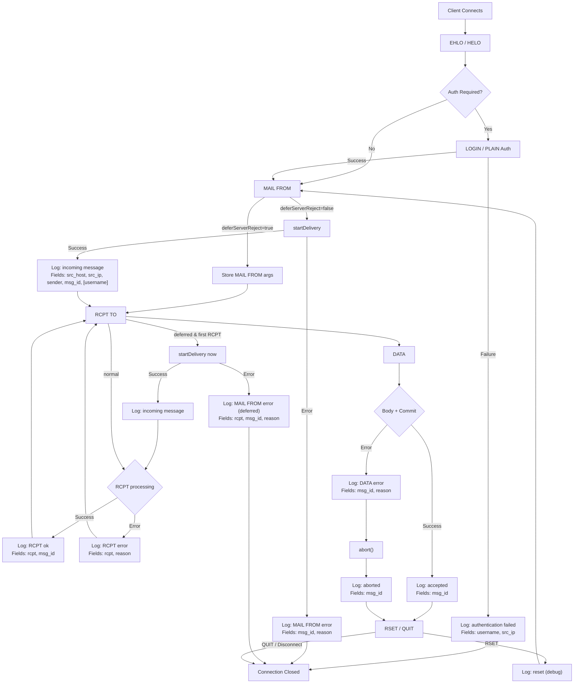
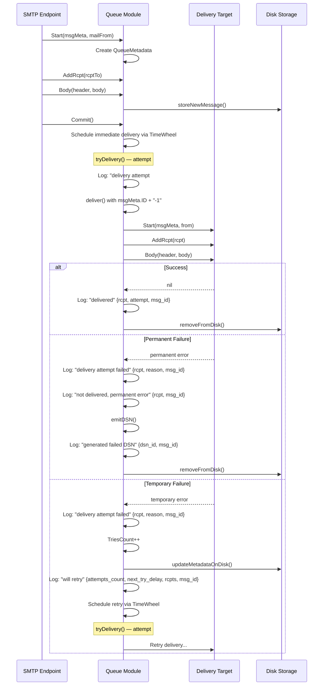
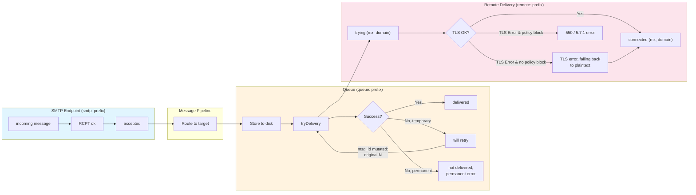

# Maddy Mail Server — Runtime Behavior Reference

> **Onboarding guide bridging source code structure and observable runtime output**

This document is a comprehensive runtime behavior reference for the [Maddy](https://github.com/foxcpp/maddy) mail server. It is designed to help new engineers understand the log messages, error codes, and message lifecycle events produced by the Maddy subsystems during normal and error conditions. All content is derived from direct source code analysis, with exact log strings, JSON field names, and SMTP status codes traced to their origin in the codebase.

---

## Document Scope

This reference covers three core subsystems:

| Subsystem | Package | Description |
|-----------|---------|-------------|
| **SMTP Endpoint** | `internal/endpoint/smtp/` | Inbound SMTP/submission/LMTP session handling, message acceptance and rejection |
| **Queue Delivery** | `internal/target/queue/` | Disk-backed delivery queue with retry scheduling and failure classification |
| **Remote Delivery** | `internal/target/remote/` | Outbound MX delivery with TLS negotiation, MX authentication, and policy enforcement |

Supporting infrastructure documented:

| Package | Purpose |
|---------|---------|
| `internal/log/` | Structured logging library: log format, JSON serialization, debug output |
| `internal/smtpconn/` | Outbound SMTP connection wrapper: TLS, error wrapping, client lifecycle |
| `internal/exterrors/` | Error decoration: structured fields, SMTP codes, enhanced status codes |
| `internal/testutils/` | Test infrastructure: mock targets, deterministic IDs, debug logging flags |

---

## Environment Setup

### Prerequisites

- **Go 1.13** minimum (Source: `go.mod` line 3: `go 1.13`)
- `CGO_ENABLED=0` is required in environments without `gcc`. This disables the `mattn/go-sqlite3` driver but does **not** affect any of the target test packages.

### Module Download

```bash
export CGO_ENABLED=0
go mod download
```

### Test Execution Commands

**SMTP endpoint tests** (successful delivery, abort, submission auth):
```bash
CGO_ENABLED=0 go test -v -count=1 \
  -run "TestSMTPDelivery$|TestSMTPDelivery_AbortData|TestSMTPDelivery_SubmissionAuthOK" \
  ./internal/endpoint/smtp/ -test.debuglog
```

**Queue delivery tests** (success, permanent fail, temporary fail, retry, serialization):
```bash
CGO_ENABLED=0 go test -v -count=1 \
  -run "TestQueueDelivery$|TestQueueDelivery_PermanentFail_NonPartial|TestQueueDelivery_TemporaryFail$|TestQueueDelivery_MultipleAttempts|TestQueueDelivery_SerializationRoundtrip" \
  ./internal/target/queue/
```

**Remote delivery tests** (MX auth failure, TLS fallback, RequireTLS, DNSSEC, CommonDomain):
```bash
CGO_ENABLED=0 go test -v -count=1 \
  -run "TestRemoteDelivery_AuthMX_Fail|TestRemoteDelivery_TLSErrFallback|TestRemoteDelivery_RequireTLS|TestRemoteDelivery_AuthMX_DNSSEC|TestRemoteDelivery_AuthMX_CommonDomain" \
  ./internal/target/remote/ -test.debuglog
```

### Debug Logging Flags

| Flag | Purpose | Source |
|------|---------|--------|
| `-test.debuglog` | Enables debug messages via `testutils.Logger()`: sets `Logger.Debug = true` | `internal/testutils/logger.go` lines 14, 23, 39 |
| `-test.directlog` | Sends log output to stderr instead of `t.Log()` | `internal/testutils/logger.go` lines 15, 19–24 |

When debug messages are logged via `t.Log()`, they receive a `[debug] ` prefix (Source: `internal/testutils/logger.go` line 32).

---

## Log Format Specification

### Grammar

The Maddy logging library (`internal/log/`) produces log lines in the following format:

```
<log_line>    ::= <name_prefix> <message> <tab> <json_fields>
<name_prefix> ::= <logger_name> ": "           (if Logger.Name != ""; Source: log.go line 181–182)
<message>     ::= <arbitrary text>
<tab>         ::= '\t'                          (literal tab character; Source: log.go line 139)
<json_fields> ::= '{' <key_value_pairs> '}'     (if any fields exist; Source: log.go lines 141–152)
               |  ''                             (empty string if no fields; Source: log.go line 141)
```

Source: `internal/log/log.go` function `formatMsg()` at lines 135–155 and `log()` at lines 180–195.

### JSON Field Ordering

Keys are sorted **alphabetically** via `marshalOrderedJSON()` in `internal/log/orderedjson.go` lines 16–62.

Implementation: Keys are collected into a slice and sorted with `sort.Strings(order)` (line 23). This produces deterministic output for both ad-hoc parsing and human readability.

### Value Serialization Rules

Source: `internal/log/orderedjson.go` lines 39–53.

| Go Type | Serialization | Reference |
|---------|---------------|-----------|
| `time.Time` | ISO 8601 string: `"2006-01-02T15:04:05.000"` | orderedjson.go line 42 |
| `time.Duration` | Go duration string via `.String()` (e.g., `"15m0s"`) | orderedjson.go line 44 |
| `LogFormatter` interface | `.FormatLog()` string | orderedjson.go line 46 |
| `fmt.Stringer` | `.String()` | orderedjson.go line 48 |
| `error` | `.Error()` | orderedjson.go line 50 |
| All other values | Standard `json.Marshal` | orderedjson.go line 53 |

### Logger Methods

#### `Logger.Msg(msg string, fields ...interface{})` — log.go lines 72–76

Emits a structured event log message. Fields are provided as alternating key–value pairs. They are converted to a map via `fieldsToMap()` (lines 115–133), then merged with `Logger.Fields` (persistent per-logger fields, lines 145–147). Produces:

```
name: msg\t{"key1":"val1","key2":"val2"}
```

#### `Logger.Error(msg string, err error, fields ...interface{})` — log.go lines 89–104

Same format as `Msg()`, but additionally:

1. Extracts the error's structured fields via `exterrors.Fields(err)` (line 90)
2. Merges all fields into a single map
3. Auto-adds `"reason"` key from `err.Error()` **unless** `"reason"` already exists in the error's fields (lines 96–100)

The output always includes a `"reason"` field.

#### `Logger.DebugMsg(kind string, fields ...interface{})` — log.go lines 106–113

Only emits if `Logger.Debug` is `true` (line 107). Same format as `Msg()` but the output is marked as debug. In test output, debug messages receive a `[debug] ` prefix (Source: `internal/testutils/logger.go` line 32).

#### `Logger.Printf(format string, val ...interface{})` / `Logger.Debugf(...)` — log.go lines 50–51, 36–41

Free-form formatted text with no JSON fields. Still prefixed with the logger name. `Debugf` only emits when `Logger.Debug == true`.

### Annotated Example

```
smtp: incoming message	{"msg_id":"a1b2c3d4","sender":"user@example.org","src_host":"mx.example.org","src_ip":"127.0.0.1:12345"}
^^^^^  ^^^^^^^^^^^^^^^^^	^^^^^^^^^^^^^^^^^^^^^^^^^^^^^^^^^^^^^^^^^^^^^^^^^^^^^^^^^^^^^^^^^^^^^^^^^^^^^^^^^^^^^^^^^^^^^^^^^^^^^^^^^^^
|      |                	|
|      |                	JSON fields (alphabetically ordered keys, tab-separated from message)
|      message text
logger name prefix (Logger.Name + ": ")
```

---

## SMTP Endpoint Runtime Behavior

### Module Name

The logger is created with name `"smtp"` in tests (Source: `internal/endpoint/smtp/smtp_test.go` line 49: `endp.Log = testutils.Logger(t, "smtp")`) and with the `modName` parameter in production (Source: `smtp.go` line 495: `Log: log.Logger{Name: modName}`). For submission mode, production uses `"submission"` (smtp.go line 492).

### Message ID Format

| Context | Format | Generation | Source |
|---------|--------|------------|--------|
| **Production** | 8-character hex string | 4 random bytes via `crypto/rand.Read()`, hex-encoded. Called via `msgpipeline.GenerateMsgID()` | `msgpipeline/msgid.go` lines 12–15; called from smtp.go line 112 |
| **Tests** | 40-character hex string | Full SHA-1 hash of `t.Name()`, hex-encoded | `testutils/target.go` lines 239–240 |

Test implementation:
```go
IDRaw := sha1.Sum([]byte(t.Name()))
encodedID := hex.EncodeToString(IDRaw[:])
```

### Successful Delivery Log Trace

Source: `TestSMTPDelivery` in `smtp_test.go` lines 122–158.

**Step 1: `incoming message`** — smtp.go lines 127–142

When `MAIL FROM` is processed, the session logs the message arrival.

Anonymous (unauthenticated) case (lines 136–141):
```go
s.log.Msg("incoming message",
    "src_host", msgMeta.Conn.Hostname,
    "src_ip", msgMeta.Conn.RemoteAddr.String(),
    "sender", from,
    "msg_id", msgMeta.ID,
)
```

JSON fields (alphabetically ordered):

| Field | Type | Description | Source |
|-------|------|-------------|--------|
| `msg_id` | string | Message identifier | smtp.go:140 |
| `sender` | string | Envelope sender address | smtp.go:139 |
| `src_host` | string | Client hostname from connection state | smtp.go:137 |
| `src_ip` | string | Client IP:port address | smtp.go:138 |

Authenticated case (lines 128–134) adds one extra field:

| Field | Type | Description | Source |
|-------|------|-------------|--------|
| `username` | string | Authenticated username | smtp.go:133 |

**Step 2: `RCPT ok`** — smtp.go line 243

For each successful `RCPT TO`:
```go
s.endp.Log.Msg("RCPT ok", "rcpt", to, "msg_id", s.msgMeta.ID)
```

| Field | Type | Description | Source |
|-------|------|-------------|--------|
| `msg_id` | string | Message identifier | smtp.go:243 |
| `rcpt` | string | Accepted recipient address | smtp.go:243 |

**Step 3: `accepted`** — smtp.go line 334

After successful `DATA` commit:
```go
s.log.Msg("accepted", "msg_id", s.msgMeta.ID)
```

| Field | Type | Description | Source |
|-------|------|-------------|--------|
| `msg_id` | string | Message identifier | smtp.go:334 |

### Aborted Delivery Log Trace

Source: `TestSMTPDelivery_AbortData` in `smtp_test.go` lines 360–396.

**Step 1: `incoming message`** — Same as successful delivery (smtp.go lines 136–141).

**Step 2: `RCPT ok`** — Same as successful delivery (smtp.go line 243).

**Step 3: `DATA error`** — smtp.go line 317

When DATA body processing fails:
```go
s.log.Error("DATA error", err, "msg_id", s.msgMeta.ID)
```

| Field | Type | Description | Source |
|-------|------|-------------|--------|
| `msg_id` | string | Message identifier | smtp.go:317 |
| `reason` | string | Error description (auto-added by `Logger.Error`) | log.go:99 |

Additional fields from `exterrors.Fields(err)` are merged in if the error carries structured field data (e.g., `smtp_code`, `smtp_enchcode`, `smtp_msg`).

**Step 4: `aborted`** — smtp.go line 72

When delivery is aborted via the `abort()` method:
```go
s.log.Msg("aborted", "msg_id", s.msgMeta.ID)
```

| Field | Type | Description | Source |
|-------|------|-------------|--------|
| `msg_id` | string | Message identifier | smtp.go:72 |

### Success vs. Abort Comparison

| Phase | Successful Delivery | Aborted Delivery |
|-------|-------------------|-----------------|
| MAIL FROM | `incoming message` ✓ | `incoming message` ✓ |
| RCPT TO | `RCPT ok` ✓ | `RCPT ok` ✓ |
| DATA | *(no log on success)* | `DATA error` ✗ |
| Outcome | `accepted` ✓ | `aborted` ✗ |

**Key difference:** A successful delivery emits no log at the DATA processing stage — it proceeds silently to `accepted`. An aborted delivery emits `DATA error` with error details, followed by `aborted` when the session cleans up.

### Additional SMTP Log Messages

| Message | Method | Level | Source | Fields |
|---------|--------|-------|--------|--------|
| `MAIL FROM error` | `s.log.Error(...)` | Error | smtp.go:168 | `msg_id`, `reason`, plus exterror fields |
| `MAIL FROM error (deferred)` | `s.log.Error(...)` | Error | smtp.go:223 | `rcpt`, `msg_id`, `reason`, plus exterror fields |
| `RCPT error` | `s.log.Error(...)` | Error | smtp.go:235 | `rcpt`, `reason`, plus exterror fields |
| `too many RCPT errors, possible dictonary attack` | `s.log.Msg(...)` | Info | smtp.go:238 | `src_ip`, `msg_id` |
| `MAIL FROM repeated error a lot of times, possible dictonary attack` | `s.log.Msg(...)` | Info | smtp.go:274 | `count`, `src_ip` |
| `authentication failed` | `endp.Log.Msg(...)` | Info | smtp.go:654 | `username`, `src_ip` |
| `adding missing Message-ID` | `s.log.Msg(...)` | Info | submission.go:35 | *(none)* |
| `adding missing Date header` | `s.log.Msg(...)` | Info | submission.go:125 | *(none)* |
| `reset` | `s.endp.Log.DebugMsg(...)` | Debug | smtp.go:64 | *(none)* |
| `delivery abort failed` | `s.endp.Log.Error(...)` | Error | smtp.go:70 | `reason` |

**Note:** The spelling `"dictonary"` in the source code is the actual string used in the codebase (smtp.go lines 238 and 274).

### Submission Auth Log Trace

Source: `TestSMTPDelivery_SubmissionAuthOK` in `smtp_test.go` lines 480–520.

For authenticated submission, the `incoming message` log line includes the extra `"username"` field (smtp.go lines 127–134):
```go
s.log.Msg("incoming message",
    "src_host", msgMeta.Conn.Hostname,
    "src_ip", msgMeta.Conn.RemoteAddr.String(),
    "sender", from,
    "msg_id", msgMeta.ID,
    "username", s.connState.AuthUser,
)
```

In tests, the module name is still `"smtp"` (test line 49). In production, the submission endpoint would use the `"submission"` module name (smtp.go line 492: `submission: modName == "submission"`; line 495: `Log: log.Logger{Name: modName}`).

### SMTP `wrapErr` Behavior

Source: `internal/endpoint/smtp/smtp.go` lines 389–455.

The `wrapErr` function transforms internal errors into SMTP-protocol-level error responses:

1. Extracts `smtp_code`, `smtp_enchcode`, `smtp_msg` from `exterrors.Fields(err)` (lines 415–427)
2. Default SMTP code: `554` "Internal server error" (or `451` if temporary) (lines 402–413)
3. Appends `" (msg ID = " + msgId + ")"` to the SMTP error message text (line 437)

This ensures that every SMTP error response to a client includes the message ID for tracing.

---

## Queue Delivery Mechanics

### Module Logger Name

The queue logger is created with name `"queue"` (Source: `queue.go` line 188: `Log: log.Logger{Name: "queue"}`).

### DeliveryLogger Enrichment

All queue log messages use a delivery-scoped logger created via:
```go
dl := target.DeliveryLogger(q.Log, meta.MsgMeta)
```
Source: `internal/target/delivery.go` lines 8–16. This adds a persistent `"msg_id"` field to **every** subsequent log message from the delivery logger:
```go
fields["msg_id"] = msgMeta.ID
```

### Retry ID Mutation

Source: `queue.go` line 439.

For each delivery attempt, the message ID is mutated to include the attempt number:
```go
msgMeta.ID = msgMeta.ID + "-" + strconv.Itoa(meta.TriesCount+1)
```

**Format:** `originalID-N` where `N` is the attempt number (`TriesCount + 1`).

**Example:** If the original ID is `"abc123def0"`:
- First delivery attempt uses: `"abc123def0-1"`
- First retry (second attempt) uses: `"abc123def0-2"`
- Second retry (third attempt) uses: `"abc123def0-3"`

### Successful Delivery Log Trace

Source: `TestQueueDelivery` — successful single-attempt delivery.

**Step 1: Debug `delivery attempt #N`** — queue.go line 367:
```go
dl.Debugf("delivery attempt #%d", meta.TriesCount+1)
```
Only visible with debug logging enabled. The delivery logger carries the persistent `msg_id` field.

**Step 2: `delivered`** — queue.go line 378:
```go
dl.Msg("delivered", "rcpt", rcpt, "attempt", meta.TriesCount+1)
```

| Field | Type | Description | Source |
|-------|------|-------------|--------|
| `attempt` | int | Current attempt number (1-indexed) | queue.go:378 |
| `msg_id` | string | Message identifier (from DeliveryLogger) | delivery.go:13 |
| `rcpt` | string | Recipient address | queue.go:378 |

### Permanent Failure Log Trace

Source: `TestQueueDelivery_PermanentFail_NonPartial`.

**Step 1: `delivery attempt failed`** — queue.go line 384:
```go
dl.Error("delivery attempt failed", rcptErr, "rcpt", rcpt)
```

| Field | Type | Description | Source |
|-------|------|-------------|--------|
| `msg_id` | string | Message identifier (from DeliveryLogger) | delivery.go:13 |
| `rcpt` | string | Failed recipient | queue.go:384 |
| `reason` | string | Error description (auto-added by `Logger.Error`) | log.go:99 |

Plus any fields from `exterrors.Fields(rcptErr)` — for SMTP errors these include: `smtp_code`, `smtp_enchcode`, `smtp_msg`, and possibly `target`, `remote_server`.

**Step 2: `not delivered, permanent error`** — queue.go line 398:
```go
dl.Msg("not delivered, permanent error", "rcpt", rcpt)
```

| Field | Type | Description | Source |
|-------|------|-------------|--------|
| `msg_id` | string | Message identifier (from DeliveryLogger) | delivery.go:13 |
| `rcpt` | string | Failed recipient | queue.go:398 |

### Temporary Failure with Retry Log Trace

Source: `TestQueueDelivery_TemporaryFail` and `TestQueueDelivery_MultipleAttempts`.

**Step 1: `delivery attempt failed`** — Same as permanent failure (queue.go line 384).

**Step 2: `will retry`** — queue.go lines 415–418:
```go
dl.Msg("will retry",
    "attempts_count", meta.TriesCount,
    "next_try_delay", time.Until(nextTryTime),
    "rcpts", meta.To)
```

| Field | Type | Description | Source |
|-------|------|-------------|--------|
| `attempts_count` | int | Number of attempts already made | queue.go:416 |
| `msg_id` | string | Message identifier (from DeliveryLogger) | delivery.go:13 |
| `next_try_delay` | string | Duration until next attempt (Go duration format, e.g. `"15m0s"`) | queue.go:417 |
| `rcpts` | []string | Remaining recipients to retry | queue.go:418 |

> **CRITICAL: The exact JSON field name that contains the retry delay value is `next_try_delay`** (Source: queue.go line 417).

### Retry Scheduling Formula

Source: `queue.go` lines 121–125 (comment) and line 414 (implementation).

```
delay = initialRetryTime × retryTimeScale ^ (TriesCount - 1)
```

**Default values:**

| Parameter | Default | Source |
|-----------|---------|--------|
| `initialRetryTime` | 15 minutes | queue.go line 185 |
| `retryTimeScale` | 2 | queue.go line 186 |
| `maxTries` | 8 | queue.go line 204 |

**Worked example (production defaults):**

| Retry # | TriesCount | Calculation | Delay |
|---------|-----------|-------------|-------|
| 1st retry | 1 | 15min × 2^0 | **15 minutes** |
| 2nd retry | 2 | 15min × 2^1 | **30 minutes** |
| 3rd retry | 3 | 15min × 2^2 | **60 minutes** |
| 4th retry | 4 | 15min × 2^3 | **120 minutes** |
| 5th retry | 5 | 15min × 2^4 | **240 minutes** |
| 6th retry | 6 | 15min × 2^5 | **480 minutes** |
| 7th retry | 7 | 15min × 2^6 | **960 minutes** |

**Note:** In test configuration, `initialRetryTime` is set to `0` and `retryTimeScale` to `1` (queue_test.go lines 50–51), so test retry delays are effectively zero.

### Additional Queue Log Messages

| Message | Method | Level | Source | Fields |
|---------|--------|-------|--------|--------|
| `not delivered, temporary error` | `dl.Msg(...)` | Info | queue.go:394 | `msg_id`, `rcpt` |
| `generated failed DSN` | `dl.Msg(...)` | Info | queue.go:914 | `msg_id`, `dsn_id` |
| `loaded %d saved queue entries` | `q.Log.Printf(...)` | Info | queue.go:684 | *(free-form, no JSON)* |
| `delivery attempt #%d` | `dl.Debugf(...)` | Debug | queue.go:367 | *(free-form, msg_id from logger)* |
| `using message ID = %s` | `dl.Debugf(...)` | Debug | queue.go:440 | *(free-form, msg_id from logger)* |
| `target.Start OK` | `dl.Debugf(...)` | Debug | queue.go:456 | *(free-form)* |
| `target.Start failed: %v` | `dl.Debugf(...)` | Debug | queue.go:449 | *(free-form)* |
| `delivery.AddRcpt %s OK` | `dl.Debugf(...)` | Debug | queue.go:470 | *(free-form)* |
| `delivery.AddRcpt %s failed: %v` | `dl.Debugf(...)` | Debug | queue.go:467 | *(free-form)* |
| `delivery.Body OK` | `dl.Debugf(...)` | Debug | queue.go:507 | *(free-form)* |
| `delivery.Body failed: %v` | `dl.Debugf(...)` | Debug | queue.go:504 | *(free-form)* |
| `delivery.Commit OK` | `dl.Debugf(...)` | Debug | queue.go:529 | *(free-form)* |
| `delivery.Commit failed: %v` | `dl.Debugf(...)` | Debug | queue.go:526 | *(free-form)* |
| `delivery.Abort (no accepted receipients)` | `dl.Debugf(...)` | Debug | queue.go:477 | *(free-form)* |
| `delivery.Abort (all recipients failed)` | `dl.Debugf(...)` | Debug | queue.go:518 | *(free-form)* |
| `removed message from disk` | `dl.Debugf(...)` | Debug | queue.go:619 | *(free-form)* |
| `meta-data update` | `dl.Error(...)` | Error | queue.go:410 | `msg_id`, `reason` |
| `failed to generate fail DSN` | `dl.Error(...)` | Error | queue.go:903 | `msg_id`, `reason` |
| `failed to enqueue DSN` | `dl.Error(...)` | Error | queue.go:923,929 | `msg_id`, `dsn_id`, `reason` |
| `delivery.Abort failed` | `dl.Error(...)` | Error | queue.go:479–480 | `msg_id`, `reason` |
| `delivery.Abort failed` | `dl.Msg(...)` | Info | queue.go:520 | `err` (positional) |

---

## Remote Delivery: MX Authentication and TLS

### Module Logger Name

The remote delivery logger is created with name `"remote"` (Source: `remote.go` line 83: `Log: log.Logger{Name: "remote"}`).

### MX Authentication Error Catalog

#### Error 1: MX Record Authenticity Failure

Source: `connect.go` lines 94–99.

```go
&exterrors.SMTPError{
    Code:         550,
    EnhancedCode: exterrors.EnhancedCode{5, 7, 0},
    Message:      fmt.Sprintf("Failed to estabilish the MX record (%s) authenticity", mx),
}
```

| Property | Value |
|----------|-------|
| **Exact error message** | `"Failed to estabilish the MX record (<mx_hostname>) authenticity"` |
| **SMTP code** | 550 |
| **Enhanced status code** | **5.7.0** |
| **Trigger** | `rd.rt.requireMXAuth && !authenticated` (connect.go line 94) |
| **Test** | `TestRemoteDelivery_AuthMX_Fail` (mxauth_test.go) |

> **Note:** The spelling `"estabilish"` is the actual string in the source code — quoted verbatim.

#### Error 2: MX Authenticity via MTA-STS Failure

Source: `connect.go` lines 64–68.

```go
&exterrors.SMTPError{
    Code:         550,
    EnhancedCode: exterrors.EnhancedCode{5, 7, 0},
    Message:      "Failed to estabilish the MX record authenticity (MTA-STS)",
}
```

| Property | Value |
|----------|-------|
| **Exact error message** | `"Failed to estabilish the MX record authenticity (MTA-STS)"` |
| **SMTP code** | 550 |
| **Enhanced status code** | **5.7.0** |
| **Trigger** | MTA-STS enforce mode active and MX doesn't match policy (connect.go lines 62–68) |

#### Error 3: TLS Required but Unavailable

Source: `connect.go` lines 101–106.

```go
&exterrors.SMTPError{
    Code:         550,
    EnhancedCode: exterrors.EnhancedCode{5, 7, 1},
    Message:      fmt.Sprintf("TLS is required but unsupported or failed (mx = %s)", mx),
}
```

| Property | Value |
|----------|-------|
| **Exact error message** | `"TLS is required but unsupported or failed (mx = <mx_hostname>)"` |
| **SMTP code** | 550 |
| **Enhanced status code** | **5.7.1** |
| **Trigger** | `requireTLS && !didTLS` (connect.go line 101) |
| **Tests** | `TestRemoteDelivery_RequireTLS` (remote_test.go) |

#### Error 4: Null MX

Source: `connect.go` lines 156–160.

```go
&exterrors.SMTPError{
    Code:         556,
    EnhancedCode: exterrors.EnhancedCode{5, 1, 10},
    Message:      "Domain does not accept email (null MX)",
}
```

| Property | Value |
|----------|-------|
| **Exact error message** | `"Domain does not accept email (null MX)"` |
| **SMTP code** | 556 |
| **Enhanced status code** | **5.1.10** |
| **Trigger** | MX record has host `"."` (null MX, RFC 7505) (connect.go line 155) |
| **Test** | `TestRemoteDelivery_NullMX` (remote_test.go) |

### TLS Fallback Behavior

Source: `TestRemoteDelivery_TLSErrFallback` (remote_test.go).

#### Fallback Log Message

Source: `connect.go` lines 176–177:

```go
rd.Log.Error("TLS error, falling back to plaintext", err,
    "mx", record.Host, "domain", domain)
```

**Log message:** `"TLS error, falling back to plaintext"`

JSON fields (alphabetically ordered):

| Field | Type | Description | Source |
|-------|------|-------------|--------|
| `domain` | string | Target domain being delivered to | connect.go:177 |
| `msg_id` | string | Message identifier (from DeliveryLogger) | remote.go:190 |
| `mx` | string | MX hostname that had the TLS error | connect.go:177 |
| `reason` | string | TLS error description (auto-added by `Logger.Error` from `err`) | log.go:99 |

The `reason` field value comes from `smtpconn.TLSError.Error()` which produces `"smtpconn: <underlying_error>"` (Source: `smtpconn.go` lines 144–145).

#### Fallback Trigger Conditions

Source: `connect.go` lines 170–189:

1. The connection attempt returns an error
2. The error is of type `smtpconn.TLSError` (from failed STARTTLS; Source: `smtpconn.go` line 196)
3. The `checkPolicies()` call returns `nil` (no auth policy prevents plaintext)
4. If all three conditions are met: log the fallback message and reconnect without TLS (`starttls = false`)

#### `smtpconn.TLSError` Type

Source: `smtpconn.go` lines 135–150.

- Returned by `Connect()` when the STARTTLS handshake fails (smtpconn.go line 196)
- Wraps the underlying TLS error
- `Error()` returns `"smtpconn: " + err.Err.Error()` (line 145)
- Does **not** implement a `Fields()` method — so no additional structured fields are merged beyond the `reason` auto-injected by `Logger.Error`

### RequireTLS Enforcement

When `requireTLS` is `true` (set by local policy via `rd.rt.requireTLS`, or by MTA-STS enforce mode), TLS fallback is **prevented**:

1. `checkPolicies()` returns a non-nil error (550/5.7.1) when `requireTLS && !didTLS` (connect.go lines 101–106)
2. This means the condition `authErr == nil` at connect.go line 175 evaluates to `false`
3. Therefore the TLS fallback branch (`if _, ok := err.(smtpconn.TLSError); ok && authErr == nil`) is **not entered**
4. The connection attempt fails with the policy error (`"TLS is required but unsupported or failed"`) instead of falling back

### MX Authentication Debug Messages

| Message | Method | Fields | Trigger | Source |
|---------|--------|--------|---------|--------|
| `trying` | `rd.Log.DebugMsg(...)` | `domain`, `mx` | Before each MX connection attempt | connect.go:163 |
| `connected` | `rd.Log.DebugMsg(...)` | `domain`, `mx` | After successful connection and MAIL FROM | connect.go:216 |
| `authenticated MX using DNSSEC` | `rd.Log.DebugMsg(...)` | `domain`, `mx` | DNSSEC auth enabled and `conn.dnssecOk == true` | connect.go:77 |
| `authenticated MX using common domain rule` | `rd.Log.DebugMsg(...)` | `domain`, `mx` | Common domain auth enabled and `commonDomainCheck()` returns true | connect.go:83 |
| `authenticated MX using MTA-STS` | `rd.Log.DebugMsg(...)` | `mx` | MTA-STS policy exists and `stsPolicy.Match(mx)` returns true | connect.go:60 |
| `TLS required by MTA-STS` | `rd.Log.DebugMsg(...)` | `domain`, `mx` | MTA-STS enforce mode active | connect.go:57 |
| `TLS required by local policy` | `rd.Log.DebugMsg(...)` | `domain`, `mx` | `rd.rt.requireTLS == true` | connect.go:89 |
| `Policy fetch error, ignoring` | `rd.Log.DebugMsg(...)` | `mx`, `domain`, `err` | MTA-STS policy fetch error in non-enforce mode | connect.go:71 |
| `skipping MX not matching MTA-STS` | `rd.Log.Msg(...)` ⚠️ | `domain`, `mx` | MTA-STS enforce mode and MX doesn't match policy | connect.go:63 |

> **Note:** `skipping MX not matching MTA-STS` uses `Msg()` not `DebugMsg()` — it is **always** logged regardless of debug settings.

### smtpconn Connection-Level Messages

| Message | Method | Fields | Source |
|---------|--------|--------|--------|
| `connected` | `c.Log.DebugMsg(...)` | `remote_server` | smtpconn.go:248 |
| `QUIT error` | `c.Log.Error(...)` | `reason`, plus wrapped error fields | smtpconn.go:330 |

#### Error Wrapping in `wrapClientErr`

Source: `smtpconn.go` lines 65–120.

| Input Error Type | Wrapping Behavior | Extra Fields |
|------------------|-------------------|--------------|
| `*smtp.SMTPError` | Wrapped as `*exterrors.SMTPError` with `"serverName said: msg"` format (when `AddrInSMTPMsg == true`) | `remote_server` |
| `*net.OpError` with DNS error | Wrapped with DNS reason extraction | `remote_server`, `io_op` |
| Other `*net.OpError` | Wrapped as 450 / 4.4.2 "Network I/O error" | `remote_addr`, `io_op` |
| Default | Wrapped with `exterrors.WithFields` | `remote_server` |

---

## Cross-Module JSON Field Reference

### SMTP Endpoint Fields

| Field | Type | Logged By | Source |
|-------|------|-----------|--------|
| `msg_id` | string | `incoming message`, `RCPT ok`, `accepted`, `aborted`, `DATA error`, `MAIL FROM error`, `MAIL FROM error (deferred)`, `too many RCPT errors...` | smtp.go |
| `sender` | string | `incoming message` | smtp.go:131,139 |
| `src_host` | string | `incoming message` | smtp.go:129,137 |
| `src_ip` | string / net.Addr | `incoming message`, `authentication failed`, `too many RCPT errors...`, `MAIL FROM repeated error...` | smtp.go:130,138,654,238,274 |
| `username` | string | `incoming message` (authenticated only), `authentication failed` | smtp.go:133,654 |
| `rcpt` | string | `RCPT ok`, `RCPT error`, `MAIL FROM error (deferred)` | smtp.go:243,235,223 |
| `count` | int | `MAIL FROM repeated error a lot of times...` | smtp.go:274 |
| `reason` | string | All `Error()` calls (auto-added by `Logger.Error`) | log.go:99 |

### Queue Fields

| Field | Type | Logged By | Source |
|-------|------|-----------|--------|
| `msg_id` | string | All queue messages (via `DeliveryLogger`) | delivery.go:13 |
| `rcpt` | string | `delivered`, `delivery attempt failed`, `not delivered, permanent error`, `not delivered, temporary error` | queue.go:378,384,394,398 |
| `attempt` | int | `delivered` | queue.go:378 |
| `attempts_count` | int | `will retry` | queue.go:416 |
| **`next_try_delay`** | string (Duration) | `will retry` | queue.go:417 |
| `rcpts` | []string | `will retry` | queue.go:418 |
| `dsn_id` | string | `generated failed DSN`, `failed to enqueue DSN` | queue.go:914,923,929 |
| `reason` | string | All `Error()` calls (auto-added by `Logger.Error`) | log.go:99 |

### Remote Delivery Fields

| Field | Type | Logged By | Source |
|-------|------|-----------|--------|
| `domain` | string | `trying`, `connected`, `TLS error, falling back to plaintext`, `TLS required by MTA-STS`, `TLS required by local policy`, `authenticated MX using DNSSEC`, `authenticated MX using common domain rule`, `skipping MX not matching MTA-STS` | connect.go |
| `err` | error/string | `Policy fetch error, ignoring` | connect.go:71 |
| `mx` | string | Same messages as `domain`, plus `authenticated MX using MTA-STS` | connect.go |
| `remote_server` | string | `connected` (smtpconn level) | smtpconn.go:248 |
| `reason` | string | `TLS error, falling back to plaintext`, all `Error()` calls | log.go:99 |

### Error Wrapping Fields (from `exterrors.SMTPError.Fields()`)

Source: `internal/exterrors/smtp.go` lines 72–92.

| Field | Type | Description | Source |
|-------|------|-------------|--------|
| `smtp_code` | int | SMTP status code (e.g., 550, 451) | exterrors/smtp.go:77 |
| `smtp_enchcode` | EnhancedCode | Enhanced status code (formatted as X.Y.Z via `FormatLog()` — exterrors/smtp.go line 12) | exterrors/smtp.go:78 |
| `smtp_msg` | string | SMTP error message text | exterrors/smtp.go:79 |
| `check` | string | Check module name (if error from a check) | exterrors/smtp.go:81 |
| `target` | string | Target module name (if error from a delivery target) | exterrors/smtp.go:84 |
| `reason` | string | Error reason text (from `Err.Error()` or explicit `Reason`) | exterrors/smtp.go:87–89 |
| `remote_server` | string | Remote server name (from `smtpconn.wrapClientErr`) | smtpconn.go:87,93,117 |
| `remote_addr` | net.Addr | Remote address (from `net.OpError` wrapping) | smtpconn.go:111 |
| `io_op` | string | I/O operation name (from `net.OpError` wrapping) | smtpconn.go:112 |

---

## Architectural Diagrams

### SMTP Session State Machine



### Queue Retry Lifecycle



### Remote Delivery TLS Policy Decision Tree

```mermaid
flowchart TD
    Start["checkPolicies(mx, didTLS, conn)"] --> A{MX == domain?}
    A -->|Yes| Auth1["authenticated = true<br/>(implicit MX auth)"]
    A -->|No| B{MTA-STS enabled?}
    
    B -->|No| D{DNSSEC enabled?}
    B -->|Yes| C{Fetch STS policy}
    
    C -->|Error| D
    C -->|Success| E{Mode == Enforce?}
    E -->|Yes| F["requireTLS = true<br/>Log: TLS required by MTA-STS"]
    E -->|No| G{stsPolicy.Match(mx)?}
    F --> G
    
    G -->|Yes| H["authenticated = true<br/>Log: authenticated MX using MTA-STS"]
    G -->|No, Enforce mode| I["Log: skipping MX not matching MTA-STS<br/>Return 550 / 5.7.0<br/>'Failed to estabilish the MX record authenticity (MTA-STS)'"]
    G -->|No, Non-enforce| D
    H --> D
    Auth1 --> B
    
    D -->|Yes & dnssecOk| J["authenticated = true<br/>Log: authenticated MX using DNSSEC"]
    D -->|No or !dnssecOk| K{CommonDomain enabled?}
    J --> K
    
    K -->|Yes & eTLD+1 match| L["authenticated = true<br/>Log: authenticated MX using common domain rule"]
    K -->|No| M{Local requireTLS?}
    L --> M
    
    M -->|Yes| N["requireTLS = true<br/>Log: TLS required by local policy"]
    M -->|No| O{requireMXAuth && !authenticated?}
    N --> O
    
    O -->|Yes| P["Return 550 / 5.7.0<br/>'Failed to estabilish the MX record (mx) authenticity'"]
    O -->|No| Q{requireTLS && !didTLS?}
    
    Q -->|Yes| R["Return 550 / 5.7.1<br/>'TLS is required but unsupported or failed (mx = mx)'"]
    Q -->|No| S["Return nil — All green ✓"]
```

### Cross-Module Message Flow



**Message ID enrichment flow:**
1. SMTP endpoint creates `msg_id` via `msgpipeline.GenerateMsgID()` → 8-char hex (production) or 40-char hex (tests)
2. Queue's `DeliveryLogger` adds persistent `msg_id` field to all queue log messages
3. For each delivery attempt, the queue mutates the ID: `originalID + "-" + attemptNumber` (queue.go line 439)

---

## Test Execution Reference

### SMTP Endpoint Tests

**Package:** `internal/endpoint/smtp/`

**Command:**
```bash
CGO_ENABLED=0 go test -v -count=1 \
  -run "TestSMTPDelivery$|TestSMTPDelivery_AbortData|TestSMTPDelivery_SubmissionAuthOK" \
  ./internal/endpoint/smtp/ -test.debuglog
```

**Key test functions:**

| Test | Purpose | Expected Log Pattern |
|------|---------|---------------------|
| `TestSMTPDelivery` | Successful anonymous delivery | `incoming message` → `RCPT ok` → `accepted` |
| `TestSMTPDelivery_AbortData` | Client disconnects during DATA | `incoming message` → `RCPT ok` → `DATA error` → `aborted` |
| `TestSMTPDelivery_AbortLogout` | Client disconnects after RCPT TO before DATA | `incoming message` → `RCPT ok` → `aborted` |
| `TestSMTPDelivery_SubmissionAuthOK` | Authenticated submission | `incoming message` with `username` field → `RCPT ok` → `accepted` |
| `TestSMTPDelivery_Reset` | RSET command mid-session | `incoming message` → `aborted` → `reset` (debug) |
| `TestSMTPDelivery_Multi` | Multiple messages per session | Two full delivery sequences |

**Port management:** Random port via `-test.smtpport` flag (smtp_test.go line 522–532). Tests select a random port to avoid conflicts.

### Queue Delivery Tests

**Package:** `internal/target/queue/`

**Command:**
```bash
CGO_ENABLED=0 go test -v -count=1 \
  -run "TestQueueDelivery$|TestQueueDelivery_PermanentFail_NonPartial|TestQueueDelivery_TemporaryFail$|TestQueueDelivery_MultipleAttempts|TestQueueDelivery_SerializationRoundtrip" \
  ./internal/target/queue/
```

**Key test functions:**

| Test | Purpose | Expected Log Pattern |
|------|---------|---------------------|
| `TestQueueDelivery` | Successful single-attempt delivery | `delivered` with `attempt: 1` |
| `TestQueueDelivery_PermanentFail_NonPartial` | Permanent failure | `delivery attempt failed` → `not delivered, permanent error` |
| `TestQueueDelivery_TemporaryFail` | Temporary failure with retry | `delivery attempt failed` → `will retry` with `next_try_delay` |
| `TestQueueDelivery_MultipleAttempts` | Multiple retries | Multiple `delivery attempt failed` → `will retry` sequences |
| `TestQueueDelivery_SerializationRoundtrip` | Queue persistence and reload | `loaded N saved queue entries` on restart |

**Test queue configuration:**

| Parameter | Test Value | Production Default | Source |
|-----------|-----------|-------------------|--------|
| `initialRetryTime` | 0 | 15 minutes | queue_test.go ~line 50 |
| `retryTimeScale` | 1 | 2 | queue_test.go ~line 51 |
| `maxTries` | 5 | 8 | queue_test.go ~line 53 |

### Remote Delivery Tests

**Package:** `internal/target/remote/`

**Command:**
```bash
CGO_ENABLED=0 go test -v -count=1 \
  -run "TestRemoteDelivery_AuthMX_Fail|TestRemoteDelivery_TLSErrFallback|TestRemoteDelivery_RequireTLS|TestRemoteDelivery_AuthMX_DNSSEC|TestRemoteDelivery_AuthMX_CommonDomain" \
  ./internal/target/remote/ -test.debuglog
```

**Key test functions:**

| Test | Purpose | Expected Output |
|------|---------|-----------------|
| `TestRemoteDelivery_AuthMX_Fail` | MX auth failure | 550 / 5.7.0 — `"Failed to estabilish the MX record (...) authenticity"` |
| `TestRemoteDelivery_TLSErrFallback` | TLS error with fallback | `"TLS error, falling back to plaintext"` with `msg_id`, `domain`, `mx`, `reason` fields |
| `TestRemoteDelivery_RequireTLS` | RequireTLS with no TLS support | 550 / 5.7.1 — `"TLS is required but unsupported or failed"` |
| `TestRemoteDelivery_AuthMX_DNSSEC` | DNSSEC-based MX auth | `"authenticated MX using DNSSEC"` (debug) |
| `TestRemoteDelivery_AuthMX_CommonDomain` | Common domain MX auth | `"authenticated MX using common domain rule"` (debug) |
| `TestRemoteDelivery_NullMX` | Null MX handling | 556 / 5.1.10 — `"Domain does not accept email (null MX)"` |

**Port management:** Random port via `-test.smtpport` flag (remote_test.go). Tests use in-process SMTP servers with configurable TLS.

---

## Summary of SMTP Enhanced Status Codes

| Error Condition | SMTP Code | Enhanced Code | Error Message | Source |
|----------------|-----------|---------------|---------------|--------|
| MX authenticity failure | 550 | **5.7.0** | `"Failed to estabilish the MX record (<mx>) authenticity"` | connect.go:95–99 |
| MTA-STS MX mismatch | 550 | **5.7.0** | `"Failed to estabilish the MX record authenticity (MTA-STS)"` | connect.go:64–68 |
| TLS required but unavailable | 550 | **5.7.1** | `"TLS is required but unsupported or failed (mx = <mx>)"` | connect.go:102–106 |
| Null MX (RFC 7505) | 556 | **5.1.10** | `"Domain does not accept email (null MX)"` | connect.go:156–160 |
| Non-ASCII without SMTPUTF8 | 550 | **5.6.7** | `"SMTPUTF8 is required for non-ASCII senders"` | smtp.go:94–98 |
| Address normalization failure | 553 | **5.1.7** | `"Unable to normalize the sender address"` | smtp.go:105–109 |
| Default internal error (permanent) | 554 | *(not set)* | `"Internal server error"` | smtp.go:402–408 |
| Default internal error (temporary) | 451 | *(not set)* | `"Internal server error"` | smtp.go:411–413 |
| Rate limit exceeded | 451 | **4.4.5** | `"High load, try again later"` | smtp.go:394–400 |

---

## Key Answers to Specific Questions

### What is the exact JSON field name that contains the retry delay value?

> **`next_try_delay`** — Source: `internal/target/queue/queue.go` line 417.

### What is the module name prefix in SMTP endpoint log lines?

> **`smtp`** (or `submission` / `lmtp` depending on the endpoint personality) — Source: `smtp.go` line 495.

### What is the msg_id format?

> **Production:** 8-character hexadecimal string (first 4 bytes of UUID).
> **Tests:** 40-character hexadecimal string (full SHA-1 of `t.Name()`).
> **Queue retries:** `originalID-N` where N is the attempt number.

### What is the exact error message when MX authenticity checks fail?

> `"Failed to estabilish the MX record (<mx_hostname>) authenticity"` with SMTP code **550** and enhanced code **5.7.0** — Source: `connect.go` lines 95–99. Note the spelling `"estabilish"` is verbatim from source.

### What is the exact log message for TLS fallback?

> `"TLS error, falling back to plaintext"` with JSON fields: `msg_id`, `domain`, `mx`, `reason` — Source: `connect.go` lines 176–177; `msg_id` from DeliveryLogger at `remote.go` line 190.
