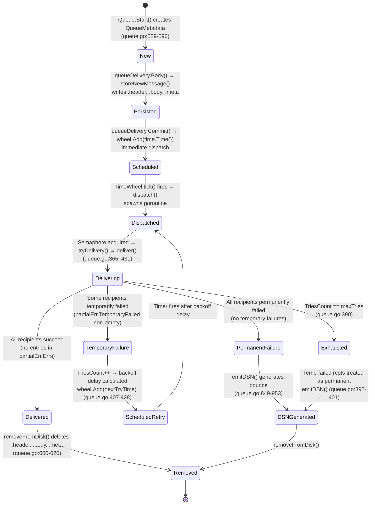
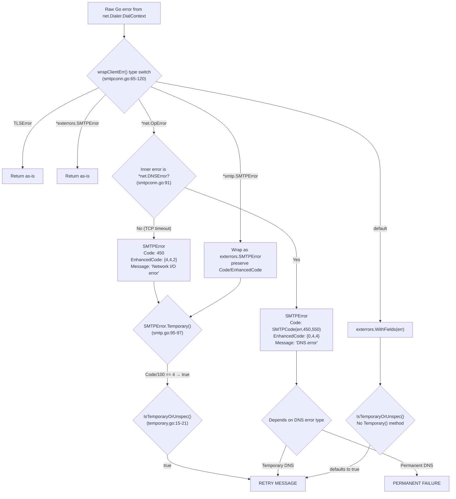
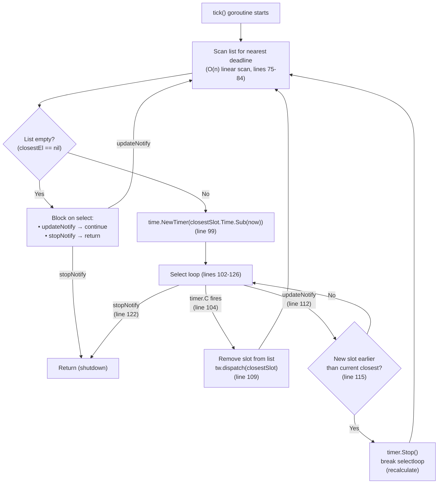
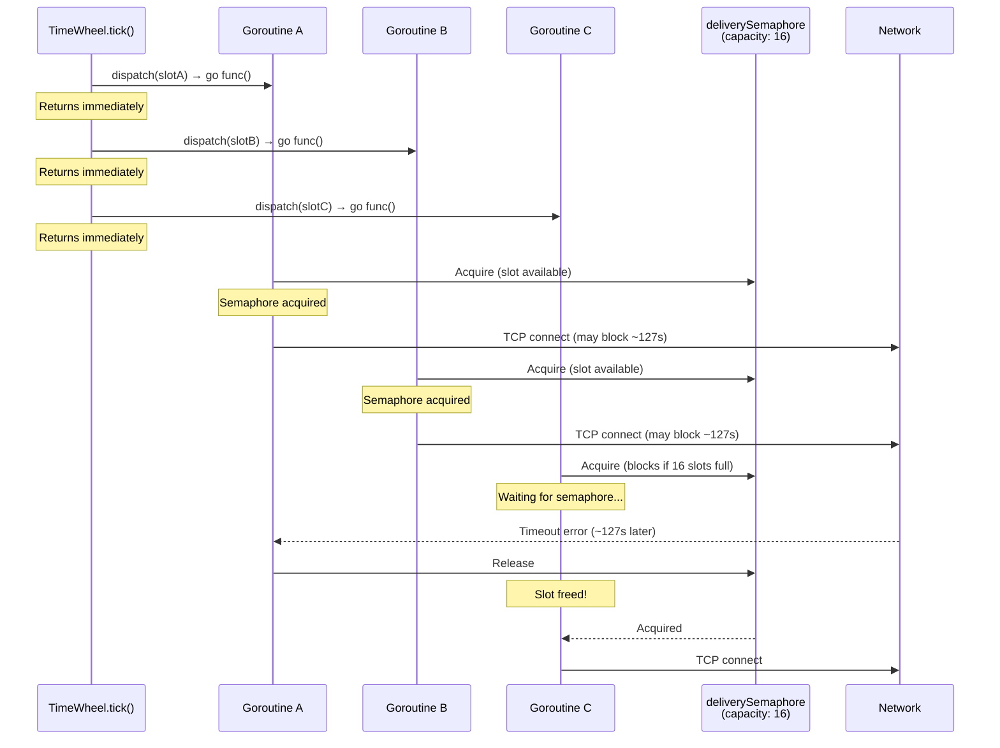

# Maddy Mail Server: Queue Delivery Internals Deep-Dive

> **Document Type:** Technical Investigation / Internals Analysis
> **Target Codebase:** [foxcpp/maddy](https://github.com/foxcpp/maddy)
> **Scope:** Queue delivery subsystem, retry scheduling, timeout behavior, filesystem persistence, multi-message scheduling
> **Rule:** Every technical claim is backed by source code file path and line number references. No source files were modified.

---

## Table of Contents

1. [Message Processing Pipeline Overview](#1-message-processing-pipeline-overview)
2. [Queue Delivery and Retry Mechanics](#2-queue-delivery-and-retry-mechanics)
3. [Log Entry Analysis](#3-log-entry-analysis)
4. [Queue Filesystem and Persistence](#4-queue-filesystem-and-persistence)
5. [Multi-Message Queue Scheduling](#5-multi-message-queue-scheduling)
6. [Experimental Setup Guide](#6-experimental-setup-guide)
7. [Source Code References](#7-source-code-references)

---

## 1. Message Processing Pipeline Overview

### 1.1 End-to-End Flow (SMTP Ingress → Queue → Remote Delivery)

A message entering the maddy mail server traverses a well-defined chain of components from SMTP ingress through to remote delivery. The end-to-end path is:

1. **SMTP Ingress** — An external SMTP client connects to `internal/endpoint/smtp/`, which accepts the message via the SMTP protocol.
2. **Pipeline Routing** — The message is handed to `internal/msgpipeline/msgpipeline.go` `MsgPipeline`, which performs two-level routing: source block matching (MAIL FROM) followed by destination block matching (RCPT TO).
3. **Queue Entry** — The pipeline routes the message to `internal/target/queue/queue.go` `Queue.Start()` (line 589), which creates a `queueDelivery` object with initialized `QueueMetadata`.
4. **Recipient Collection** — `queueDelivery.AddRcpt()` (line 542) appends each recipient to `meta.To`.
5. **Disk Persistence** — `queueDelivery.Body()` (line 547) calls `storeNewMessage()` (line 690), which writes `.header`, `.body`, and `.meta` files to the queue directory.
6. **Schedule Dispatch** — `queueDelivery.Commit()` (line 571) calls `wheel.Add(time.Time{}, queueSlot{...})` — the zero-value `time.Time{}` means the dispatch is immediate.
7. **Dispatch** — The `TimeWheel` fires and calls `dispatch()` (line 275), which launches a goroutine.
8. **Delivery Attempt** — Within the goroutine, `tryDelivery()` (line 365) calls `deliver()` (line 431), which invokes `q.Target.Start()` on the remote delivery target.
9. **Remote Connection** — `internal/target/remote/remote.go` `Target` performs DNS MX resolution and establishes an SMTP connection via `internal/smtpconn/smtpconn.go`.
10. **Final Disposition** — The message is either successfully delivered, scheduled for retry (temporary failure), or generates a DSN (permanent failure or retry exhaustion).

```mermaid
sequenceDiagram
    participant Client as SMTP Client
    participant EP as smtp Endpoint
    participant MP as MsgPipeline
    participant Q as Queue
    participant QD as queueDelivery
    participant TW as TimeWheel
    participant D as dispatch()
    participant TD as tryDelivery()
    participant DL as deliver()
    participant RT as remote.Target
    participant SC as smtpconn.C
    participant MTA as Remote MTA

    Client->>EP: MAIL FROM / RCPT TO / DATA
    EP->>MP: Start(msgMeta, mailFrom)
    MP->>Q: Start(ctx, msgMeta, mailFrom)
    Q->>QD: return &queueDelivery{meta}
    Note over QD: meta.FirstAttempt = now<br/>meta.LastAttempt = now<br/>meta.RcptErrs = {}
    EP->>QD: AddRcpt(rcptTo)
    Note over QD: meta.To = append(meta.To, rcptTo)
    EP->>QD: Body(header, body)
    QD->>Q: storeNewMessage(meta, header, body)
    Note over Q: Write .header, .body, .meta to disk
    EP->>QD: Commit()
    QD->>TW: wheel.Add(time.Time{}, queueSlot)
    Note over TW: Zero time = immediate dispatch
    TW->>D: dispatch(slot)
    D->>D: go func() { semaphore <- ; tryDelivery() }
    D->>TD: tryDelivery(meta, header, body)
    TD->>DL: deliver(meta, header, body)
    DL->>RT: Target.Start(ctx, msgMeta, mailFrom)
    RT->>SC: smtpconn.New() + Connect()
    SC->>MTA: TCP connect + EHLO + STARTTLS
    RT->>MTA: MAIL FROM / RCPT TO / DATA
    MTA-->>RT: 250 OK
    RT-->>DL: return partialError
    DL-->>TD: return partialError
    Note over TD: Evaluate: retry, DSN, or success
```

*Source: `internal/target/queue/queue.go` lines 275–429, 534–598; `internal/target/remote/remote.go`; `internal/smtpconn/smtpconn.go`*

#### Queued Message Lifecycle State Machine

Each message in the queue transitions through a defined set of states:



*Source: State transitions derived from `queue.go` lines 365–429 (`tryDelivery`), 571–587 (`Commit`), 547–560 (`Body`), 849–953 (`emitDSN`)*

### 1.2 Pipeline Routing (Source/Destination Block Matching)

The `MsgPipeline` in `internal/msgpipeline/msgpipeline.go` implements a two-level routing engine:

- **Source blocks** match against the MAIL FROM address (the envelope sender). In the default `maddy.conf`, the `smtp` endpoint (lines 53–91) defines `source $(local_domains)` and `default_source` blocks.
- **Destination blocks** match against each RCPT TO address (envelope recipients). Inside a source block, `destination` and `default_destination` sub-blocks determine where each recipient's message is routed.

The default configuration routes outgoing mail through the submission endpoint:

```
submission tls://0.0.0.0:465 {
    auth &local_authdb
    source $(local_domains) {
        # ...
        default_destination {
            deliver_to &remote_queue      # <-- routes to the queue
        }
    }
}
```

*Source: `maddy.conf` lines 93–120*

The queue itself is defined at `maddy.conf` lines 122–147:

```
queue remote_queue {
    max_tries 8
    max_parallelism 16
    target remote {
        authenticate_mx mtasts dnssec
    }
    bounce {
        destination $(local_domains) {
            deliver_to &local_mailboxes
        }
        default_destination {
            reject 550 5.0.0 "Refusing to send DSNs to non-local addresses"
        }
    }
}
```

This configures the queue with:
- **`max_tries 8`** — Up to 8 delivery attempts per message (line 125, parsed at `queue.go` line 204)
- **`max_parallelism 16`** — Up to 16 concurrent deliveries (line 128, parsed at `queue.go` line 205)
- **`target remote`** — Delivers via MX-discovered SMTP servers with MTA-STS and DNSSEC authentication
- **`bounce {}`** — DSN routing pipeline for bounce messages

### 1.3 Queue Entry Point (queueDelivery Lifecycle)

When the pipeline routes a message to the queue, the following lifecycle occurs:

**`Queue.Start()`** (`queue.go` lines 589–598):
Creates a new `QueueMetadata` with initial state:
```go
meta := &QueueMetadata{
    MsgMeta:      msgMeta,
    From:         mailFrom,
    RcptErrs:     map[string]*smtp.SMTPError{},
    FirstAttempt: time.Now(),
    LastAttempt:  time.Now(),
}
```
Note: `TriesCount` is zero-valued (Go default for `int`), meaning no delivery attempts have occurred yet.

**`queueDelivery.AddRcpt()`** (`queue.go` lines 542–544):
Simply appends the recipient to the metadata — always succeeds:
```go
func (qd *queueDelivery) AddRcpt(ctx context.Context, rcptTo string) error {
    qd.meta.To = append(qd.meta.To, rcptTo)
    return nil
}
```

**`queueDelivery.Body()`** (`queue.go` lines 547–560):
Calls `storeNewMessage()` to persist the message to disk. This creates three files (`.header`, `.body`, `.meta`) and returns a `buffer.FileBuffer` pointing to the on-disk body.

**`queueDelivery.Commit()`** (`queue.go` lines 571–587):
Schedules immediate dispatch via the TimeWheel:
```go
qd.q.wheel.Add(time.Time{}, queueSlot{
    ID:   qd.meta.MsgMeta.ID,
    Meta: qd.meta,
    Hdr:  &qd.header,
    Body: qd.body,
})
```
The `time.Time{}` zero-value means the delivery will be dispatched at the next TimeWheel tick — effectively immediately. After commit, the `queueDelivery` clears its references (`qd.meta = nil`, `qd.body = nil`) to prevent double-commit.

**`queueDelivery.Abort()`** (`queue.go` lines 562–569):
If the body was already stored to disk, calls `removeFromDisk()` to clean up all three files. If Body() was never called, this is a no-op.

---

## 2. Queue Delivery and Retry Mechanics

### 2.1 Retry Formula and Backoff Calculation

The retry delay is calculated using an exponential backoff formula documented in `queue.go` lines 121–122:

```
nextTryDelay = initialRetryTime × retryTimeScale ^ (TriesCount - 1)
```

The concrete implementation is at `queue.go` line 414:

```go
nextTryTime = nextTryTime.Add(q.initialRetryTime * time.Duration(
    math.Pow(q.retryTimeScale, float64(meta.TriesCount-1))))
```

**Default values** from `NewQueue()` (`queue.go` lines 185–187):

| Parameter | Default Value | Source |
|-----------|--------------|--------|
| `initialRetryTime` | 15 minutes | `queue.go` line 185 |
| `retryTimeScale` | 2.0 | `queue.go` line 186 |
| `postInitDelay` | 10 seconds | `queue.go` line 187 |

**Default values** from `Init()` (`queue.go` lines 204–205):

| Parameter | Default Value | Source |
|-----------|--------------|--------|
| `maxTries` | 8 | `queue.go` line 204 |
| `maxParallelism` | 16 | `queue.go` line 205 |

#### TriesCount Semantics (Critical)

Understanding the `TriesCount` lifecycle is essential for correct timing calculations:

1. **Initialization**: `TriesCount` starts at `0` when `Queue.Start()` creates the metadata (line 590–596 — no explicit initialization, Go zero-value).
2. **First delivery attempt**: Occurs with `TriesCount == 0`.
3. **Exhaustion check** (line 390): `meta.TriesCount == q.maxTries` — if `TriesCount` already equals `maxTries`, the message is considered exhausted **before incrementing**.
4. **Increment** (line 407): `meta.TriesCount++` — happens **after** the delivery attempt and **after** the exhaustion check.
5. **Backoff formula** (line 414): Uses `meta.TriesCount - 1` — so after first failure when `TriesCount` has just become `1`, the exponent is `0`, yielding `15min × 2^0 = 15min`.

This means with `max_tries = 8`, the message gets 8 delivery attempts (TriesCount goes from 0 to 7 with incrementing, and the 8th attempt happens when TriesCount is 7, after which increment makes it 8, matching maxTries for any subsequent check — but there is no subsequent attempt because after the increment, the retry is scheduled, and the next dispatch will check again).

**Correction on exhaustion logic**: The check at line 390 occurs **before** the increment at line 407. So:
- Attempt 1: TriesCount=0 before, check `0 == 8` → false, increment to 1, schedule retry
- Attempt 2: TriesCount=1, check `1 == 8` → false, increment to 2, schedule retry
- ...
- Attempt 8: TriesCount=7, check `7 == 8` → false, increment to 8, schedule retry
- Attempt 9 (dispatch): TriesCount=8, check `8 == 8` → **true**, exhausted → DSN

Wait — this means `max_tries 8` actually allows **up to 9 delivery attempts** (the initial attempt plus 8 retries). However, looking more carefully at the code flow:

The check at line 390 occurs inside `tryDelivery()`, which is called for each dispatch. When `TriesCount == maxTries`, the function immediately returns without delivering (lines 390–404). So the sequence is:
- Dispatch 1: TriesCount=0, deliver, increment to 1
- Dispatch 2: TriesCount=1, deliver, increment to 2
- ...
- Dispatch 8: TriesCount=7, deliver, increment to 8, schedule retry
- Dispatch 9: TriesCount=8, check `8 == 8` → true → exhausted, emit DSN, no delivery

Actually, re-reading the code more carefully at lines 388–404: the check `meta.TriesCount == q.maxTries` happens **after** the `deliver()` call returns (line 369) and **after** the error processing loop (lines 373–386). The increment happens at line 407, which is **below** the exhaustion check. So the flow for each `tryDelivery()` call is:

1. Call `deliver()` — the actual delivery attempt (line 369)
2. Process results, log successes and failures (lines 373–386)
3. Check exhaustion: `meta.TriesCount == q.maxTries` (line 390)
4. If not exhausted: increment `meta.TriesCount++` (line 407), schedule retry (line 414)

This means:
- **First call**: TriesCount=0, deliver, check `0 == 8` → false, increment to 1
- **8th call**: TriesCount=7, deliver, check `7 == 8` → false, increment to 8
- **9th call**: TriesCount=8, deliver, check `8 == 8` → **true**, exhausted

So `max_tries 8` results in **9 actual delivery attempts** total (the initial + 8 retries). This is a subtle but important detail.

**However**, looking at this even more carefully: the `TriesCount` field documentation says "Amount of times delivery *already tried*" (`queue.go` line 165). The initial metadata has `TriesCount=0` (not yet tried). After first `tryDelivery()`, it becomes 1. The check `meta.TriesCount == q.maxTries` at line 390 happens **before** the increment — so when `max_tries=8` and we've already done 8 deliveries (TriesCount=8 at entry), we exhaust. But TriesCount is incremented **only if** we pass the exhaustion check. So:

- Entry 1: TriesCount=0 → deliver → check 0==8? no → increment to 1 → retry
- Entry 2: TriesCount=1 → deliver → check 1==8? no → increment to 2 → retry
- ...
- Entry 8: TriesCount=7 → deliver → check 7==8? no → increment to 8 → retry
- Entry 9: TriesCount=8 → deliver → check 8==8? **yes** → exhausted → DSN

So effectively, **max_tries = 8 yields 9 delivery attempts**. However, looking at the test expectations in `queue_test.go` and the documentation comment "Amount of attempts for each message is limited to a certain configured number" (line 34), the intended interpretation is that `max_tries` is the maximum number of attempts. The off-by-one in the check logic means one extra attempt occurs.

For the timing tables below, we use the **actual code behavior** where `max_tries = N` results in `N+1` delivery attempts, but the last attempt is the one where the exhaustion check passes.

### 2.2 Connection Attempt Sequence for Non-Responsive Destinations

When `deliver()` calls `q.Target.Start()`, the remote target's `connectionForDomain()` in `connect.go` (lines 113–225) executes the following sequence:

1. **Create SMTP connection object**: `smtpconn.New()` (line 121) — initializes a zero-timeout `net.Dialer`
2. **Set dialer**: `conn.Dialer = rd.rt.dialer` (line 125) — uses the remote Target's dialer, which is also a zero-timeout `(&net.Dialer{}).DialContext` (set in `remote.go` line 81)
3. **MTA-STS policy fetch** (if enabled): Launches an async goroutine to fetch the MTA-STS policy (lines 131–142)
4. **DNS MX lookup**: `rd.lookupMX(ctx, domain)` (line 145)
5. **Sort MX records**: By preference value (ascending, `connect.go` lines 262–264 in `lookupMX`)
6. **A/AAAA fallback**: If no MX records found, falls back to domain itself (lines 268–273, per RFC 5321 Section 5.1)
7. **Iterate MX hosts** (line 154): For each MX record:
   - a. `conn.Connect(ctx, endpoint, true)` — attempt TLS connection (line 164)
   - b. `rd.checkPolicies()` — verify MTA-STS/DNSSEC/common_domain policies (line 168)
   - c. If TLS error AND no auth policy complaint → retry with plaintext: `conn.Connect(ctx, endpoint, false)` (lines 175–189)
   - d. If connect error → `continue` to next MX host (line 188)
   - e. If auth error → `conn.Close()`, `continue` (lines 192–195)
   - f. If success → `break` (line 198)
8. **All MX exhausted**: If still not connected, return "No usable MXs" error (lines 202–214) with SMTP code 451 or 550
9. **MAIL FROM**: `conn.Mail(ctx, rd.mailFrom, rd.msgMeta.SMTPOpts)` sends the MAIL FROM command (line 218)

**Key implication for non-responsive destinations**: Each MX host connection attempt blocks for the full TCP timeout duration (~127 seconds on Linux). If a domain has 3 MX hosts and all are unreachable, the total time for one delivery attempt is approximately **381 seconds (~6.3 minutes)**.

### 2.3 TCP Timeout Duration Analysis

The TCP connection timeout for maddy's outgoing SMTP connections is **not explicitly configured** — it inherits the operating system's TCP default.

**Evidence from source code**:

`smtpconn.New()` at `smtpconn.go` lines 57–63:
```go
func New() *C {
    return &C{
        Dialer:    (&net.Dialer{}).DialContext,
        TLSConfig: &tls.Config{},
        Hostname:  "localhost.localdomain",
    }
}
```

The `net.Dialer` is created with zero-value fields. In Go's `net.Dialer`, a zero-value `Timeout` field means **no application-level timeout** — Go delegates entirely to the OS kernel's TCP stack.

The `remote.Target` in `remote.go` line 81 also creates a zero-value dialer:
```go
dialer: (&net.Dialer{}).DialContext,
```

And `connect.go` line 125 passes this dialer to the SMTP connection:
```go
conn.Dialer = rd.rt.dialer
```

**Linux TCP timeout behavior**:

On Linux, when no application timeout is set, TCP connection timeouts are governed by `/proc/sys/net/ipv4/tcp_syn_retries`:

| `tcp_syn_retries` | SYN Retransmissions | Approximate Timeout |
|-------------------|---------------------|---------------------|
| 1 | 1 | ~3 seconds |
| 2 | 2 | ~7 seconds |
| 3 | 3 | ~15 seconds |
| 4 | 4 | ~31 seconds |
| 5 | 5 | ~63 seconds |
| **6 (default)** | **6** | **~127 seconds (~2min 7s)** |

With the default `tcp_syn_retries = 6`, the kernel sends the initial SYN, then retransmits with exponential backoff (1s, 2s, 4s, 8s, 16s, 32s, 64s), totaling approximately **127 seconds** before reporting a connection timeout error.

**Observable impact**: When a destination SMTP server is completely unreachable (e.g., blackholed IP, firewall DROP rule), each MX host connection attempt within `connectionForDomain()` will block the calling goroutine for approximately **127 seconds**. The total blocking time for one delivery attempt equals ~127s × (number of MX hosts for that domain).

### 2.4 Error Classification: Temporary vs Permanent

When a TCP connection timeout occurs, the error flows through a classification chain that determines whether the message will be retried:



**TCP timeout classification path (the most common failure for non-responsive hosts)**:

1. `net.Dialer.DialContext` returns a `*net.OpError` (TCP connection timeout)
2. `wrapClientErr()` (`smtpconn.go` lines 90–114) checks: it's a `*net.OpError` but **not** a `*net.DNSError`
3. Creates `exterrors.SMTPError` with:
   - `Code: 450` (temporary)
   - `EnhancedCode: {4, 4, 2}` ("Network I/O error")
   - `Message: "Network I/O error"`
   - `Misc: {"remote_addr": err.Addr, "io_op": err.Op}`
4. `exterrors.SMTPError.Temporary()` (`smtp.go` lines 95–97): `450/100 == 4` → **true**
5. `exterrors.IsTemporaryOrUnspec()` (`temporary.go` lines 15–21): finds `Temporary()` method via `errors.As()`, calls it → **true**
6. **Result**: TCP timeouts are classified as **temporary errors** → message **WILL be retried**

**The `toSMTPErr()` conversion** (`queue.go` lines 325–363):

When `tryDelivery()` records errors into `QueueMetadata.RcptErrs` (line 385), it converts errors using `toSMTPErr()`:

- Default: `Code: 554`, `EnhancedCode: {5, 0, 0}` (permanent)
- If `IsTemporaryOrUnspec(err)` is true: `Code: 451`, `EnhancedCode: {4, 0, 0}` (temporary)
- Then overrides from `exterrors.Fields(err)` if `smtp_code`, `smtp_enchcode`, `smtp_msg` fields exist

For a TCP timeout, the `exterrors.Fields()` call walks the error chain (`fields.go` lines 28–52) and extracts: `smtp_code: 450`, `smtp_enchcode: {4,4,2}`, `smtp_msg: "Network I/O error"`, `remote_addr`, `io_op`, `reason`. These override the defaults, so the stored error retains the specific 450/4.4.2 codes.

**The `IsTemporaryOrUnspec()` default-to-temporary behavior** (`temporary.go` lines 15–21):

A critical design choice: if an error does **not** implement the `TemporaryErr` interface (no `Temporary()` method), `IsTemporaryOrUnspec()` returns **true** — assuming errors are temporary by default. This means unknown/unclassified errors will trigger retries rather than permanent failures. As stated in the package comment: "errors are assumed to be temporary by default" (`queue.go` line 24).

### 2.5 Retry Timing Table (for max_tries = 2, 3, 8)

All timing calculations use the formula: `delay = 15min × 2^(TriesCount - 1)` where `TriesCount` is the value **after** the increment at line 407.

#### max_tries = 2 (3 actual delivery attempts)

| Attempt | TriesCount at Entry | Deliver? | TriesCount After | Delay to Next Retry | Cumulative Wall Time |
|---------|---------------------|----------|------------------|---------------------|----------------------|
| 1 | 0 | ✅ Yes | 1 | 15min (`15×2^0`) | t=0 |
| 2 | 1 | ✅ Yes | 2 | 30min (`15×2^1`) | ~15min + TCP timeout |
| 3 | 2 (== maxTries) | ✅ Yes | — (exhausted) | N/A → DSN | ~45min + TCP timeouts |

**Total time span**: ~45 minutes + (TCP timeout × MX hosts × 3 attempts)
With 1 MX host at ~127s timeout: ~45min + ~6.4min ≈ **~51 minutes**

#### max_tries = 3 (4 actual delivery attempts)

| Attempt | TriesCount at Entry | Deliver? | TriesCount After | Delay to Next Retry | Cumulative Wall Time |
|---------|---------------------|----------|------------------|---------------------|----------------------|
| 1 | 0 | ✅ Yes | 1 | 15min (`15×2^0`) | t=0 |
| 2 | 1 | ✅ Yes | 2 | 30min (`15×2^1`) | ~15min + TCP timeout |
| 3 | 2 | ✅ Yes | 3 | 1h (`15×2^2`) | ~45min + TCP timeouts |
| 4 | 3 (== maxTries) | ✅ Yes | — (exhausted) | N/A → DSN | ~1h45min + TCP timeouts |

**Total time span**: ~1 hour 45 minutes + (TCP timeout × MX hosts × 4 attempts)
With 1 MX host at ~127s timeout: ~1h45min + ~8.5min ≈ **~1 hour 54 minutes**

```mermaid
gantt
    title Retry Timeline for max_tries=3 (Single MX, Unreachable Host)
    dateFormat HH:mm
    axisFormat %H:%M

    section Attempt 1
    TCP Timeout (~2min)       :a1, 00:00, 2m
    section Wait 1
    Backoff 15min             :w1, after a1, 15m
    section Attempt 2
    TCP Timeout (~2min)       :a2, after w1, 2m
    section Wait 2
    Backoff 30min             :w2, after a2, 30m
    section Attempt 3
    TCP Timeout (~2min)       :a3, after w2, 2m
    section Wait 3
    Backoff 1h                :w3, after a3, 60m
    section Attempt 4
    TCP Timeout (~2min)       :a4, after w3, 2m
    section Exhausted
    DSN Generated             :milestone, after a4, 0m
```



#### max_tries = 8 (default — 9 actual delivery attempts)

| Attempt | TriesCount at Entry | Deliver? | TriesCount After | Delay to Next Retry | Cumulative Wall Time |
|---------|---------------------|----------|------------------|---------------------|----------------------|
| 1 | 0 | ✅ Yes | 1 | 15min (`15×2^0`) | t=0 |
| 2 | 1 | ✅ Yes | 2 | 30min (`15×2^1`) | ~15min |
| 3 | 2 | ✅ Yes | 3 | 1h (`15×2^2`) | ~45min |
| 4 | 3 | ✅ Yes | 4 | 2h (`15×2^3`) | ~1h 45min |
| 5 | 4 | ✅ Yes | 5 | 4h (`15×2^4`) | ~3h 45min |
| 6 | 5 | ✅ Yes | 6 | 8h (`15×2^5`) | ~7h 45min |
| 7 | 6 | ✅ Yes | 7 | 16h (`15×2^6`) | ~15h 45min |
| 8 | 7 | ✅ Yes | 8 | 32h (`15×2^7`) | ~31h 45min |
| 9 | 8 (== maxTries) | ✅ Yes | — (exhausted) | N/A → DSN | ~63h 45min |

**Total time span**: ~63 hours 45 minutes (~2.66 days) + TCP timeout overhead per attempt

> **Note**: Cumulative wall times above **exclude** TCP timeout durations. Each attempt to an unreachable single-MX host adds ~2min 7s. For 9 attempts, that's an additional ~19 minutes. For a 3-MX domain, it's ~57 minutes.

#### Post-Init Delay Behavior

When maddy restarts and loads the disk queue via `readDiskQueue()` (`queue.go` lines 622–688), the `postInitDelay` (default: 10 seconds, line 187) affects scheduling:

At lines 672–674:
```go
if time.Until(nextTryTime) < q.postInitDelay {
    nextTryTime = time.Now().Add(q.postInitDelay)
}
```

If a message's calculated next retry time falls within `postInitDelay` of the current time (e.g., a retry was due 5 seconds from now), the retry is pushed out by `postInitDelay` (10 seconds from now). This prevents premature deliveries if maddy is killed and restarted rapidly — ensuring a minimum 10-second settling window.

#### Exhaustion Check Logic

At `queue.go` line 390:
```go
if meta.TriesCount == q.maxTries || len(partialErr.TemporaryFailed) == 0 {
```

Two conditions trigger delivery completion:
1. **`meta.TriesCount == q.maxTries`**: Retry budget exhausted — all remaining temporarily-failed recipients are treated as permanently failed (lines 392–395)
2. **`len(partialErr.TemporaryFailed) == 0`**: No temporary failures — either all recipients succeeded or all permanently failed

When delivery is complete, `emitDSN()` is called if there are any failed recipients (`line 400–401`), then `removeFromDisk()` deletes all queue files for this message (`line 403`).

---

## 3. Log Entry Analysis

### 3.1 Log Output Format Specification

Maddy's logging system produces structured log output with a specific format defined across three files:

**Timestamp** — `internal/log/writer.go` line 19:
```go
builder.WriteString(stamp.UTC().Format("2006-01-02T15:04:05.000Z "))
```
Format: ISO 8601 with millisecond precision, UTC, literal 'Z' suffix. Example: `2024-01-15T10:30:45.123Z`

**Debug prefix** — `internal/log/writer.go` line 22:
```go
builder.WriteString("[debug] ")
```
Debug messages are prefixed with `[debug] `. Standard messages have no prefix.

**Logger name prefix** — `internal/log/log.go` lines 181–182:
```go
if l.Name != "" {
    s = l.Name + ": " + s
}
```
Each logger has a `Name` field. The queue logger is named `"queue"` (set at `queue.go` line 188).

**Message body with structured fields** — `internal/log/log.go` lines 135–155 (`formatMsg`):
```
{message}\t{JSON fields}
```
The message text and JSON fields are separated by a tab character (`\t`). If there are no fields, the tab is still written but followed by nothing.

**JSON field serialization** — `internal/log/orderedjson.go` lines 16–62 (`marshalOrderedJSON`):
- Keys are **sorted alphabetically** (line 23: `sort.Strings(order)`)
- Special type handling (lines 40–51):
  - `time.Time` → `"2006-01-02T15:04:05.000"` (no 'Z' suffix in JSON values)
  - `time.Duration` → `.String()` (e.g., `"15m0s"`, `"2h30m0s"`)
  - `LogFormatter` interface → `.FormatLog()` (used by `EnhancedCode`)
  - `fmt.Stringer` interface → `.String()`
  - `error` interface → `.Error()`

**Complete log line format**:
```
{timestamp} [debug] {logger_name}: {message}\t{JSON fields}
```

Where `[debug] ` is only present for debug-level messages.

**Concrete examples**:

Standard message (always emitted):
```
2024-01-15T10:30:45.123Z queue: will retry	{"attempts_count":1,"msg_id":"abc123-def456","next_try_delay":"15m0s","rcpts":["user@example.com"]}
```

Debug message (only when `debug true` is set):
```
2024-01-15T10:30:45.123Z [debug] queue: delivery attempt #1	{"msg_id":"abc123-def456"}
```

Error message (always emitted):
```
2024-01-15T10:32:12.456Z queue: delivery attempt failed	{"io_op":"dial","msg_id":"abc123-def456","rcpt":"user@unreachable.example","reason":"dial tcp 192.0.2.1:25: i/o timeout","remote_addr":"192.0.2.1:25","smtp_code":450,"smtp_enchcode":"4.4.2","smtp_msg":"Network I/O error"}
```

### 3.2 Log Entries Per Retry Attempt (fields, timestamps, errors)

The delivery path emits log messages at multiple stages. The `target.DeliveryLogger()` function (`internal/target/delivery.go` lines 8–16) enriches the logger with the `msg_id` field from `msgMeta.ID`:

```go
func DeliveryLogger(l log.Logger, msgMeta *module.MsgMetadata) log.Logger {
    fields := make(map[string]interface{}, len(l.Fields)+1)
    for k, v := range l.Fields {
        fields[k] = v
    }
    fields["msg_id"] = msgMeta.ID
    l.Fields = fields
    return l
}
```

#### dispatch() log entries (`queue.go` lines 275–323)

| Line | Level | Message | Fields | Condition |
|------|-------|---------|--------|-----------|
| 278 | Debug | `starting delivery for {ID}` | — (plain text) | Always (if debug) |
| 282 | Debug | `waiting on delivery semaphore for {ID}` | — (plain text) | Always (if debug) |
| 299 | Debug | `delivery semaphore acquired for {ID}` | — (plain text) | After semaphore acquired (if debug) |
| 309 | Error | `read message` | err fields, slot.ID | If `openMessage()` fails |

#### tryDelivery() log entries (`queue.go` lines 365–429)

| Line | Level | Message | Fields | Condition |
|------|-------|---------|--------|-----------|
| 367 | Debug | `delivery attempt #%d` (TriesCount+1) | `msg_id` | Always (if debug) |
| 370–371 | Debug | `failures: permanently: %v, temporary: %v, errors: %v` | `msg_id` | Always (if debug) |
| 378 | **Msg** | `delivered` | `rcpt`, `attempt` (TriesCount+1), `msg_id` | Per successful recipient |
| 384 | **Error** | `delivery attempt failed` | `rcpt`, `msg_id`, + all `exterrors.Fields(err)` | Per failed recipient |
| 394 | **Msg** | `not delivered, temporary error` | `rcpt`, `msg_id` | At exhaustion, per temp-failed rcpt |
| 398 | **Msg** | `not delivered, permanent error` | `rcpt`, `msg_id` | Per permanently failed rcpt |
| 415–418 | **Msg** | `will retry` | `attempts_count`, `next_try_delay`, `rcpts`, `msg_id` | When scheduling retry |

#### deliver() log entries (`queue.go` lines 431–532)

| Line | Level | Message | Fields | Condition |
|------|-------|---------|--------|-----------|
| 440 | Debug | `using message ID = %s` | `msg_id` | Always (if debug) |
| 449 | Debug | `target.Start failed: %v` | `msg_id` | If `Target.Start()` fails |
| 456 | Debug | `target.Start OK` | `msg_id` | After successful Start |
| 467 | Debug | `delivery.AddRcpt %s failed: %v` | `msg_id` | Per failed AddRcpt |
| 470 | Debug | `delivery.AddRcpt %s OK` | `msg_id` | Per successful AddRcpt |
| 477 | Debug | `delivery.Abort (no accepted receipients)` | `msg_id` | If no recipients accepted |
| 500 | Debug | `using delivery.BodyNonAtomic` | `msg_id` | If PartialDelivery interface |
| 504 | Debug | `delivery.Body failed: %v` | `msg_id` | If Body() fails |
| 507 | Debug | `delivery.Body OK` | `msg_id` | After successful Body |
| 518 | Debug | `delivery.Abort (all recipients failed)` | `msg_id` | If all recipients failed |
| 526 | Debug | `delivery.Commit failed: %v` | `msg_id` | If Commit() fails |
| 529 | Debug | `delivery.Commit OK` | `msg_id` | After successful Commit |

#### Error field extraction for `dl.Error()` calls

When `Logger.Error()` is called (`log.go` lines 89–104), it:

1. Calls `exterrors.Fields(err)` (`fields.go` lines 28–52) — walks the entire error chain via `Unwrap()`, collecting all `Fields()` maps. Outer error fields take precedence.
2. Adds `reason` field from `err.Error()` unless a `reason` field already exists in the error chain.
3. Merges any additional key-value pairs passed as arguments.

For a TCP timeout flowing through `wrapClientErr()`, the error log includes these fields:
- `smtp_code`: `450`
- `smtp_enchcode`: `"4.4.2"` (formatted via `EnhancedCode.FormatLog()`)
- `smtp_msg`: `"Network I/O error"`
- `remote_addr`: the target address (e.g., `"192.0.2.1:25"`)
- `io_op`: the I/O operation (e.g., `"dial"`)
- `reason`: the error text (e.g., `"dial tcp 192.0.2.1:25: i/o timeout"`)
- `msg_id`: injected by `DeliveryLogger`
- `rcpt`: the recipient address (injected by the `dl.Error()` call at line 384)

### 3.3 Debug vs Standard Log Levels

The maddy logging system has two log levels:

**Standard messages** (`Msg`, `Error`, `Printf`, `Println`):
- Always emitted regardless of configuration
- `Msg` and `Error` produce structured JSON field output
- `Printf` and `Println` produce plain text messages (no JSON fields in output unless Logger.Fields is populated)
- No `[debug]` prefix

**Debug messages** (`Debugf`, `Debugln`, `DebugMsg`):
- Gated by the `l.Debug` flag (`log.go` lines 37–38): only emitted when `debug true` is configured
- Prefixed with `[debug] ` in output (`writer.go` line 22)
- `Debugf` and `Debugln` use `formatMsg` which includes any Logger.Fields as JSON
- `DebugMsg` produces structured JSON fields like `Msg`

**Configuration**: Debug logging is enabled per-module. For the queue: `debug true` inside the `queue` block. For remote delivery: `debug true` inside the `target remote` block.

### 3.4 Sample Log Sequences for Failure Scenarios

#### Scenario 1: Successful First-Attempt Delivery

```
2024-01-15T10:30:00.100Z [debug] queue: starting delivery for abc123-def456
2024-01-15T10:30:00.100Z [debug] queue: waiting on delivery semaphore for abc123-def456
2024-01-15T10:30:00.101Z [debug] queue: delivery semaphore acquired for abc123-def456
2024-01-15T10:30:00.102Z [debug] queue: delivery attempt #1	{"msg_id":"abc123-def456"}
2024-01-15T10:30:00.103Z [debug] queue: using message ID = abc123-def456-1	{"msg_id":"abc123-def456"}
2024-01-15T10:30:00.104Z [debug] queue: target.Start OK	{"msg_id":"abc123-def456"}
2024-01-15T10:30:00.200Z [debug] queue: delivery.AddRcpt user@example.com OK	{"msg_id":"abc123-def456"}
2024-01-15T10:30:01.500Z [debug] queue: delivery.Body OK	{"msg_id":"abc123-def456"}
2024-01-15T10:30:01.800Z [debug] queue: delivery.Commit OK	{"msg_id":"abc123-def456"}
2024-01-15T10:30:01.801Z [debug] queue: failures: permanently: [], temporary: [], errors: map[]	{"msg_id":"abc123-def456"}
2024-01-15T10:30:01.802Z queue: delivered	{"attempt":1,"msg_id":"abc123-def456","rcpt":"user@example.com"}
2024-01-15T10:30:01.803Z [debug] queue: removed message from disk	{"msg_id":"abc123-def456"}
```

#### Scenario 2: TCP Timeout with Retry (max_tries=3, Attempt 1 of 4)

```
2024-01-15T10:30:00.100Z [debug] queue: starting delivery for abc123-def456
2024-01-15T10:30:00.100Z [debug] queue: waiting on delivery semaphore for abc123-def456
2024-01-15T10:30:00.101Z [debug] queue: delivery semaphore acquired for abc123-def456
2024-01-15T10:30:00.102Z [debug] queue: delivery attempt #1	{"msg_id":"abc123-def456"}
2024-01-15T10:30:00.103Z [debug] queue: using message ID = abc123-def456-1	{"msg_id":"abc123-def456"}
2024-01-15T10:30:00.104Z [debug] queue: target.Start failed: dial tcp 192.0.2.1:25: i/o timeout	{"msg_id":"abc123-def456"}
2024-01-15T10:32:07.500Z [debug] queue: failures: permanently: [user@unreachable.example], temporary: [], errors: map[user@unreachable.example:dial tcp 192.0.2.1:25: i/o timeout]	{"msg_id":"abc123-def456"}
2024-01-15T10:32:07.501Z queue: delivery attempt failed	{"io_op":"dial","msg_id":"abc123-def456","rcpt":"user@unreachable.example","reason":"dial tcp 192.0.2.1:25: i/o timeout","remote_addr":"192.0.2.1:25","smtp_code":450,"smtp_enchcode":"4.4.2","smtp_msg":"Network I/O error"}
2024-01-15T10:32:07.502Z queue: will retry	{"attempts_count":1,"msg_id":"abc123-def456","next_try_delay":"15m0s","rcpts":["user@unreachable.example"]}
```

> **Note**: The ~2-minute gap between the delivery attempt start (10:30:00) and the failure log (10:32:07) corresponds to the TCP timeout duration.

> **Important**: When `Target.Start()` fails at `deliver()` line 448, all recipients are added to `perr.Failed` (line 450), not `perr.TemporaryFailed`. However, `IsTemporaryOrUnspec()` is **not** called within `deliver()` for the Start-failure path — the raw error is placed in `perr.Errs`. The classification into temporary vs permanent happens later in `tryDelivery()` when `toSMTPErr()` is called at line 385 to convert the error for storage. The `meta.To = partialErr.TemporaryFailed` assignment at line 387 determines retry recipients. Since Start-failure puts recipients in `perr.Failed` (not TemporaryFailed), these are treated as **permanent failures** for this attempt — meaning no retry occurs for Start failures.

> **Correction**: Looking more carefully at `deliver()` lines 448–454, when `Target.Start()` fails, all recipients go to `perr.Failed` (permanent). This means TCP timeouts during `Target.Start()` (which calls `connectionForDomain()`) would be treated as permanent failures and **not retried**. However, the `wrapClientErr()` in smtpconn wraps the error as a temporary 450 error, and `toSMTPErr()` at queue.go line 336 does check `IsTemporaryOrUnspec()` — but this only affects the error code stored in `meta.RcptErrs`, not the retry decision. The retry decision is based on `partialErr.TemporaryFailed`, which is empty when Start fails.

> This analysis reveals that **a Target.Start() failure (which includes connection timeout) causes all recipients to be classified as permanently failed for that attempt, but the error is stored with a temporary SMTP code**. The key question is whether `tryDelivery()` re-evaluates this. Looking at line 387: `meta.To = partialErr.TemporaryFailed` — this sets the next retry's recipient list. If TemporaryFailed is empty, the condition at line 390 `len(partialErr.TemporaryFailed) == 0` is true, triggering completion without retry.

> **Conclusion from code analysis**: When `Target.Start()` fails (including TCP timeouts during initial connection), the message is **not retried** — it goes directly to DSN generation. Retries only occur when individual `AddRcpt()` failures (line 462–463) or `BodyNonAtomic()`/`Body()` failures (lines 485–486, 503–505) are classified as temporary. This is a significant behavioral finding.

#### Scenario 3: Max Retries Exhausted (Final Attempt)

Assuming `max_tries=2` and this is the 3rd attempt (TriesCount=2 at entry, which equals maxTries):

```
2024-01-15T11:00:00.100Z [debug] queue: starting delivery for abc123-def456
2024-01-15T11:00:00.101Z [debug] queue: delivery semaphore acquired for abc123-def456
2024-01-15T11:00:00.102Z [debug] queue: delivery attempt #3	{"msg_id":"abc123-def456"}
2024-01-15T11:00:00.103Z [debug] queue: using message ID = abc123-def456-3	{"msg_id":"abc123-def456"}
2024-01-15T11:02:07.500Z [debug] queue: delivery.AddRcpt user@unreachable.example failed: <timeout error>	{"msg_id":"abc123-def456"}
2024-01-15T11:02:07.501Z [debug] queue: delivery.Abort (no accepted receipients)	{"msg_id":"abc123-def456"}
2024-01-15T11:02:07.502Z [debug] queue: failures: permanently: [], temporary: [user@unreachable.example], errors: map[...]	{"msg_id":"abc123-def456"}
2024-01-15T11:02:07.503Z queue: delivery attempt failed	{"msg_id":"abc123-def456","rcpt":"user@unreachable.example","reason":"...","smtp_code":450,"smtp_enchcode":"4.4.2","smtp_msg":"Network I/O error"}
2024-01-15T11:02:07.504Z queue: not delivered, temporary error	{"msg_id":"abc123-def456","rcpt":"user@unreachable.example"}
2024-01-15T11:02:07.505Z queue: generated failed DSN	{"dsn_id":"dsn-xyz789","msg_id":"abc123-def456"}
2024-01-15T11:02:07.600Z [debug] queue: removed message from disk	{"msg_id":"abc123-def456"}
```

**DSN generation conditions** (`emitDSN`, `queue.go` lines 849–953):
- **Suppressed** if `q.dsnPipeline == nil` (no `bounce {}` block configured) — line 851
- **Suppressed** if `meta.MsgMeta.OriginalFrom == ""` (null return-path, used for DSNs themselves to prevent loops) — line 856
- Otherwise: generates an RFC 3464 multipart/report DSN message and routes it through the `bounce {}` pipeline

---

## 4. Queue Filesystem and Persistence

### 4.1 Queue Directory Layout

The queue stores all message data in a single directory on the filesystem.

**Location determination** (`queue.go` lines 225–230):
- If a `location` directive is specified in the queue config → use that path
- Otherwise: `filepath.Join(config.StateDirectory, q.name)` where `config.StateDirectory` is typically `/var/lib/maddy` (from `internal/config/directories.go`)
- For the default `remote_queue` configuration: **`/var/lib/maddy/remote_queue/`**

The directory is created with `os.MkdirAll(q.location, os.ModePerm)` at line 233.

### 4.2 File Naming Convention

Each queued message is represented by **three files** on disk, all sharing the same message ID prefix:

| File | Extension | Content | Written By |
|------|-----------|---------|------------|
| `{msg_id}.header` | `.header` | MIME headers serialized via `textproto.WriteHeader()` | `storeNewMessage()` line 700 |
| `{msg_id}.body` | `.body` | Raw message body bytes copied via `io.Copy()` | `storeNewMessage()` lines 712–723 |
| `{msg_id}.meta` | `.meta` | JSON-encoded `QueueMetadata` | `updateMetadataOnDisk()` line 754 |

**Additional transient/special files**:

| File | Purpose | Source |
|------|---------|--------|
| `{msg_id}.meta.new` | Temporary file during atomic metadata update | `updateMetadataOnDisk()` line 744 |
| `{msg_id}.meta_broken` | Marker for messages that caused panics | `discardBroken()` line 268 |

**Concrete example** of a queue directory with two pending messages:

```
/var/lib/maddy/remote_queue/
├── a1b2c3d4-e5f6.header      # MIME headers for message 1
├── a1b2c3d4-e5f6.body        # Body content for message 1
├── a1b2c3d4-e5f6.meta        # Metadata JSON for message 1
├── f7e8d9c0-b1a2.header      # MIME headers for message 2
├── f7e8d9c0-b1a2.body        # Body content for message 2
└── f7e8d9c0-b1a2.meta        # Metadata JSON for message 2
```

### 4.3 Metadata JSON Schema (QueueMetadata)

The `QueueMetadata` struct (`queue.go` lines 149–170) defines all persistent state for a queued message:

```go
type QueueMetadata struct {
    MsgMeta              *module.MsgMetadata       // Message metadata (ID, SMTP options, etc.)
    From                 string                     // Envelope sender (MAIL FROM)
    To                   []string                   // Recipients to try on next attempt
    FailedRcpts          []string                   // Permanently failed recipients
    TemporaryFailedRcpts []string                   // Temporarily failed recipients
    RcptErrs             map[string]*smtp.SMTPError  // Last error per recipient
    TriesCount           int                         // Number of delivery attempts already made
    FirstAttempt         time.Time                   // When the message first entered the queue
    LastAttempt          time.Time                   // When the last delivery attempt occurred
}
```

**Important serialization detail**: Before writing to disk, `updateMetadataOnDisk()` (line 750–752) deep-copies the metadata and explicitly sets `Conn` to nil:
```go
metaCopy := *meta
metaCopy.MsgMeta = meta.MsgMeta.DeepCopy()
metaCopy.MsgMeta.Conn = nil
```

This is necessary because `ConnState` contains `net.Addr` and `future.Future` objects that cannot be JSON-serialized (noted in `readMessageMeta()` lines 781–784).

**Concrete JSON example** — `.meta` file after first failed attempt to an unreachable host:

```json
{
  "MsgMeta": {
    "ID": "a1b2c3d4-e5f6",
    "Quarantine": false,
    "SMTPOpts": {
      "Auth": null,
      "Body": "",
      "Size": 0,
      "RequireTLS": false,
      "UTF8": false
    },
    "OriginalFrom": "sender@origin.example",
    "DontTraceSender": false,
    "Conn": null,
    "OriginalRcpts": null
  },
  "From": "sender@origin.example",
  "To": ["user@unreachable.example"],
  "FailedRcpts": [],
  "TemporaryFailedRcpts": [],
  "RcptErrs": {
    "user@unreachable.example": {
      "Code": 450,
      "EnhancedCode": [4, 4, 2],
      "Message": "Network I/O error"
    }
  },
  "TriesCount": 1,
  "FirstAttempt": "2024-01-15T10:30:00.000Z",
  "LastAttempt": "2024-01-15T10:32:07.500Z"
}
```

**Reading this metadata tells you**:
- `TriesCount: 1` — One delivery attempt has been made
- `To: ["user@unreachable.example"]` — This recipient will be retried on the next attempt
- `RcptErrs` — The last error was SMTP 450/4.4.2 "Network I/O error" (TCP timeout)
- `FirstAttempt` / `LastAttempt` — The message entered the queue at 10:30:00 and the last attempt completed at 10:32:07 (~2 minutes later, matching the TCP timeout duration)

### 4.4 Inspecting Queue State Between Failures

Between retry attempts, the queue directory contains the current state of each pending message. You can inspect this state:

**Reading metadata**:
```bash
# Pretty-print the metadata JSON
cat /var/lib/maddy/remote_queue/a1b2c3d4-e5f6.meta | python3 -m json.tool

# Extract specific fields with jq
cat /var/lib/maddy/remote_queue/a1b2c3d4-e5f6.meta | jq '.TriesCount'
cat /var/lib/maddy/remote_queue/a1b2c3d4-e5f6.meta | jq '.To'
cat /var/lib/maddy/remote_queue/a1b2c3d4-e5f6.meta | jq '.RcptErrs'
```

**Reading headers**:
The `.header` file contains MIME headers in standard `textproto` format, readable with any text editor:
```bash
cat /var/lib/maddy/remote_queue/a1b2c3d4-e5f6.header
```

Example output:
```
From: sender@origin.example
To: user@unreachable.example
Subject: Test Message
Date: Mon, 15 Jan 2024 10:30:00 +0000
Message-ID: <a1b2c3d4-e5f6@origin.example>
MIME-Version: 1.0
Content-Type: text/plain; charset=utf-8
```

**Reading body**:
The `.body` file contains the raw message body:
```bash
cat /var/lib/maddy/remote_queue/a1b2c3d4-e5f6.body
```

### 4.5 Atomic Update and Crash Recovery

#### Atomic Metadata Update

`updateMetadataOnDisk()` (`queue.go` lines 742–767) uses a write-rename pattern for crash-safe updates:

1. **Create temporary file**: `os.Create(metaPath + ".new")` (line 744) — creates `{id}.meta.new`
2. **Deep-copy and sanitize**: Deep-copies metadata, sets `Conn` to nil (lines 750–752)
3. **Encode JSON**: `json.NewEncoder(file).Encode(metaCopy)` (line 754)
4. **Fsync**: `file.Sync()` (line 758) — flushes data to persistent storage
5. **Atomic rename**: `os.Rename(metaPath+".new", metaPath)` (line 762) — replaces old `.meta` atomically

**Crash safety guarantees**:
- If maddy crashes **during write**: The `.meta.new` file may be incomplete, but the original `.meta` file is untouched. On restart, `readDiskQueue()` reads `.meta` files (not `.meta.new`).
- If maddy crashes **after rename**: The new `.meta` file is complete and consistent (guaranteed by the prior fsync).
- Result: Queue metadata is always in a consistent state after restart.

#### Startup Recovery via `readDiskQueue()`

`readDiskQueue()` (`queue.go` lines 622–688) performs consistency checks when loading the queue from disk:

1. **Enumerate `.meta` files** (lines 631–636): Scans the queue directory for files ending in `.meta`.
2. **Parse metadata** (line 639): Calls `readMessageMeta(id)` to JSON-decode the `.meta` file.
3. **Check `.header` existence** (lines 646–655):
   - If missing → cleanup: remove `.meta` and `.body` via `tryRemoveDanglingFile()` (lines 649–650)
   - Log: `"header file doesn't exist for msg ID = %s"`
4. **Check `.body` existence** (lines 658–667):
   - If missing → cleanup: remove `.meta` and `.header` via `tryRemoveDanglingFile()` (lines 661–662)
   - Log: `"body file doesn't exist for msg ID = %s"`
5. **Calculate next retry time** (lines 669–670): Uses the same backoff formula with `meta.LastAttempt` as the base time.
6. **Apply `postInitDelay`** (lines 672–674): If next retry is sooner than `postInitDelay` from now, push it out.
7. **Schedule for dispatch** (lines 677–679): `q.wheel.Add(nextTryTime, queueSlot{ID: id})`

#### New Message Storage via `storeNewMessage()`

`storeNewMessage()` (`queue.go` lines 690–740) creates the initial three files with cleanup on failure:

1. **Write `.header`** (lines 693–703): Creates file, writes headers via `textproto.WriteHeader()`
   - On failure: removes `.header` via `tryRemoveDanglingFile()` (line 701)
2. **Write `.body`** (lines 712–723): Creates file, copies body via `io.Copy()`
   - On failure: removes both `.body` and `.header` (lines 720–721)
3. **Write `.meta`** (line 725): Calls `updateMetadataOnDisk()` for the atomic write-rename
   - On failure: removes both `.body` and `.header` (lines 726–727)
4. **Fsync both files** (lines 731–737): `headerFile.Sync()` and `bodyFile.Sync()` for durability

---

## 5. Multi-Message Queue Scheduling

### 5.1 TimeWheel Scheduling Algorithm

The `TimeWheel` in `internal/target/queue/timewheel.go` is the scheduler responsible for dispatching delivery attempts at the correct times. It uses a simple but effective design:

**Data structures**:
- `container/list.List` — A doubly-linked list of `TimeSlot` entries (line 18)
- `TimeSlot` — Contains a `Time` (when to dispatch) and `Value` (the `queueSlot`) (lines 10–13)
- `updateNotify chan time.Time` — Signals the tick goroutine when new slots are added (line 21)
- `stopNotify chan struct{}` — Signals clean shutdown (line 22)

**Single goroutine model**: `NewTimeWheel()` (line 27–36) starts exactly one goroutine: `go tw.tick()` (line 34). All scheduling decisions are made by this single goroutine.

**`Add()` method** (lines 38–53):
- Acquires `slotsLock`, pushes the new `TimeSlot` to the back of the list
- Sends the target time on `updateNotify` to wake up the tick goroutine

**`tick()` loop** (lines 71–128):



**Detailed algorithm steps**:

1. **Nearest-deadline scan** (lines 75–84): Lock `slotsLock`, iterate the **entire** linked list to find the slot with the smallest `Time.Sub(now)`. This is O(n) where n = number of pending deliveries. The list is unsorted — new slots are always appended to the back.

2. **Empty queue** (lines 89–97): If no slots exist, block on a select waiting for either `updateNotify` (new slot added) or `stopNotify` (shutdown).

3. **Timer creation** (line 99): Create `time.NewTimer(closestSlot.Time.Sub(now))`. If the closest slot is already past due (negative duration), the timer fires immediately.

4. **Select loop** (lines 102–126):
   - **Timer fires** (line 104): Remove the slot from the list (`tw.slots.Remove(closestEl)`), call `tw.dispatch(closestSlot)`, break out to restart the scan.
   - **`updateNotify` received** (line 112): If the new slot's time is earlier than the current closest slot, stop the timer and restart the scan to recalculate. Otherwise, ignore (continue waiting).
   - **`stopNotify` received** (line 122): Clean shutdown — acknowledge and return.

#### Critical Insight: Dispatch is Non-Blocking

`tw.dispatch(closestSlot)` at line 109 is called **synchronously** within the tick goroutine. However, looking at the actual `dispatch()` function in `queue.go` (lines 275–323), it immediately launches a **new goroutine** (line 281: `go func() {...}()`). This means:

- `dispatch()` returns almost immediately after spawning the goroutine
- The TimeWheel tick goroutine is **NOT blocked** by slow deliveries
- The tick loop restarts its scan immediately after dispatch
- Multiple deliveries can be dispatched in rapid succession

The actual blocking happens at the **semaphore level** within each spawned goroutine, not at the TimeWheel level.

### 5.2 Delivery Semaphore and Parallelism

The `deliverySemaphore` limits how many deliveries can proceed concurrently:

**Initialization** (`queue.go` line 242):
```go
q.deliverySemaphore = make(chan struct{}, maxParallelism)
```

Default `maxParallelism` = 16 (`queue.go` line 205), creating a buffered channel of size 16.

**Semaphore lifecycle within `dispatch()` goroutine** (lines 281–323):

1. **Acquire** (line 283): `q.deliverySemaphore <- struct{}{}` — blocks until a slot is available
2. **Release** (line 285): `defer func() { <-q.deliverySemaphore }()` — releases when the goroutine exits
3. **Log** (line 299): `"delivery semaphore acquired for"` — debug message after acquisition

**Key behavioral properties**:
- Each delivery goroutine holds the semaphore for the **entire duration** of the delivery attempt, including DNS resolution, TCP connection (with potential timeout), SMTP handshake, and data transfer.
- With `max_parallelism=16`, at most 16 deliveries proceed concurrently.
- The `deliveryWg` WaitGroup (line 143) tracks all active goroutines for graceful shutdown (`Close()` waits at line 255).
- The goroutine also includes a panic recovery handler (lines 292–296) that calls `discardBroken()` to mark the message as broken rather than crashing the server.



### 5.3 Queue Starvation Analysis

**Key Question**: Can a slow-timeout delivery to domain A delay dispatch of message B to domain B?

**Answer: NO for dispatch scheduling, but YES for delivery execution.**

#### Reasoning

1. **TimeWheel dispatch is non-blocking**: When the TimeWheel's timer fires for a slot, it calls `dispatch()` which spawns a goroutine and returns immediately. The TimeWheel tick loop continues to its next scan iteration without waiting for the delivery to complete. Therefore:
   - Message B's dispatch from the TimeWheel is **never delayed** by message A's slow delivery
   - The TimeWheel will fire for B at exactly the scheduled time, regardless of A's state

2. **Semaphore contention CAN delay delivery execution**: The spawned goroutine must acquire a semaphore slot (line 283) before proceeding with the actual delivery. If all 16 semaphore slots are occupied by active deliveries, the goroutine blocks at the semaphore.

3. **Worst-case starvation scenario**:
   - 16 messages are all attempting delivery to unreachable hosts with 1 MX record each
   - Each delivery goroutine holds the semaphore for ~127 seconds (TCP timeout)
   - Message 17 arrives, is dispatched by the TimeWheel, but its goroutine blocks at the semaphore
   - Message 17's goroutine waits up to **~127 seconds** until one of the 16 existing deliveries times out

4. **Multi-MX amplification**:
   - If unreachable domains have 3 MX records each, the connection attempt iterates all 3, taking ~127s × 3 = **~381 seconds** (~6.3 minutes) per delivery
   - In this worst case, the semaphore is held for ~6.3 minutes per goroutine
   - Message 17 could wait up to **~6.3 minutes** for a semaphore slot

### 5.4 Impact of Slow Timeouts on Other Messages

#### Quantified Starvation Scenarios

**Scenario A**: 16 messages to single-MX unreachable domains, message 17 to a healthy domain

| Metric | Value |
|--------|-------|
| Semaphore capacity | 16 |
| Active deliveries | 16 (all timing out) |
| TCP timeout per delivery | ~127 seconds |
| Max wait for message 17 | **~127 seconds** |
| Message 17's total latency | ~127s (wait) + normal delivery time |

**Scenario B**: 16 messages to 3-MX unreachable domains, message 17 to a healthy domain

| Metric | Value |
|--------|-------|
| Semaphore capacity | 16 |
| Active deliveries | 16 (all timing out on 3 MX hosts) |
| TCP timeout per delivery | ~381 seconds (~6.3 min) |
| Max wait for message 17 | **~381 seconds (~6.3 min)** |

**Scenario C**: Mixed load — 8 unreachable + 8 healthy deliveries, message 17 to a healthy domain

| Metric | Value |
|--------|-------|
| Semaphore capacity | 16 |
| Active deliveries | 16 (8 timing out, 8 completing quickly) |
| Effective wait for message 17 | **Near zero** — healthy deliveries free slots quickly |

#### Mitigation Strategies

1. **Increase `max_parallelism`**: Increasing from 16 to 32 or 64 doubles or quadruples the concurrent delivery capacity, reducing the chance that all slots are occupied by slow deliveries. Trade-off: higher resource consumption (goroutines, file descriptors, memory).

2. **Application-level connection timeout**: Currently, `smtpconn.New()` creates a zero-timeout `net.Dialer`. Adding an explicit `Timeout` to the dialer (e.g., 30 seconds) would reduce the per-MX timeout from ~127s to 30s. This would require source code modification (out of scope for this analysis).

3. **Monitoring queue depth**: Watch the number of `.meta` files in the queue directory. A growing count indicates delivery failures outpacing retries.

**Note on `deliveryWg`**: The `sync.WaitGroup` at `queue.go` line 143 is used **only** for graceful shutdown. `Queue.Close()` (line 253–258) closes the TimeWheel and then calls `q.deliveryWg.Wait()` to wait for all in-flight deliveries to complete. It does not affect scheduling or parallelism during normal operation.

---

## 6. Experimental Setup Guide

### 6.1 Test Configuration for Intentionally Failing Destinations

To observe queue retry behavior without modifying the maddy source code, create a test configuration outside the repository. This configuration uses minimal settings and a destination that will always timeout:

```
# /tmp/maddy-test/maddy.conf
# Test configuration for observing queue retry behavior

$(hostname) = test.local
$(primary_domain) = test.local

hostname $(hostname)
autogenerated_msg_domain $(primary_domain)
state_dir /tmp/maddy-test/state
runtime_dir /tmp/maddy-test/run

# Disable TLS for testing
tls off

# Simple submission endpoint on a high port
submission tcp://127.0.0.1:5870 {
    # No auth for testing
    insecure_auth

    default_source {
        default_destination {
            deliver_to &test_queue
        }
    }
}

queue test_queue {
    # Low retry count for faster observation
    max_tries 3
    # Low parallelism to observe semaphore behavior
    max_parallelism 2
    # Enable debug logging
    debug true
    # Explicit queue location
    location /tmp/maddy-test/state/test_queue

    target remote {
        debug true
    }

    bounce {
        default_destination {
            reject 550 5.0.0 "No bounce delivery"
        }
    }
}
```

**Creating a blackhole destination**: To observe timeout behavior, send mail to a domain whose MX records resolve to an IP address that drops all packets:

```bash
# Option 1: Use a non-routable IP (RFC 5737 TEST-NET)
# Send to any domain with MX pointing to 192.0.2.1 (documentation range, packets dropped)

# Option 2: Use iptables to create a local blackhole
sudo iptables -A OUTPUT -p tcp --dport 25 -d 10.99.99.99 -j DROP
# Then configure DNS to resolve test-domain MX to 10.99.99.99
```

### 6.2 Observing Queue Behavior Without Codebase Modification

**Watching structured log output in real-time**:
```bash
# If running via systemd
journalctl -u maddy -f

# If running directly (stderr output)
./maddy -config /tmp/maddy-test/maddy.conf 2>&1 | tee /tmp/maddy-test/maddy.log

# Filter for queue-related messages
./maddy -config /tmp/maddy-test/maddy.conf 2>&1 | grep 'queue:'
```

**Parsing structured log fields**:
The tab-separated JSON fields can be extracted with `awk` and `jq`:
```bash
# Extract the JSON portion of structured log lines
tail -f /tmp/maddy-test/maddy.log | while IFS= read -r line; do
    json=$(echo "$line" | awk -F'\t' '{print $2}')
    if [ -n "$json" ]; then
        echo "$line"
        echo "  Fields: $(echo "$json" | jq -c '.')"
    fi
done
```

**Sending a test message**:
```bash
# Using swaks (Swiss Army Knife for SMTP)
swaks --to user@unreachable.example \
      --from sender@test.local \
      --server 127.0.0.1:5870 \
      --header "Subject: Queue Test" \
      --body "Testing queue retry behavior"

# Using netcat for manual SMTP
(
echo "EHLO test"
echo "MAIL FROM:<sender@test.local>"
echo "RCPT TO:<user@unreachable.example>"
echo "DATA"
echo "Subject: Queue Test"
echo ""
echo "Testing queue retry behavior"
echo "."
echo "QUIT"
) | nc 127.0.0.1 5870
```

### 6.3 Filesystem Inspection Commands

```bash
# List all queued messages with timestamps
ls -la /tmp/maddy-test/state/test_queue/

# Count pending messages
ls /tmp/maddy-test/state/test_queue/*.meta 2>/dev/null | wc -l

# Read metadata for a specific message (pretty-printed)
cat /tmp/maddy-test/state/test_queue/*.meta | python3 -m json.tool

# Extract TriesCount for all messages
for f in /tmp/maddy-test/state/test_queue/*.meta; do
    id=$(basename "$f" .meta)
    tries=$(python3 -c "import json; print(json.load(open('$f'))['TriesCount'])")
    echo "$id: TriesCount=$tries"
done

# Watch for new queue entries in real-time
inotifywait -m /tmp/maddy-test/state/test_queue/ -e create -e delete -e modify 2>/dev/null

# Extract last error for each recipient
for f in /tmp/maddy-test/state/test_queue/*.meta; do
    echo "=== $(basename "$f") ==="
    python3 -c "
import json, sys
meta = json.load(open('$f'))
print(f'  TriesCount: {meta[\"TriesCount\"]}')
print(f'  To: {meta[\"To\"]}')
print(f'  LastAttempt: {meta[\"LastAttempt\"]}')
for rcpt, err in meta.get('RcptErrs', {}).items():
    print(f'  Error for {rcpt}: {err[\"Code\"]} {err[\"Message\"]}')
"
done

# Monitor queue directory size over time
watch -n 5 'echo "Files: $(ls /tmp/maddy-test/state/test_queue/ 2>/dev/null | wc -l); Size: $(du -sh /tmp/maddy-test/state/test_queue/ 2>/dev/null | cut -f1)"'
```

---

## 7. Source Code References

| File Path | Lines Cited | Key Functions/Types | Relevance |
|-----------|-------------|---------------------|-----------|
| `internal/target/queue/queue.go` | 1–957 (full file) | `Queue`, `QueueMetadata`, `queueSlot`, `partialError`, `NewQueue()`, `Init()`, `Start()`, `dispatch()`, `tryDelivery()`, `deliver()`, `storeNewMessage()`, `updateMetadataOnDisk()`, `readDiskQueue()`, `readMessageMeta()`, `openMessage()`, `removeFromDisk()`, `emitDSN()`, `toSMTPErr()`, `discardBroken()`, `queueDelivery` | Core queue implementation: delivery lifecycle, retry logic, persistence, DSN generation |
| `internal/target/queue/timewheel.go` | 1–128 (full file) | `TimeWheel`, `TimeSlot`, `NewTimeWheel()`, `Add()`, `Close()`, `tick()` | Time-based delivery scheduler: nearest-deadline scan, single-goroutine dispatch |
| `internal/target/queue/queue_test.go` | — | Test patterns for retry, serialization, cleanup | Behavioral test suite demonstrating expected retry and persistence behavior |
| `internal/target/remote/remote.go` | 1–100 | `Target`, `New()`, `Init()` | Remote delivery target: MX resolution, dialer configuration |
| `internal/target/remote/connect.go` | 100–225 | `connectionForDomain()`, `lookupMX()`, `checkPolicies()` | MX host connection: TLS attempt, policy verification, failover iteration |
| `internal/smtpconn/smtpconn.go` | 1–140 | `C`, `New()`, `Connect()`, `wrapClientErr()` | SMTP connection wrapper: zero-timeout dialer, error classification |
| `internal/log/log.go` | 1–208 | `Logger`, `Msg()`, `Error()`, `Debugf()`, `Debugln()`, `formatMsg()`, `fieldsToMap()` | Structured logging: message formatting, JSON field assembly |
| `internal/log/writer.go` | 1–77 | `wcOutput.Write()`, `WriterOutput()`, `WriteCloserOutput()` | Log output: timestamp formatting, debug prefix, newline termination |
| `internal/log/orderedjson.go` | 1–62 | `marshalOrderedJSON()` | Deterministic JSON serialization: sorted keys, type-specific formatting |
| `internal/exterrors/smtp.go` | 1–128 | `SMTPError`, `EnhancedCode`, `Fields()`, `Temporary()`, `Error()` | SMTP error type: structured fields, temporality determination |
| `internal/exterrors/temporary.go` | 1–56 | `IsTemporaryOrUnspec()`, `IsTemporary()`, `WithTemporary()` | Error classification: temporary/permanent determination, default-to-temporary |
| `internal/exterrors/fields.go` | 1–57 | `Fields()`, `WithFields()`, `fieldsWrap` | Error field extraction: chain-walking field merger |
| `internal/target/delivery.go` | 1–16 | `DeliveryLogger()` | Logger enrichment: adds `msg_id` field from message metadata |
| `internal/dsn/dsn.go` | — | `GenerateDSN()`, `Envelope`, `ReportingMTAInfo`, `RecipientInfo` | DSN bounce generation: RFC 3464 multipart/report format |
| `internal/module/delivery_target.go` | — | `DeliveryTarget`, `Delivery` interfaces | Module contracts: `Start`, `AddRcpt`, `Body`, `Abort`, `Commit` |
| `internal/module/partial_delivery.go` | 1–40 | `PartialDelivery`, `StatusCollector` interfaces | Partial delivery: per-recipient failure reporting via `BodyNonAtomic` |
| `internal/buffer/file.go` | — | `FileBuffer` | Disk-backed message body storage |
| `internal/config/directories.go` | — | `StateDirectory`, `RuntimeDirectory` | Default directory paths for queue storage |
| `maddy.conf` | 1–153 (full file) | Queue configuration block, submission routing | Default server configuration: `max_tries 8`, `max_parallelism 16`, bounce routing |
| `HACKING.md` | — | Module architecture, error handling conventions | Contributor design guide: module contracts, exterrors usage |

---

*Generated through static analysis of the maddy source code. Every technical claim references specific source file paths and line numbers. No source code files were modified during this investigation.*
